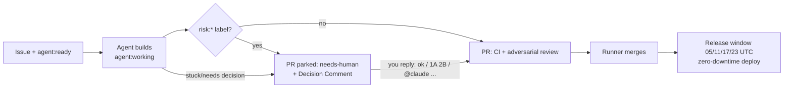

# Agent Workflow Playbook — Issues, PRs, Labels & Comments

How work flows through this repo's autonomous agent pipeline, and exactly what humans (owner and
contributors) do at each point. The runner is a long-lived daemon (`lem-agentd`, source in
`scripts/agent-pipeline/v2/`, installed to `/home/lem/agent-pipeline/` on the VPS). It is woken by
GitHub webhooks and reconciles on a timer, picks up ready issues, builds them in isolated worktrees,
opens PRs, reviews, merges, and ships them on the release train (4x daily: 05/11/17/23 UTC).
v1's `tick.sh` remains only as a heartbeat-gated failsafe. **Labels are the entire state machine** —
this doc is the contract for them; the daemon's own states and decisions are
[`agent-pipeline-v2.md`](agent-pipeline-v2.md).

## TL;DR — who is waiting on whom

| Labels on the issue/PR | State | Who acts next |
|---|---|---|
| `agent:ready` (and NOT `needs-human`/`agent:blocked`/`agent:working`) | Queued | **Agents** — auto-picked, nothing needed |
| `agent:working` | Being built / PR in flight | **Agents** — hands off |
| `agent:revise` (PR) | Owner feedback being implemented | **Agents** |
| `needs-human` | **Parked — waiting on a human** | **You** — answer its Decision Comment or do the ask |
| `agent:blocked` | Escalated/held (usually paired with `needs-human`) | **You** |
| *No flow label at all* | **Invisible — nothing will ever happen** | **You** — triage it (add `agent:ready` + `priority:*`) |

The single most common mistake: filing an issue with no flow label and expecting the agents to see
it. **An issue without `agent:ready` does not exist to the pipeline.**

## Label reference

### Flow labels (the state machine — one at a time per item)
| Label | Meaning | Set by |
|---|---|---|
| `agent:ready` | Queued for pickup | Human (or automation that files issues) |
| `agent:working` | Claimed; being built or its PR is in the merge loop | Runner |
| `agent:revise` | (PR) Owner requested changes / answered a Decision Comment | Runner |
| `agent:blocked` | Held after escalation; runner skips it | Runner/agent |
| `agent:depfix` | (PR) Dependabot PR with failing CI, priority fix lane | CI router |
| `agent:phasefix` | (PR) Phase-guard hold: agent files/links the follow-up for a multi-phase close | Runner |
| `needs-human` | Waiting on a human decision or human-only action | Agent (on escalation) or human |

### Priority (queue order within the ready pool)
`priority:critical` / `priority:high` **jump the whole line**; then ordering is milestone number
(`Milestone 7` → `Milestone 15`…), then `priority:medium` / `priority:low`, then issue number.
No priority label = last. Milestone titles must match `Milestone <N>: …` to sort.

### Risk gates (`risk:*`) — "build it, but a human signs off before merge"
`risk:migration`, `risk:security`, `risk:live-linkedin`, `risk:product-decision`.
A `risk:*` label does **not** stop the agent from building. It makes the agent park the finished PR
with `needs-human` + a **Decision Comment** so the owner approves before merge. Use it for schema
changes, auth/security surface, anything needing a live LinkedIn session, or spend/policy calls.

### Review economy
- Default per-PR reviewer is the pipeline's **Claude adversarial review** (posts a comment starting
  with `🔎 Claude adversarial review` — that marker is the merge gate's review evidence).
- **`review:copilot`** — add to any PR (or rely on `risk:*`, which implies it) to also get a GitHub
  Copilot review. Copilot credits are metered ($) — the runner requests it once, after CI is green.
  Never request Copilot review by hand on routine PRs.
- **Policy-triggered exception** — the pipeline may self-apply `review:copilot` on a routine PR when
  the PR body carries the builder's own `Uncertain: <reason>` line (**spec-first** step 1's assumption
  format), at most once per PR and never alongside `risk:*`. That's a fixed rule fired the same way
  every time, not the per-PR discretionary ask the line above bans.
- `agent:model:sonnet` / `agent:model:haiku` / `agent:model:opus` — owner's cost dial, read off the
  **issue** (not the PR): forces the model for that issue's build, CI-fix and review runs. No label
  = default (best) model. Agents never touch these.

### Topical labels
`bug`, `feature`, `ui`, `infrastructure`, `analytics`, `observability`, `authenticity`, `outbound`,
`cleanup`, `documentation`, `testing`, `ci-cd` — informational; add what fits (docs/cleanup +
`priority:low` also auto-downgrades the model tier).

## Writing an issue agents can execute

```markdown
## Context
Why this matters + evidence (link data, PRs, docs). Agents only know what's written here.

## Scope
- Concrete changes, named files/modules where known
- What is explicitly OUT of scope

## Acceptance
- Testable criteria (unit/integration tests, behavior, coverage)
```

Then label it: `agent:ready` + one `priority:*` + topicals (+ `risk:*` if merge needs your
sign-off) and put it in a milestone if it belongs to one. That's it — the pipeline does the rest:
branch `feature/claude-issue-<N>`, PR titled `…(closes #N)`, adversarial review, merge, release.

Conventions agents follow (so don't fight them in the issue): migrations are timestamp-versioned
(`V<YYYYMMDDHHMMSS>__name.sql`), ≥80% patch coverage, all repo rules in `CLAUDE.md`.

### Structured template — `.github/ISSUE_TEMPLATE/agent-task.yml`

The Context/Scope/Acceptance convention above is free-form prose — GitHub never enforced it, and
`MODE=start` only ever read it as a soft judgment call. `.github/ISSUE_TEMPLATE/agent-task.yml` is
a GitHub issue **form** that structures the same convention into named fields (`Context`, `Scope`,
`Acceptance`, `Verifier`, `Phase`, `Remaining phases`) and auto-applies the `template:agent-task`
label to every issue filed through it. Filing this way is optional, not a replacement for the
prose convention — but it is what makes two checks load-bearing instead of advisory:

- **`MODE=start`** hard-STOPs before writing any code on a `template:agent-task` issue whose
  `Acceptance` isn't independently testable against its `Verifier` field — posting `Uncertain:
  <reason>` + `needs-human` instead of guessing. **This gate is completely inert on any issue
  WITHOUT the label** — i.e. the entire pre-template backlog — which keeps `MODE=start`'s existing
  behavior on that backlog unchanged.
- **`MODE=selfreview`** additionally walks the `Acceptance` checklist item-by-item against the
  diff+tests on a template issue, layered on top of its usual general defect-hunting pass; it still
  only ever fixes findings in place or escalates, exactly as it does today.
- **`phase_guard_ok`** (the `tick.sh` merge-time failsafe, see "Phased work" just below) reads the
  form's `Phase` field FIRST, before falling back to its existing prose-regex scan — giving the
  field one real, working consumer today. **This is v1's failsafe getting a structured field to
  read, not v2-native phase enforcement** — `lem-agentd` (v2) has no phase guard at all yet, tracked
  and explicitly out of scope here as `#1396`.

Walkthrough of every field: the **agent-task-template** skill.

## Phased work — one phase, one issue

Staged work (research → implementation, or a `2a → 2b → 2c` build order) is normal here. What is
**not** allowed is describing a later phase only in prose inside an issue that is about to close.

`Closes #N` in a PR body closes #N the instant the PR merges. GitHub does not care that the body
said "Phase 2 lands in a follow-up PR" — the issue goes closed, drops off every `agent:ready` and
`needs-human` query, and the remaining work becomes invisible. That is not hypothetical: **#548**
(avatar likeness/preview/guardrails), **#568** (encrypt LinkedIn secrets at rest, passkeys) and the
stretch half of **#647** all shipped phase one and lost the rest this way; none of it was noticed
until an audit of every closed issue re-discovered it and re-filed it as #744, #745 and #746.

**The rule: an issue may be closed only when ALL of its acceptance criteria are met.**

### Writing a phased issue
- Put **only the phase you want built now** in `## Acceptance`. If the later phase has real scope,
  it belongs in its own issue, not in a paragraph.
- If phase two genuinely can't be specified yet (it depends on what the research finds), say so in
  `## Scope` **and** make "file the follow-up issue for phase two" an explicit acceptance box. Then
  the phase-two issue exists before this one can honestly close.
- Title follow-ups so the lineage is obvious: `<original title> — Phase N (follow-up of #<orig>)`,
  quote the remaining scope from the original, and give it its own testable acceptance.
- Label the follow-up like any other work — topicals + `agent:ready` + a `priority:*` (+ `risk:*` if
  merge needs sign-off). An unlabeled follow-up is invisible; see the TL;DR.
- Cross-link both ways: `Follow-up: #<new>` in the PR body, and a comment on the original issue.

### When you close the first phase
Before merging a PR that says `Closes #N`, check #N for leftovers — unchecked `- [ ]` boxes you
didn't implement, or wording like *Phase 2 / Part 2 / next phase / deferred to / out of scope for
this issue / stretch*. If anything remains, do one of exactly two things:

1. **File the follow-up issue and link it** — then `Closes #N` is honest.
2. **Drop `Closes #N`** — write "Remaining on #N: …" instead and leave the issue open.

The pipeline enforces this at the merge gate: a PR whose closed issue declares a later phase with no
linked follow-up is **not merged**. It gets a `🧩 phase-guard` comment and is routed to
**MODE=phasefix** (`agent:phasefix`): an agent files + links the follow-up issue itself and hands the
PR back to the merge loop — filing the follow-up is mechanical, not a human decision. The owner is
assigned (`needs-human` + `agent:blocked`) only after two failed phasefix passes. Unchecked boxes
alone only produce a warning comment — so tick the boxes you actually satisfied, and don't leave a
phase living in prose.

This detection is a prose regex over the issue body ("Phase 2", "deferred to", …), which is exactly
what the **structured template's** `Phase` field (see above) gives a real value to read instead of
guess from: `phase_guard_ok` checks `Phase: phase N of M` first and only falls back to the regex
when that field is absent. Still v1's failsafe, still prose-adjacent under the hood — full v2-native
phase enforcement in `lem-agentd` remains tracked and blocked on `#1396`.

Clearing the hold is a two-part manual step — the guard **strips `agent:working`**, and a PR without
it is invisible to the merge loop no matter how you fixed the scope. So do one of the two above,
then put the PR back in the flow:

```bash
gh pr edit <N> --add-label agent:working --remove-label needs-human --remove-label agent:blocked
```

## Decision Comments — how to answer when something waits on you

When an agent parks work, it posts a comment titled **“🧑‍⚖️ Human decision needed — reply with
option letters”** with numbered questions and lettered options. The runner watches **both** the PR
and the issue thread for your reply, so answer on either — but only a reply by the repo owner
(**@gitchrisqueen**) posted **after** the newest Decision Comment counts. A contributor's reply is
ignored silently, so if you're not the owner, say your piece and ping them.

Accepted reply shapes:

| You write | What happens |
|---|---|
| `ok` | Every ✅-recommended option is implemented |
| `1A 2B` | Those options are implemented |
| `1A 2C (also open an issue for X) 3A` | Options + your parenthetical instructions — extras honored, side-asks become linked issues |
| `2D: none of those — do <your idea>` or a reply starting `@claude …` / `decision:` / `go:` | **Your off-menu answer wins over the menu** |
| Anything containing “hold off” / “don’t merge yet” / “not yet” / “wait until …” | Stays parked (even if it starts with letters) |
| A free-form question ending in `?` | Stays parked; nothing builds off a question |

Plain prose that doesn't match these shapes is **not** detected. Either start it with `@claude`, or
re-label by hand after commenting — and note that re-adding `agent:ready` alone does **nothing**,
because the queue skips anything still carrying `needs-human`/`agent:blocked`:

```bash
gh pr edit <N>    --add-label agent:revise --remove-label needs-human --remove-label agent:blocked
gh issue edit <N> --add-label agent:ready  --remove-label needs-human --remove-label agent:blocked
```

## PR rules

- Agent PRs carry `agent:working`. **Never enable GitHub auto-merge** — merge is runner-controlled:
  CI green + one fresh review (adversarial marker or Copilot) + zero unresolved Copilot threads.
- Human contributors: normal fork/branch PRs are fine and reviewed by humans as usual. You can hand
  a PR to the runner's merge loop (adversarial review, then auto-merge when green) by labeling it
  `agent:working` — but **only if the branch lives in this repo**. The runner resolves a PR's branch
  as `origin/<branch>`, so a **fork** PR labeled `agent:working` has no branch it can check out or
  push fixes to. Fork PRs stay on human review.
- Merged PRs batch into a release-please PR that auto-merges at the next window (05/11/17/23 UTC)
  → tag → image build → zero-downtime blue/green deploy. Ship a batch early:
  `gh workflow run release-auto-merge.yml`. Redeploy/rollback a tag:
  `gh workflow run deploy-vps.yml -f tag=vX.Y.Z`.

## Cheat sheet

```bash
# What is waiting on ME?
gh issue list --label needs-human --state open
gh pr list --label needs-human --state open

# What will agents pick up next? (jumps first: critical/high, then milestone order)
gh issue list --label agent:ready --state open --limit 200

# Issues invisible to the pipeline (no flow label) — triage these.
# --limit matters: gh returns only 30 rows by default, so a bare list silently misses the tail.
gh issue list --state open --limit 200 --json number,title,labels \
  --jq '.[] | select((.labels|map(.name)) as $l | ([$l[] | select(startswith("agent:") or . == "needs-human")] | length) == 0) | "#\(.number) \(.title)"'

# Closed issues that may have dropped a later phase (audit the "Phased work" rule).
# Markers match the merge gate's own list PLUS "stretch" — #647 lost its stretch half and says
# nothing about a "phase", so a narrower regex reports a false all-clear on exactly that case.
gh issue list --state closed --limit 300 --json number,title,body \
  --jq '.[] | select((.body // "") | test("(?i)phase [2-9]|part [2-9]|next phase|later phase|follow-up (pr|issue)|lands? in a follow-up|deferred to|out of scope for this issue|will be handled in|tracked separately|stretch")) | "#\(.number) \(.title)"'

# Put an issue into the flow
gh issue edit <N> --add-label agent:ready --add-label priority:medium

# Take an issue OUT of the flow (park it for yourself)
gh issue edit <N> --add-label needs-human --remove-label agent:ready

# Answer a Decision Comment: just reply "ok" or "1A 2B ..." on the PR or the issue.

# Cheaper model for a mechanical issue     # Copilot second opinion on a PR
gh issue edit <N> --add-label agent:model:sonnet
gh pr edit <N> --add-label review:copilot
```

## Lifecycle at a glance


