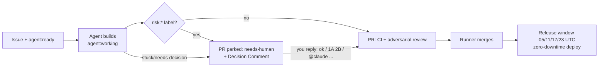

# Agent Workflow Playbook — Issues, PRs, Labels & Comments

How work flows through this repo's autonomous agent pipeline, and exactly what humans (owner and
contributors) do at each point. The pipeline runner (`tick.sh` + `RUNBOOK.md`, on the VPS at
`/home/lem/agent-pipeline/` — not in this repo) polls every 5 minutes, picks up ready issues,
builds them in isolated worktrees, opens PRs, reviews, merges, and ships them on the release train
(4x daily: 05/11/17/23 UTC). **Labels are the entire state machine** — this doc is the contract.

## TL;DR — who is waiting on whom

| Labels on the issue/PR | State | Who acts next |
|---|---|---|
| `agent:ready` (and NOT `needs-human`/`agent:blocked`/`agent:working`) | Queued | **Agents** — auto-picked, nothing needed |
| `agent:working` | Being built / PR in flight | **Agents** — hands off |
| `agent:revise` (PR) | Owner feedback being implemented | **Agents** |
| `needs-human` | **Parked — waiting on a human** | **You** — answer its Decision Comment or do the ask |
| `agent:blocked` | Escalated/held (usually paired with `needs-human`) | **You** |
| *No flow label at all* | **Invisible — nothing will ever happen** | **You** — triage it (add `agent:ready` + `priority:*`) |

The single most common mistake: filing an issue with no flow label and expecting the agents to see
it. **An issue without `agent:ready` does not exist to the pipeline.**

## Label reference

### Flow labels (the state machine — one at a time per item)
| Label | Meaning | Set by |
|---|---|---|
| `agent:ready` | Queued for pickup | Human (or automation that files issues) |
| `agent:working` | Claimed; being built or its PR is in the merge loop | Runner |
| `agent:revise` | (PR) Owner requested changes / answered a Decision Comment | Runner |
| `agent:blocked` | Held after escalation; runner skips it | Runner/agent |
| `agent:depfix` | (PR) Dependabot PR with failing CI, priority fix lane | CI router |
| `needs-human` | Waiting on a human decision or human-only action | Agent (on escalation) or human |

### Priority (queue order within the ready pool)
`priority:critical` / `priority:high` **jump the whole line**; then ordering is milestone number
(`Milestone 7` → `Milestone 15`…), then `priority:medium` / `priority:low`, then issue number.
No priority label = last. Milestone titles must match `Milestone <N>: …` to sort.

### Risk gates (`risk:*`) — "build it, but a human signs off before merge"
`risk:migration`, `risk:security`, `risk:live-linkedin`, `risk:product-decision`.
A `risk:*` label does **not** stop the agent from building. It makes the agent park the finished PR
with `needs-human` + a **Decision Comment** so the owner approves before merge. Use it for schema
changes, auth/security surface, anything needing a live LinkedIn session, or spend/policy calls.

### Review economy
- Default per-PR reviewer is the pipeline's **Claude adversarial review** (posts a comment starting
  with `🔎 Claude adversarial review` — that marker is the merge gate's review evidence).
- **`review:copilot`** — add to any PR (or rely on `risk:*`, which implies it) to also get a GitHub
  Copilot review. Copilot credits are metered ($) — the runner requests it once, after CI is green.
  Never request Copilot review by hand on routine PRs.
- `agent:model:sonnet` / `agent:model:haiku` / `agent:model:opus` — owner's cost dial: forces the
  model for all agent runs on that issue. No label = default (best) model. Agents never touch these.

### Topical labels
`bug`, `feature`, `ui`, `infrastructure`, `analytics`, `observability`, `authenticity`, `outbound`,
`cleanup`, `documentation`, `testing`, `ci-cd` — informational; add what fits (docs/cleanup +
`priority:low` also auto-downgrades the model tier).

## Writing an issue agents can execute

```markdown
## Context
Why this matters + evidence (link data, PRs, docs). Agents only know what's written here.

## Scope
- Concrete changes, named files/modules where known
- What is explicitly OUT of scope

## Acceptance
- Testable criteria (unit/integration tests, behavior, coverage)
```

Then label it: `agent:ready` + one `priority:*` + topicals (+ `risk:*` if merge needs your
sign-off) and put it in a milestone if it belongs to one. That's it — the pipeline does the rest:
branch `feature/claude-issue-<N>`, PR titled `…(closes #N)`, adversarial review, merge, release.

Conventions agents follow (so don't fight them in the issue): migrations are timestamp-versioned
(`V<YYYYMMDDHHMMSS>__name.sql`), ≥80% patch coverage, all repo rules in `CLAUDE.md`.

## Decision Comments — how to answer when something waits on you

When an agent parks work, it posts a comment titled **“🧑‍⚖️ Human decision needed — reply with
option letters”** with numbered questions and lettered options. The runner watches **both** the PR
and the issue thread for your reply, so answer on either. Accepted reply shapes:

| You write | What happens |
|---|---|
| `ok` | Every ✅-recommended option is implemented |
| `1A 2B` | Those options are implemented |
| `1A 2C (also open an issue for X) 3A` | Options + your parenthetical instructions — extras honored, side-asks become linked issues |
| `2D: none of those — do <your idea>` or a reply starting `@claude …` / `decision:` / `go:` | **Your off-menu answer wins over the menu** |
| Anything containing “hold off” / “don’t merge yet” / “not yet” / “wait until …” | Stays parked (even if it starts with letters) |
| A free-form question ending in `?` | Stays parked; nothing builds off a question |

Plain prose that doesn't match these shapes is **not** detected — either start it with `@claude`,
or add the `agent:revise` label (PR) / re-add `agent:ready` (issue) yourself after commenting.

## PR rules

- Agent PRs carry `agent:working`. **Never enable GitHub auto-merge** — merge is runner-controlled:
  CI green + one fresh review (adversarial marker or Copilot) + zero unresolved Copilot threads.
- Human contributors: normal fork/branch PRs are fine and reviewed by humans as usual. To hand your
  PR to the runner's merge loop instead, label it `agent:working` (it will be adversarially
  reviewed and auto-merged when green).
- Merged PRs batch into a release-please PR that auto-merges at the next window (05/11/17/23 UTC)
  → tag → image build → zero-downtime blue/green deploy. Ship a batch early:
  `gh workflow run release-auto-merge.yml`. Redeploy/rollback a tag:
  `gh workflow run deploy-vps.yml -f tag=vX.Y.Z`.

## Cheat sheet

```bash
# What is waiting on ME?
gh issue list --label needs-human --state open
gh pr list --label needs-human --state open

# What will agents pick up next? (jumps first: critical/high, then milestone order)
gh issue list --label agent:ready --state open

# Issues invisible to the pipeline (no flow label) — triage these
gh issue list --state open --json number,title,labels \
  --jq '.[] | select((.labels|map(.name)) as $l | ([$l[] | select(startswith("agent:") or . == "needs-human")] | length) == 0) | "#\(.number) \(.title)"'

# Put an issue into the flow
gh issue edit <N> --add-label agent:ready --add-label priority:medium

# Take an issue OUT of the flow (park it for yourself)
gh issue edit <N> --add-label needs-human --remove-label agent:ready

# Answer a Decision Comment: just reply "ok" or "1A 2B ..." on the PR or the issue.

# Cheaper model for a mechanical issue     # Copilot second opinion on a PR
gh issue edit <N> --add-label agent:model:sonnet
gh pr edit <N> --add-label review:copilot
```

## Lifecycle at a glance


