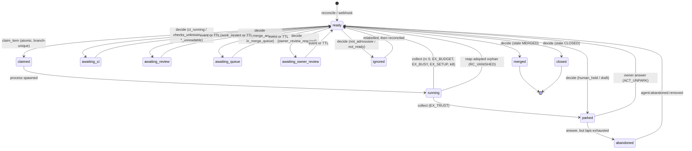

# Agent pipeline v2 — the scheduler daemon

The autonomous runner that takes a labelled GitHub issue to a merged PR. This file is the
**architecture and state-machine** half: what the daemon is, how an item moves, and which
GitHub field combinations it is defined for. It deliberately does not re-derive four things that
already have owners — read them alongside:

| For | Read |
|---|---|
| The label contract (who waits on whom, how to write an executable issue) | [`AGENT_WORKFLOW_PLAYBOOK.md`](AGENT_WORKFLOW_PLAYBOOK.md) |
| What each agent is told to do in each MODE | `scripts/agent-pipeline/RUNBOOK.md` |
| Claude-vs-Ollama lane routing and model tiers | [`agent-pipeline-routing.md`](../scripts/agent-pipeline/docs/agent-pipeline-routing.md) |
| The trust boundary and why a label is not an access control | [`contribution-security.md`](contribution-security.md) |

Operating commands live on the box in `scripts/agent-pipeline/v2/README.md`, which `install.sh`
copies there.

**Status: live since 2026-08-10.** `LEMD_SHADOW=0`, `V1_RETIRED` present, `lem-agentd` enabled.
v1 (`tick.sh`) survives only as a heartbeat-gated 15-minute failsafe.

---

## 1. Why v2 exists

v1 gave one cron tick to ONE unit of work. The figures below were measured from v1's
`tick-outcomes.ndjson` during the v2 design and are quoted from that analysis — **the log is on the
box, not in this repo, so they are not reproducible from a checkout**:

| Symptom | Measurement |
|---|---|
| Ticks spent re-polling GitHub for unchanged answers | **~75%** of dispatches |
| Hard ceiling on work, regardless of `MAX_AGENTS=5` | 288 units/day (one per 5-min tick) |
| Concurrency actually used | slot ≥2 on **39 of 2,456** ticks |
| Worst single incident | one wedged PR consumed **45 of 62** ticks in 6 hours |

Only the 288/day ceiling is derivable from the repo (`capacity.py`); treat the rest as the recorded
rationale for building v2, not as live metrics. The thing being polled is fast — PR CI ~3 min, merge
queue ~3.8 min — so the pipeline was never GitHub-bound, it was tick-bound. v2 keeps every guard v1
earned and changes only *when* work runs.

---

## 2. The loop

One process, one loop. `Daemon.tick()` (`v2/lemd/daemon.py`) runs these in order, and the order is
load-bearing:

```
heartbeat        write state/lemd.heartbeat        (the watchdog's liveness signal)
collect          reap finished runs                 ← runs even while PAUSED, or a pause
                                                      would strand claims and branch locks
── if PAUSED: stop here ──
drain_events     webhook rows  → items.dirty=1      (≤200 per pass)
reconcile        GitHub labels → the queue          (600s; 120s only if silent AND drifting)
refresh_usage    subscription meter → state/usage.json
observe_dirty    changed items → decide()           (≤25 per pass)
sweep_ttls       expired waits → decide()           (≤25 per pass)
act              fill both pools with what decide() already decided
```

Then it sleeps `max(1, min(60, next_wake, next_reconcile))`. **A waiting item costs nothing** —
that is the entire economy change. An item awaiting CI, review, the merge queue or a human is not a
candidate for anything until an event marks it dirty or its TTL fires.

**Three wake paths**, each a backstop for the one above:
1. **Webhook** (`lemd.receiver`, port 8420) — the fast path. HMAC-verified, deduped on
   `X-GitHub-Delivery`, writes an event row and `kv:last_webhook_at` in one transaction.
2. **Reconcile** — re-derives the queue from GitHub labels on a timer, so a missed delivery costs
   latency and never work.
3. **Watchdog** (`lem-agentd-watchdog.timer`, every 15 min) — restarts the daemon when the unit is
   dead **or** the heartbeat is older than 600s. Liveness and freshness are separate questions; a
   wedged process passes the first and fails the second.

Degraded reconcile (120s) requires **both** webhook silence past `LEMD_WEBHOOK_STALE_SECONDS` **and**
drift found by the last reconcile. Silence alone is not evidence: it reads identically for a broken
event path and a quiet repository, and polling 5× harder on a quiet repo is backwards.

Events never decide anything. They only say *"this item changed, look again"*, which is what makes a
duplicate or out-of-order delivery harmless.

---

## 3. The item state machine



`claimed` and `running` are **active states**: `upsert_item` refuses to move an item out of them, so
only the run lifecycle (`collect`, crash recovery) can, which makes every such transition auditable.

The claim is not a lock but an **index**: `items_active_branch` is a partial unique index over
`branch WHERE state IN ('claimed','running')`, so "two workers on one branch" is unrepresentable
rather than merely guarded.

| State | Meaning | Leaves on |
|---|---|---|
| `ready` | dispatchable, or awaiting a decision | act(), or the next observation |
| `claimed` | won the claim, not yet spawned | spawn, or `startup_recover` |
| `running` | a child process is alive | collect(), or `wake_at = now + max(60, timeout)` |
| `awaiting_ci` | CI running, or checks unreadable | event, or `LEMD_TTL_CI` (1800s) |
| `awaiting_review` | work in flight elsewhere | event, or `FIRST_REVIEW_TIMEOUT_SECONDS` (3600s) |
| `awaiting_queue` | auto-merge armed or in the queue | event, or `LEMD_TTL_QUEUE` (900s) |
| `awaiting_owner_review` | auto-merge armed, checks green, `BLOCKED` only on `require_code_owner_reviews` | event, or `LEMD_TTL_PARKED` (21600s) |
| `parked` | the owner's, not the pipeline's — a question WAS asked | an owner answer, or `LEMD_TTL_PARKED` (21600s) |
| `ignored` | not the pipeline's business; nobody was asked | a relabel, noticed by `reconcile` |
| `abandoned` | parked for the same reason too many times; the pipeline stopped asking | removing `agent:abandoned` — laps cleared, back on the queue |
| `merged` / `closed` | terminal | — |

`awaiting_owner_review` is the one wait state **excluded from `db.WIP_STATES`** (#1501). Every other
wait state above resolves through pipeline action or CI on a timeline the pipeline influences; this
one resolves only through a human clicking Approve on GitHub, on no timeline the pipeline controls at
all. Counting it against the WIP gate the same as `awaiting_queue` reproduces the incident it fixes:
two such PRs held both WIP slots for 7 hours while every `ready` issue behind them went undispatched.
The daemon posts ONE `gh pr comment` on the transition into this state (`_notify_owner_review_needed`)
so the wait is not also silent.

**The reviewer request GitHub never sends (#1642).** A comment is not a review request: with
`required_approving_review_count: 0`, GitHub's auto-request never fires, so a code-owner-gated PR
sits `BLOCKED` with an EMPTY Reviewers sidebar, `reviewDecision: null` and no notification. Measured
2026-08-17 on #1600, #1602, #1616, #1618 and #1620 — hours each, found only by grepping this
daemon's decision log. So `_observe_one` asks explicitly (`github.request_reviewer` →
`gh pr edit --add-reviewer`), on **two triggers, one call**:

| Trigger | When it fires | Why it exists |
|---|---|---|
| `codeowners_path` | the FIRST observation of the PR — while CI is still running | puts the owner in the Reviewers sidebar the moment the PR opens, not at the end of CI |
| `owner_review_required` | the transition into `awaiting_owner_review` | authoritative fallback: GitHub has said a code-owner review is the last gate, so the ask is owed even if the path match missed |

The path match is `lemd/codeowners.py` — a **documented subset** of gitignore syntax (anchored
directory prefixes, anchored file paths, `*`/`?`/`**`), matched last-rule-wins as GitHub does it,
over the `files` list that now rides the existing `pr_facts` call. The rules are fetched from the
base branch and cached for an hour. Being wrong is cheap in one direction only, and the two triggers
are built on that: a MISS costs a delayed request the `awaiting_owner_review` row then makes anyway,
so an unreadable or unparseable CODEOWNERS yields NO rules rather than assumed ownership.

The ask is gated on `github.owner_review_pending` — the owner is neither a requested reviewer nor
the author of a **live** review. A `DISMISSED` review reads as pending again, which is what makes
this recur: `dismiss_stale_reviews: true` silently invalidates a prior approval on the next push
(#1616 carried exactly that). "Live" is an explicit PASS LIST — `OPINIONATED_REVIEW_STATES`,
`APPROVED` and `CHANGES_REQUESTED` and nothing else — because suppressing on a state that did not
satisfy the code-owner gate re-creates the silence this exists to end. `COMMENTED` is the state
that makes that concrete and is NOT live: leaving one inline remark submits a COMMENTED review,
which removes the owner from `reviewRequests` without approving anything. Re-asking cannot loop —
the request itself puts the owner back in `reviewRequests`, so a non-live review costs one
re-request per round. A merged, closed, draft or owner-authored PR is never asked about (GitHub
refuses a self-request, and a park drafts the PR).

Every request writes one `stage: "owner_review_request"` row to `logs/lemd-decisions.ndjson`
(`{kind, number, reason, requested}`), because the ABSENCE of this signal was what had to be grepped
for the first time:

```bash
jq -c 'select(.stage=="owner_review_request")' logs/lemd-decisions.ndjson | tail -5
```

**The WIP gate, and what it is not counting.** `db.wip_count()` counts PRs in `WIP_STATES`;
`db.HUMAN_HELD_STATES` (`awaiting_owner_review`, `parked`) names the ones held out of it, and
`db.wip_excluded()` reports them. When the gate holds new starts, `act()` logs the excluded PRs by
number and state and writes ONE `stage: "wip_gate"` row to `logs/lemd-decisions.ndjson`
(`{wip, max_agents, excluded[]}`), re-written only when that shape changes. Without it the ledger
shows a run of `refused_by: wip_limit` rows and no way to tell a pipeline saturated with its own
work from one discounting PRs it cannot move — the six-hour idle in #1426 read as the first and was
the second. Every UNREADABLE state is deliberately outside `HUMAN_HELD_STATES`: an item whose merge
state, checks or work state could not be read waits in `awaiting_ci`, which **is** counted, so the
gate fails closed toward the throttle rather than toward unbounded starts.

```bash
jq -c 'select(.stage=="wip_gate")' logs/lemd-decisions.ndjson | tail -3
```

---

## 4. The decision table

`observe.decide()` is **pure** — no network, no clock, no database. Every input arrives in a
`Snapshot`, so every transition is testable exactly, including the ones that only happen when GitHub
is lying. This table is that function, in evaluation order. Order encodes priority.

`tests/unit/test_agent_pipeline_v2_decision_table.py` asserts the **reason strings** here and in
`observe.py` are the same set, in both directions — a new branch without a row fails, and a row that
outlived its branch fails. It does **not** yet check the condition, action, order or wake columns, so
those four are reviewed by eye and are where this table will rot first.

### Terminal facts, then unreadability, then admission

| # | Condition | Action | Reason | Wake |
|---|---|---|---|---|
| 1 | GitHub state `MERGED` | close | `merged` | — |
| 2 | GitHub state `CLOSED` | close | `closed_unmerged` | — |
| 3 | any required read failed | none | `github_unreadable` | 300s |
| 4 | not admissible | none → **ignored** | `not_admissible:{fork_pr,release_pr,no_agent_label}` | **never** |

**Unreadable is a decision to do NOTHING**, never a decision to proceed — v1 once merged on an
unreadable state (#1082). Admission is by LABEL and PROVENANCE, never by author: excluding
"Dependabot PRs" by author would retire the depfix lane, which exists to run an agent ON a
Dependabot PR. `admissible()` also has an `unreadable` branch, but row 3 shadows it, so that reason
is **unreachable**.

**`ignored` is not `parked`, and the distinction is the point.** `parked` means the pipeline stopped
and ASKED someone: a Decision Comment, the hold labels, an assignee, auto-merge disarmed. These
branches did none of that — they returned `ACT_NONE`, so no action ran — yet they wrote `parked`
anyway, claiming a question nobody had posed. For a fork PR and a release-please PR silence is
genuinely right; they are not ours to comment on. So they say `ignored` instead. An ignored item is
not terminal: label it properly and the next observation picks it up.

**`ACT_PARK` exists again, on the terms it was removed under.** It was deleted in #1386 as a dead
constant: defined for months, never returned, leaving a branch in the daemon nothing could reach.
#1405 is the case that needed it — an issue whose newest linked PR is merged or closed-unmerged is a
genuine ASK — so it came back RETURNED, WIRED in `_observe_one`, and reaching `park.sh` through the
same gh-pool action a budget park uses, all in one change, with a reachability test so the
dead-constant situation cannot recur. Escalation at DISPATCH is unchanged: `act()` still finds the
ledger spent and queues `park.sh` itself, and `decide()`'s parks join that path rather than opening a
second one — same action, same head-keyed comment, same counted lap.

### The owner's hold outranks every lane

| # | Condition | Action | Reason | Wake |
|---|---|---|---|---|
| 5 | hold label on a PR with auto-merge **armed** | disarm | `human_hold_armed` | — |
| 6 | hold label + actionable answer, **and this reason has parked `LEMD_MAX_PARK_LAPS` times** | abandon | `park_laps_exhausted` | — |
| 7 | hold label + actionable answer | unpark | `owner_answered` | — |
| 7 | hold label + `hold`/`question` answer | none → parked | `human_hold:{verdict}` | 6h |
| 9 | hold label + an answer already spent | none → parked | `human_hold:answer_already_routed` | 6h |
| 10 | hold label, no answer | none → parked | `human_hold` | 6h |

Row 5 sits above the answer deliberately. Only `park.sh` ever ran `--disable-auto`, so a hold a
HUMAN applied was honoured here and ignored by GitHub, which merged the PR when its gate cleared.
Un-parking one observation later costs a single pass; leaving an armed hold costs a merge nobody
authorised, and that cannot be undone.

Row 6 is the pipeline giving up. An item parked for the SAME reason `LEMD_MAX_PARK_LAPS` times
(default 3) has had that question asked and answered and asked again, and the un-park's ledger reset
is what starts each next lap — so it is tested at the UN-PARK, where the loop actually turns, not at
the park. A lap is keyed on (item, reason, head): a re-park at the same head is the same park being
re-observed, which is why the 6-hourly re-decision does not inflate the counter.

`abandon` is terminal for the PIPELINE and for nothing else. It never closes an issue or a PR — that
is a judgement about the work, not about the runner's ability to progress it — and removing the
`agent:abandoned` label revives the item with its lap history cleared. It is surfaced by `status.sh`
as a warning, because an item that stops asking is a worse failure than one that asks too often if
nothing says it exists.

`HOLD_LABELS = {needs-human, agent:blocked}`. A held item carrying no `agent:*` label is still
admitted (row 4 makes an exception) — otherwise an item parked with only `needs-human` would be
unanswerable, and the owner's reply to their own issue would be read, classified, and discarded.

**Ambiguity never starts a build.** A reply that leads with `1B` and then says "but don't merge until
Friday" reads as `hold` and stays parked.

### Issue lanes

| # | Condition | Action | Reason | Wake |
|---|---|---|---|---|
| 11 | `agent:ready`, work state unreadable | none | `start_work_state_unreadable` | 600s |
| 12 | `agent:ready` **or** `agent:working`, work exists, newest linked PR `MERGED` | **park** | `work_shipped_needs_close` | — |
| 13 | …newest linked PR `CLOSED` unmerged | **park** | `approach_rejected` | — |
| 14 | `agent:ready`, work exists, open PR **or linkage unreadable** | none | `start_already_produced_work` | 1h |
| 15 | `agent:ready`, work exists, **no PR** | dispatch `start` | `stranded_branch_no_pr` | — |
| 16 | `agent:ready`, no work | dispatch `start` | `issue_ready` | — |
| 17 | `agent:working`, unreadable | none | `working_claim_state_unreadable` | 600s |
| 18 | `agent:working`, work exists, open PR **or linkage unreadable** | none | `working_claim_has_work` | 1h |
| 19 | `agent:working`, work exists, no PR | dispatch `start` | `stranded_branch_no_pr` | — |
| 20 | `agent:working`, no work | dispatch `start` | `working_claim_stranded` | — |
| 21 | neither label | none → **ignored** | `issue_not_ready` | never |

Rows 14–15 are one question asked two ways. "Did anything leave the box" is right for *must I avoid
forking this*; it is wrong for *will anyone ever finish it*. A branch with an open PR is in flight; a
branch with no PR is a `start` that pushed and then died — resumable, and re-dispatching it resumes
on the existing branch. Linked PRs are consulted **before** the `feature/claude-issue-N` convention,
because PR #1302 carries issue #1301 on a differently-named branch and a convention-only lookup would
call that live PR stranded.

Rows 12–13 are listed once because they live in the shared helper both paths call, so they are
evaluated ahead of row 14 on the `agent:ready` route and ahead of row 18 on the `agent:working` one.
They are the linked PR's STATE, which `has_open_pr` cannot carry: that answer is True for any linked
ref whatever its state, deliberately, because `False` is what licenses a re-dispatch and a ref of
unknown state must never do that. So a merged or closed-unmerged PR used to read as in flight and
wait for ever, re-reading the same linkage every `ttl_review` for the same answer (#1405). Neither
state is "not ours": a merged PR means the work shipped and only the issue is still open, a
closed-unmerged one means a human rejected the approach — and restarting a rejected approach redoes
work that was already turned down. So both **park and ask**, which is what `ACT_PARK` is back for,
and both are lap-counted like any other park, so the ask has a floor (row 6).

The state costs **one** extra `gh pr view` per observation, and only for an issue that already has
linkage. All three of the questions `snapshot_issue` asks — does work exist, what state is the
linked PR in, is there an open PR — start from the same `closedByPullRequestsReferences` read, and
each used to make it for itself; `github.linked_pr_state()` now takes it once and hands the answer
to the other two. Its `""` (read, nothing linked) is what makes that possible: it is the same
DECISION as an unreadable `None` — both fall through to rows 14/18 and wait — and a different READ,
so `""` skips the repeat and `None` does not.

### PR lanes, cheapest-to-unblock first

| # | Condition | Action | Reason | Wake |
|---|---|---|---|---|
| 22 | draft (unheld — a held draft is rows 5-10) | none → awaiting_review | `pr_is_draft` | 6h |
| 23 | `mergeStateStatus == DIRTY` | dispatch `rebase` | `conflicts_with_main` | — |
| 24 | **a live merge-queue entry** (any state) | none | `in_merge_queue` | 15m |
| 25 | lane label, by declared priority: `agent:revise` | dispatch `revise` | `owner_requested_changes` | — |
| 26 | …then `agent:phasefix` | dispatch `phasefix` | `phase_scope_untracked` | — |
| 27 | …then `agent:depfix` | dispatch `depfix` | `dependabot_ci_failure` | — |
| 28 | …then `agent:docfix` | dispatch `docfix` | `lint_gate_failure` | — |
| 28a | an OPEN `🧩 phase-gap:` declaration on the PR | dispatch `phasefix` | `phase_scope_untracked` | — |
| 29 | `mergeStateStatus` is `UNKNOWN` or `""` | none | `merge_state_unknown` | 120s |
| 30 | `mergeStateStatus` outside the enum | none | `merge_state_unrecognised` | 300s |
| 31 | auto-merge armed, `BLOCKED`, checks all green, no queue entry | none → **awaiting_owner_review** | `owner_review_required` | 6h |
| 32 | auto-merge armed (anything else) | none | `auto_merge_armed` | 15m |
| 33 | checks unreadable | none | `checks_unknown` | 300s |
| 34 | a required check failed | dispatch `fix` | `required_checks_failing` | — |
| 35 | checks pending, or zero checks | none | `ci_running` | 30m |
| 36 | unresolved Copilot threads | dispatch `review` | `unresolved_review_threads` | — |
| 37 | no review at/after the head | dispatch `selfreview` | `no_fresh_review` | — |
| 38 | green, reviewed, threads clear | **merge** | `gate_satisfied` | 15m |

**Row 24 is the merge-queue gate (#1388), and its position is the whole rule: while the queue holds
a live entry, no lane that pushes a commit may run.** `queue_state` used to be read last, below rows
34/36/37, so a PR the queue was already validating was dispatched into `fix`, `review` or
`selfreview` — each of which pushes, which ejects it. Entry is expensive (GitHub builds the PR
against the queue head), so an ejection re-pays that cost from scratch and a PR that keeps acquiring
findings cycles. The counter-argument — *if a queued PR's required check really fails, the queue
ejects it anyway, so fix it fast* — is why this row **waits** rather than acting: losing the entry
drops `queue_state` back to `""`, and the next observation runs the ordinary ladder and dispatches
the same lane. The gate delays a fix by at most one `ttl_queue`; it never swallows one. `details`
carries `withheld`, naming the lane being held, so a silent queued PR is legible instead of
mysterious — and it names **only a lane the ladder would really run**: rows 29-32 sit above the
checks ladder and all of them wait, so an armed PR (which is how a PR reaches the queue at all)
withholds nothing, and saying `fix` there would promise a dispatch that never comes.
**Row 23 (`DIRTY`) is the one documented exception**, and only because the queue cannot
merge a conflicted PR either — it will eject it regardless, so a rebase costs the queue nothing it
was not already losing.

Row 32 sits above the checks rows (33-35) deliberately. An armed PR reporting `BLOCKED` is the
normal, healthy state of a PR waiting on required checks; without this the ladder fell through to
`gate_satisfied` on every pass and burned the per-head merge budget in three minutes (measured on
#1295).

Row 31 sits above row 32: `BLOCKED` with every required check already green and no queue entry is
not "waiting on a check" — nothing left to check. The one remaining required gate at that point is
`require_code_owner_reviews`, which only a human's approval satisfies (#1501). Auto-merge stays
armed either way — GitHub completes the merge itself the instant that approval lands — so this row
changes only where the WAIT is recorded (`awaiting_owner_review`, excluded from the WIP gate, §3),
not whether the pipeline waits. Its "no queue entry" clause is redundant under row 24 and is kept
because the branch depends on it.

**Row 28a is the phase guard (#1396), and its shape is the decision, not an implementation detail.**
v1 judged acceptance-criteria coverage itself, at the merge gate, from the issue body and a prose
regex (`phase_guard_ok`, `tick.sh:715-745`). v2 does not, and will not: reading a diff and concluding
"this closes an issue whose later phase is untracked" is the call an LLM gets confidently wrong, and
a wrong hold costs a human decision every time it fires. So the judgement is made **once**, by
`MODE=selfreview` — the pass that already has the issue, the diff and the tests in front of it —
which fixes the gap where it can and otherwise writes one line into its review comment:
`🧩 phase-gap: #N — <what remains>`. `review_state` reads that line out of the comment list it
already fetches (`PHASE_GAP_OPEN_RE`), `Snapshot.phase_gap` carries it, and this row routes the PR to
the `phasefix` lane that files + links the follow-up and clears the declaration
(`🧩 phase-gap: cleared`). It is numbered `28a` rather than `29` because it belongs with the lane
rows above it and renumbering ten rows of cross-referenced prose is how §6's budget column was once
overwritten.

Three properties are deliberate. It **fails open**: no declaration, no hold — a PR nobody said
anything about decides exactly as it did before, so the enforcement can never wedge the queue on its
own opinion. It is **not cleared by a push or by time**, because the gap is in the PR's scope claim
and neither of those touches it; only the `cleared` line retires it — and only when it **heads a
line**, which is the one place the two patterns are deliberately asymmetric. `PHASE_GAP_OPEN_RE`
matches anywhere in a comment, `PHASE_GAP_CLEARED_RE` only at the start of a line, because the two
mistakes do not cost the same: over-reading a declaration costs one phasefix run, which finds nothing
and posts the clearing line anyway, while over-reading a CLEARING retires a real hold and merges the
PR with the scope lost. Prose quotes this mechanism mid-sentence — the paragraph you are reading
does — and prose must never be able to clear a hold. And it is **bounded** by the
phasefix budget like any other dispatch, so a declaration the lane cannot clear parks and asks rather
than re-dispatching for ever. It sits below the label lanes (`agent:revise` outranks it: the owner's
own instruction outranks our bookkeeping) and above every merge row, because merging is the one act
that makes the lost scope permanent.

Row 37's freshness is **stricter than v1's**: a review must be at or after the head commit. Being
wrong in this direction costs one extra selfreview; being wrong in the other merges code no reviewer
saw. **One exception, and it errs permissive**: when the head's `committedDate` is unreadable,
`review_state` falls back to "any review counts", however stale — refusing every PR on an unreadable
date would wedge the gate entirely. Row 35 treats zero checks as pending, not green.

---

## 5. The GitHub field matrix

The point of this section is the **Undefined** column. Every cell that is not handled is a cell where
behaviour is incidental.

| `mergeStateStatus` | Handled? | What happens today |
|---|---|---|
| `CLEAN` | ✅ | falls through to the checks/review ladder |
| `DIRTY` | ✅ | row 23 → `rebase` |
| `BLOCKED` | ✅ | proceeds; normally a PR waiting on a required check, read directly off the ladder. Armed + checks-all-green + no queue entry is the one exception — `require_code_owner_reviews` is the actual gate, so it routes to `awaiting_owner_review` instead (row 31, §3) |
| `UNSTABLE` | ✅ | proceeds and can reach `gate_satisfied`. Correct **because** `checks_for` filters to required contexts, so non-required red is mergeable — now recorded rather than accidental |
| `BEHIND` | ✅ | proceeds, deliberately: `main` does not require branches to be up to date (`strict` is false) and the merge queue builds against the queue head, so a rebase would spend a model session on something GitHub does for free |
| `UNKNOWN` / `""` | ✅ | waits 120s (row 29). Was the #1082 shape — an unreadable field read as a healthy one |
| `HAS_HOOKS` | ✅ | proceeds, named |
| anything outside the enum | ✅ | waits 300s (row 30) — the enum is closed, so a new member means the world changed |

**An issue's newest linked PR** (`github.linked_pr_state`, #1405). `closedByPullRequestsReferences`
carries id/number/repository/url and **no `state`**, which is why `_open_pr_for_issue` answers True
for any ref: `False` is what licenses a re-dispatch, so a ref of unknown state must never produce
one. The state is a second read, taken only when linkage already exists.

| Newest linked PR | Handled? | What happens today |
|---|---|---|
| `OPEN` | ✅ | in flight — rows 14/18 wait, exactly as before |
| `MERGED` | ✅ | row 12 → **park**, `work_shipped_needs_close`. The work shipped and only the issue is still open |
| `CLOSED` unmerged | ✅ | row 13 → **park**, `approach_rejected`. A human turned the approach down; restarting would redo it |
| nothing linked | ✅ | `""` — read, and empty. Falls to rows 14/18, and the branch-convention lookups skip their own repeat of the read |
| unreadable (either read) | ✅ | `None`. Same decision as `""` — rows 14/18 wait — but the refs question is NOT answered, so the callers ask it themselves |
| linked, but no usable ref number | ✅ | `None`, not `""`: the issue IS linked to something, and "nothing linked" would license a re-dispatch off the branch name alone |

**Label combinations**

| Combination | Today |
|---|---|
| two lane labels (e.g. `agent:revise` + `agent:docfix`) | ✅ resolved by `LANE_LABEL_PRIORITY`; the waiting lane is recorded in `details.lanes_pending` and runs once the first clears its own label |
| `agent:merge-parked` | ✅ decided: `unpark.sh` keeps REMOVING it for rollback parity, and nothing writes it — v2 has no separate merge park, so writing it would add a concept the daemon lacks |
| hold label + lane label | hold wins (rows 5-10), lane label inert until un-parked |
| hold label + **auto-merge armed** | ❌ **the daemon holds and GitHub merges anyway** — see §7 |

**Draft × everything.** `is_draft` is checked FIRST, above `DIRTY` and above the armed-auto-merge
wait, so a draft is never rebased and an armed draft is never recognised.

| | Held | Not held |
|---|---|---|
| Draft | parked; the answer lane can release it | ✅ `awaiting_review` with `wait_reason=draft`, released by the `ready_for_review` delivery — it is the human's own state, not a park nobody placed |
| Draft + `DIRTY` | never rebased | never rebased |
| Draft + armed | hold honoured, arm untouched | arm never recognised |

**Merge queue × everything else.** `queue_state` is read at **row 24**, above every lane that pushes
a commit (#1388). It used to be read last, below `fix`, `review` and `selfreview`, which is what the
right-hand column below describes.

| Queued PR also has… | Today | Was (before #1388) |
|---|---|---|
| a failed required check | ✅ row 24 → `in_merge_queue`, `details.withheld = fix` | dispatched `fix` — the fix **pushed a commit, ejecting it from the queue** |
| an unresolved Copilot thread | ✅ row 24, `withheld = review` | dispatched `review` — the reply/resolve pushed |
| a stale review | ✅ row 24, `withheld = selfreview` | dispatched `selfreview` — same |
| checks pending | ✅ row 24, `withheld = ""` — the queue is reported, not CI | reported `ci_running`, misleading an operator reading the state |
| a lane label (`revise`/`phasefix`/`depfix`/`docfix`) | ✅ row 24, `withheld = <mode>` | dispatched that lane — every one of them pushes |
| an open `🧩 phase-gap:` declaration | ✅ row 24, `withheld = phasefix` — the declaration survives anything the queue does, so the lane runs if the entry clears. The daemon cannot queue such a PR itself (row 28a is above row 38, and the declaration arrives in the very comment that makes the review fresh), so this combination means a HUMAN armed it — and a human's arm outranks our bookkeeping | — (row 28a is new in #1396) |
| auto-merge armed **and** a failed check / stale review / unresolved thread | ✅ row 24, `withheld = ""` — row 32 is above the checks ladder, so nothing would dispatch once the entry cleared either | dispatched nothing then either (row 32 already outranked those rows) |
| `mergeStateStatus == DIRTY` | ✅ row 23 → `rebase`, the **one documented exception**: the queue cannot merge a conflicted PR either | same |
| auto-merge armed | ✅ row 24 (above row 31/32), so a queued PR reports the queue rather than the arm | reported `auto_merge_armed` |
| a hold label | hold wins — rows 5-10 are above row 24. `disarm` is a GitHub-side action and pushes nothing | same |

**A lane label is not a stop.** Holding `agent:revise` on a queued PR means the queue may complete
the merge before that feedback is applied — where the old order ejected it as a side effect of
pushing. The gesture that actually stops a queued merge is a **hold label**, which routes to row 5
(`disarm`) instead of waiting; a lane label was never a merge veto and must not be used as one.

The wait is bounded and self-healing: a lost or completed entry drops `queue_state` to `""`, and the
next observation runs the ladder normally. `MergeQueueEntryState` is not enumerated here on purpose —
every value means "the queue is mid-flight on this ref", and the answer is the same for all of them.

**Lane labels on the wrong kind**

| Combination | Today |
|---|---|
| `agent:revise`/`depfix`/`docfix` on an **ISSUE** | never read — those branches are PR-only, so the issue falls to `issue_not_ready`. `reconcile` queries them for PRs only, so it does not even enter the queue |
| `agent:ready` on a **PR** | inert; it satisfies the `agent:` admission test and nothing else |
| fork PR / release-please PR | `not_admissible` → DB `parked`, `wake_in=None`, **and no GitHub side effect at all** (see §4 ⚠️). Invisible and permanent |

---

## 6. Budgets, interrupts, and how work ends

**The ledger is the ONE budget store** (`lib/ledger.sh`, one TSV per item). Charged at DISPATCH,
before the run starts, so a timeout, a crash and a max-turns exhaustion all consume budget — the
counters it replaced charged only on success shapes, which is exactly backwards. `policy.py` reads it
and never writes.

| Mode | Pool | Budget | Timeout |
|---|---|---|---|
| `start` | agent | 2 | 2700s |
| `fix` | agent | 4 | 1200s |
| `review` | agent | 3 | 900s |
| `selfreview` | agent | 3 | 1200s |
| `rebase` | agent | 2 | 1200s |
| `revise` | agent | 2 | 1500s |
| `depfix` | agent | 3 | 1200s |
| `docfix` | agent | 3 | 600s |
| `merge` | gh | **3, but not from this table** — see below | 180s |
| `park` / `unpark` | gh | **none — they charge no ledger at all** | 180s |
| `phasefix` | agent | 2 | 600s |

Timeouts stretch up to 1.5× at full pool occupancy.

The merge budget is **three independent 3s that agree by coincidence**, and this is worth knowing
before changing any of them. `MODE_BUDGET["merge"]` is never read for the merge action — the child is
dispatched as `merge_enable`, so `budget_for` misses and returns `DEFAULT_BUDGET`. `merge_enable.sh`
ignores `LEMD_BUDGET` entirely and enforces its own `MERGE_MAX_REQUEUES` (default 3), which is also
where the per-head keying actually lives. `PER_HEAD_MODES` in `policy.py` has **zero consumers**:
`policy.exhausted()` is only ever called with the default reset key. The *intent* — a new head is a
new question for the merge queue, and elsewhere a per-head key would let an agent refill its own
meter by pushing a commit — is real and correct; the wiring is not.

**Exit codes carry meaning** — collapsing them is how v1 retried a refusal every five minutes:

| Code | Means | Daemon does |
|---|---|---|
| `EX_TRUST` 70 | provenance refused or unreadable | park, 6h TTL — answered by a human, not a timer |
| `EX_BUDGET` 71 | this (item, mode) is spent | park `{mode}_exhausted` |
| `EX_BUSY` 72 | another claimant holds the branch | retry in 120s |
| `EX_SETUP` 73 | environment not preparable | ⚠️ treated as a plain failure — no backoff |
| `RC_KILLED` -9 | we stopped it on its deadline | falls to the generic branch → re-observe. **No refund**: a run that used its whole ceiling and produced nothing is what a budget is for |
| `RC_VANISHED` -99 | its process was already gone | closed inside `_reap_adopted`, which `collect()` never sees → re-observe, **and the charge is refunded** — we ended it, so it measured nothing. Capped at one refund per (item, mode) |

`RC_KILLED` and `RC_VANISHED` are separate because collapsing them cost a real misdiagnosis: nine
runs closed `-9` with a ~675s mean read exactly like a timeout problem, and were adopted orphans from
16 daemon restarts.

**How work ends.** A park is the pipeline saying "I stopped". The ONE way out is an owner reply to
the Decision Comment, classified by `lemd/answers.py`: `answer`/`directive` un-park, `hold`/`question`
stay parked. An answer is spent once (`items.last_comment_id`), written only after the un-park
succeeds so a failed action retries.

Un-parking **resets the ledger** — the owner's answer is the statement "the world changed, try
again" — and routes the work back by WHY it stopped. Only a park that asked a question
(`needs_human`) goes to `agent:revise`, because that lane outranks the merge ladder and is only
correct when there is feedback to apply. A budget park goes back to `agent:working`: the ledger
reset is the fix, and sending it to revise spends two model sessions on an empty lane and re-parks.

The remaining gap is that nothing counts how many times this has happened — see §7.

---

## 7. Intended state — what is NOT true yet

Everything above is what the code does today. This section is what it *should* do, each item with its
issue. It exists so the gaps are visible rather than discovered one incident at a time.

| Gap | Why it matters | Issue |
|---|---|---|
| **`PER_HEAD_MODES` and `MODE_BUDGET["merge"]` have no consumers** (§6) — the merge bound lives entirely in `merge_enable.sh` and works | left as-is: moving it would relocate a functioning guard for no behaviour change | — |
| **The sync timer is not enabled.** The mechanism is shipped and tested; enabling it needs `pipeline-selfmod-gate` to be a required check first, which is an owner-only branch-protection change | until then, deploys stay manual and `main` can silently outrun the box | #1397, #1398 |

---

## 8. Deploy and operate

**The pipeline is not in the Docker image.** `scripts/agent-pipeline/` is the source; `install.sh`
copies it to `/home/lem/agent-pipeline` on the box. The release train ships the *app*, never the
runner — so a merged pipeline change is not live until someone syncs it.

```
install.sh              first install (also touches PAUSED)
install.sh --sync       update only files the box has not edited
install.sh --sync --force   overwrite box edits, after reading the diff

sudo systemctl restart lem-agentd lem-agent-webhook   # BOTH — see below
```

**Restart both units, always.** They both load the `lemd` package, and only `lem-agentd` used to be
named in this procedure — so the receiver ran 23-hour-old code through nine merged changes before
anyone noticed (#1412). It surfaced as `kv.schema_version` refusing to advance: the receiver calls
`db.connect()` per request, so every delivery rewrote the version from its stale module.

**And the procedure is not the only guard.** A documented step is only as good as the person
following it, so `status.sh` checks the property directly: every unit in `LEMD_UNITS` (both, by
default) whose start time predates the newest file in `v2/lemd/` is listed as `stale units:` and
raised in NEEDS ATTENTION, with the restart command. `--json` carries it as `v2.stale_units`, always
a list. A unit whose start time cannot be read is skipped rather than assumed current — unknown must
never render as up to date — and any future unit that imports the package inherits the check by being
added to that list.

**Automated (`scripts/agent-pipeline/sync.sh`, shipped but not enabled).** A `lem`-owned systemd
timer pulls `main` into a machine mirror at `/home/lem/agent-pipeline-src`, runs `install.sh --sync`,
restarts both units, and verifies the daemon came back — restoring a snapshot if it did not. Pull
rather than CI-push because a push needs a standing credential that executes as the uid holding
`secrets.env`, the App token and every worktree, while a pull needs nothing inbound. `state/SYNC_HOLD`
stops it; `--force` is never used, because `--sync`'s refusal on a box-edited file means someone is
mid-debug on that machine.

⚠️ **The timer is deliberately not enabled.** Auto-deploy closes a loop: agents merge their own PRs
(`required_approving_review_count` is 0), so a merged pipeline change would reach the box unattended.
`scripts/pipeline_selfmod_gate.py` is the control, and it only works once the workflow calling it is
a REQUIRED check on `main` — an owner-only branch-protection setting (#1397).

`--sync` refuses a file whose on-box hash differs from both the repo and the recorded manifest — a
box-local edit is never silently overwritten.

| Unit | Runs as | Does |
|---|---|---|
| `lem-agentd.service` | `lem` | the scheduler. `KillMode=process` so 45-minute agent children survive a restart |
| `lem-agent-webhook.service` | `lem` | the receiver, hardened, `MemoryMax=256M`, secret from a root-owned file |
| `lem-agentd-watchdog.timer` | root (see note) | liveness + heartbeat freshness every 15 min |
| `lem-gh-token.timer` | root | mints the App installation token every 45 min; root holds the key |
| `lem-agent.slice` | — | the CPU/memory envelope (`CPUQuota=300%`, `MemoryMax=3G`). **Box-only — not in the repo** |

```bash
systemctl status lem-agentd            # is it alive
scripts/agent-pipeline/status.sh       # what is it doing
tail -f logs/lemd.log                  # the loop
jq . logs/lemd-decisions.ndjson | tail # every decision, with its reason
sqlite3 v2/state/queue.db 'select kind,number,state,pending_mode from items where state!="merged"'
touch PAUSED                           # stop everything (shared with v1)
v2/rollback.sh                         # hand dispatch back to v1
```

⚠️ The watchdog unit sets `User=root`, but `watchdog.sh` documents itself as running as `lem` and
uses `sudo -n systemctl restart` on that basis. One of the two is stale: if the unit is right the
`sudo -n` path and its failure branch are dead code; if the script is right the unit drifted. Resolve
before touching either half.

**Pause vs retire.** `PAUSED` stops both runners. `V1_RETIRED` demotes v1 to the failsafe cron and is
what `cutover.sh` writes — deliberately not `PAUSED`, because `tick.sh` exits unconditionally on
PAUSED and that would disable the failsafe too.
