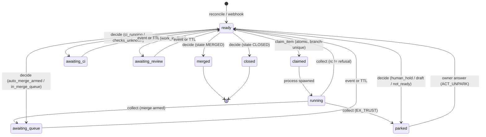

# Agent pipeline v2 — the scheduler daemon

The autonomous runner that takes a labelled GitHub issue to a merged PR. This file is the
**architecture and state-machine** half: what the daemon is, how an item moves, and which
GitHub field combinations it is defined for. It deliberately does not re-derive four things that
already have owners — read them alongside:

| For | Read |
|---|---|
| The label contract (who waits on whom, how to write an executable issue) | [`AGENT_WORKFLOW_PLAYBOOK.md`](AGENT_WORKFLOW_PLAYBOOK.md) |
| What each agent is told to do in each MODE | `scripts/agent-pipeline/RUNBOOK.md` |
| Claude-vs-Ollama lane routing and model tiers | [`agent-pipeline-routing.md`](../scripts/agent-pipeline/docs/agent-pipeline-routing.md) |
| The trust boundary and why a label is not an access control | [`contribution-security.md`](contribution-security.md) |

Operating commands live on the box in `scripts/agent-pipeline/v2/README.md`, which `install.sh`
copies there.

**Status: live since 2026-08-10.** `LEMD_SHADOW=0`, `V1_RETIRED` present, `lem-agentd` enabled.
v1 (`tick.sh`) survives only as a heartbeat-gated 15-minute failsafe.

---

## 1. Why v2 exists

v1 gave one cron tick to ONE unit of work. Measured over 2,456 recorded ticks:

| Symptom | Measurement |
|---|---|
| Ticks spent re-polling GitHub for unchanged answers | **75–84%** (1,103 of 1,464 dispatches) |
| Hard ceiling on work, regardless of `MAX_AGENTS=5` | 288 units/day (one per 5-min tick) |
| Concurrency actually used | slot ≥2 on **39 of 2,456** ticks |
| Worst single incident | one wedged PR consumed **45 of 62** ticks in 6 hours |

The thing being polled is fast: PR CI ~3 min, merge queue median 3.8 min. The pipeline was never
GitHub-bound, it was tick-bound. v2 keeps every guard v1 earned and changes only *when* work runs.

---

## 2. The loop

One process, one loop. `Daemon.tick()` (`v2/lemd/daemon.py`) runs these in order, and the order is
load-bearing:

```
heartbeat        write state/lemd.heartbeat        (the watchdog's liveness signal)
collect          reap finished runs                 ← runs even while PAUSED, or a pause
                                                      would strand claims and branch locks
── if PAUSED: stop here ──
drain_events     webhook rows  → items.dirty=1      (≤200 per pass)
reconcile        GitHub labels → the queue          (every 600s, or 120s degraded)
refresh_usage    subscription meter → state/usage.json
observe_dirty    changed items → decide()           (≤25 per pass)
sweep_ttls       expired waits → decide()           (≤25 per pass)
act              fill both pools with what decide() already decided
```

Then it sleeps `max(1, min(60, next_wake, next_reconcile))`. **A waiting item costs nothing** —
that is the entire economy change. An item awaiting CI, review, the merge queue or a human is not a
candidate for anything until an event marks it dirty or its TTL fires.

**Three wake paths**, each a backstop for the one above:
1. **Webhook** (`lemd.receiver`, port 8420) — the fast path. HMAC-verified, deduped on
   `X-GitHub-Delivery`, writes an event row and `kv:last_webhook_at` in one transaction.
2. **Reconcile** — re-derives the queue from GitHub labels on a timer, so a missed delivery costs
   latency and never work.
3. **Watchdog** (`lem-agentd-watchdog.timer`, every 15 min, as root) — restarts the daemon when the
   unit is dead **or** the heartbeat is older than 600s. Liveness and freshness are separate
   questions; a wedged process passes the first and fails the second.

Events never decide anything. They only say *"this item changed, look again"*, which is what makes a
duplicate or out-of-order delivery harmless.

---

## 3. The item state machine



`claimed` and `running` are **active states**: `upsert_item` refuses to move an item out of them, so
only the run lifecycle (`collect`, crash recovery) can, which makes every such transition auditable.

The claim is not a lock but an **index**: `items_active_branch` is a partial unique index over
`branch WHERE state IN ('claimed','running')`, so "two workers on one branch" is unrepresentable
rather than merely guarded.

| State | Meaning | Leaves on |
|---|---|---|
| `ready` | dispatchable, or awaiting a decision | act(), or the next observation |
| `claimed` | won the claim, not yet spawned | spawn, or `startup_recover` |
| `running` | a child process is alive | collect(), or `wake_at = now + max(60, timeout)` |
| `awaiting_ci` | CI running, or checks unreadable | event, or `LEMD_TTL_CI` (1800s) |
| `awaiting_review` | work in flight elsewhere | event, or `FIRST_REVIEW_TIMEOUT_SECONDS` (3600s) |
| `awaiting_queue` | auto-merge armed or in the queue | event, or `LEMD_TTL_QUEUE` (900s) |
| `parked` | the owner's, not the pipeline's | an owner answer, or `LEMD_TTL_PARKED` (21600s) |
| `merged` / `closed` | terminal | — |

---

## 4. The decision table

`observe.decide()` is **pure** — no network, no clock, no database. Every input arrives in a
`Snapshot`, so every transition is testable exactly, including the ones that only happen when GitHub
is lying. This table is that function, in evaluation order. Order encodes priority.

`tests/unit/test_agent_pipeline_v2_decision_table.py` asserts this table and the code agree — every
reason below exists in `observe.py`, and every reason in `observe.py` appears below.

### Terminal facts, then unreadability, then admission

| # | Condition | Action | Reason | Wake |
|---|---|---|---|---|
| 1 | GitHub state `MERGED` | close | `merged` | — |
| 2 | GitHub state `CLOSED` | close | `closed_unmerged` | — |
| 3 | any required read failed | none | `github_unreadable` | 300s |
| 4 | not admissible | none → parked | `not_admissible:{fork_pr,release_pr,no_agent_label,unreadable}` | never |

**Unreadable is a decision to do NOTHING**, never a decision to proceed. v1 merged on an unreadable
state once (#1082) and re-enqueued 154 times. Admission is by LABEL and PROVENANCE, never by author —
excluding "Dependabot PRs" by author would retire the depfix lane, which exists to run an agent ON a
Dependabot PR.

### The owner's hold outranks every lane

| # | Condition | Action | Reason | Wake |
|---|---|---|---|---|
| 5 | hold label + actionable answer | unpark | `owner_answered` | — |
| 6 | hold label + `hold`/`question` answer | none → parked | `human_hold:{verdict}` | 6h |
| 7 | hold label + an answer already spent | none → parked | `human_hold:answer_already_routed` | 6h |
| 8 | hold label, no answer | none → parked | `human_hold` | 6h |

`HOLD_LABELS = {needs-human, agent:blocked}`. A held item carrying no `agent:*` label is still
admitted (row 4 makes an exception) — otherwise an item parked with only `needs-human` would be
unanswerable, and the owner's reply to their own issue would be read, classified, and discarded.

**Ambiguity never starts a build.** A reply that leads with `1B` and then says "but don't merge until
Friday" reads as `hold` and stays parked.

### Issue lanes

| # | Condition | Action | Reason | Wake |
|---|---|---|---|---|
| 9 | `agent:ready`, work state unreadable | none | `start_work_state_unreadable` | 600s |
| 10 | `agent:ready`, work exists, open PR | none | `start_already_produced_work` | 1h |
| 11 | `agent:ready`, work exists, **no PR** | dispatch `start` | `stranded_branch_no_pr` | — |
| 12 | `agent:ready`, no work | dispatch `start` | `issue_ready` | — |
| 13 | `agent:working`, unreadable | none | `working_claim_state_unreadable` | 600s |
| 14 | `agent:working`, work exists, open PR | none | `working_claim_has_work` | 1h |
| 15 | `agent:working`, work exists, no PR | dispatch `start` | `stranded_branch_no_pr` | — |
| 16 | `agent:working`, no work | dispatch `start` | `working_claim_stranded` | — |
| 17 | neither label | none → parked | `issue_not_ready` | never |

Rows 10–11 are one question asked two ways. "Did anything leave the box" is right for *must I avoid
forking this*; it is wrong for *will anyone ever finish it*. A branch with an open PR is in flight; a
branch with no PR is a `start` that pushed and then died — resumable, and re-dispatching it resumes
on the existing branch. Linked PRs are consulted **before** the `feature/claude-issue-N` convention,
because PR #1302 carries issue #1301 on a differently-named branch and a convention-only lookup would
call that live PR stranded.

### PR lanes, cheapest-to-unblock first

| # | Condition | Action | Reason | Wake |
|---|---|---|---|---|
| 18 | draft | none → parked | `pr_is_draft` | 6h |
| 19 | `mergeStateStatus == DIRTY` | dispatch `rebase` | `conflicts_with_main` | — |
| 20 | label `agent:revise` | dispatch `revise` | `owner_requested_changes` | — |
| 21 | label `agent:depfix` | dispatch `depfix` | `dependabot_ci_failure` | — |
| 22 | label `agent:docfix` | dispatch `docfix` | `lint_gate_failure` | — |
| 23 | auto-merge armed | none | `auto_merge_armed` | 15m |
| 24 | checks unreadable | none | `checks_unknown` | 300s |
| 25 | a required check failed | dispatch `fix` | `required_checks_failing` | — |
| 26 | checks pending, or zero checks | none | `ci_running` | 30m |
| 27 | unresolved Copilot threads | dispatch `review` | `unresolved_review_threads` | — |
| 28 | no review at/after the head | dispatch `selfreview` | `no_fresh_review` | — |
| 29 | already in the merge queue | none | `in_merge_queue` | 15m |
| 30 | green, reviewed, threads clear | **merge** | `gate_satisfied` | 15m |

Row 23 sits above row 24 deliberately. An armed PR reporting `BLOCKED` is the normal, healthy state
of a PR waiting on required checks; without this the ladder fell through to `gate_satisfied` on every
pass and burned the per-head merge budget in three minutes (measured on #1295).

Row 28's freshness is **stricter than v1's**: a review must be at or after the head commit, full
stop. Being wrong in this direction costs one extra selfreview; being wrong in the other merges code
no reviewer saw. Row 26 treats zero checks as pending, not green.

---

## 5. The GitHub field matrix

The point of this section is the **Undefined** column. Every cell that is not handled is a cell where
behaviour is incidental.

| `mergeStateStatus` | Handled? | What happens today |
|---|---|---|
| `CLEAN` | ✅ | falls through to the checks/review ladder |
| `DIRTY` | ✅ | row 19 → `rebase` |
| `BLOCKED` | ⚠️ incidental | falls through. Usually a draft or a missing required check, so the ladder answers correctly — but by accident, not by decision |
| `UNSTABLE` | ⚠️ incidental | falls through and can reach `gate_satisfied`. Correct — `checks_for` filters to required contexts, so non-required red is mergeable — but never decided |
| `BEHIND` | ❌ **undefined** | no rebase is dispatched; relies entirely on the merge queue |
| `UNKNOWN` / `""` | ❌ **undefined and unsafe** | reads as "not DIRTY" and proceeds. GitHub computes mergeability asynchronously, so this is the #1082 shape: an unreadable field treated as a healthy one |
| `HAS_HOOKS` | ❌ undefined | falls through, untested |

**Label combinations**

| Combination | Today |
|---|---|
| two lane labels (e.g. `agent:revise` + `agent:docfix`) | first match wins by source order; undocumented, and the second lane waits for the first to remove its own label |
| `agent:merge-parked` | removed by `unpark.sh`, **written and read by nothing** in v2 — v1 provenance |
| hold label + lane label | hold wins (row 5-8), lane label inert until un-parked |
| hold label + **auto-merge armed** | ❌ **the daemon holds and GitHub merges anyway** — see §7 |

**Draft × hold**

| | Held | Not held |
|---|---|---|
| Draft | parked; the answer lane can release it | ❌ parked with no label, no comment, no question — and the answer branch lives *inside* the hold check, so an owner reply cannot reach it |

---

## 6. Budgets, interrupts, and how work ends

**The ledger is the ONE budget store** (`lib/ledger.sh`, one TSV per item). Charged at DISPATCH,
before the run starts, so a timeout, a crash and a max-turns exhaustion all consume budget — the
counters it replaced charged only on success shapes, which is exactly backwards. `policy.py` reads it
and never writes.

| Mode | Pool | Budget | Timeout |
|---|---|---|---|
| `start` | agent | 2 | 2700s |
| `fix` | agent | 4 | 1200s |
| `review` | agent | 3 | 900s |
| `selfreview` | agent | 2 | 1200s |
| `rebase` | agent | 2 | 1200s |
| `revise` | agent | 2 | 1500s |
| `depfix` | agent | 3 | 1200s |
| `docfix` | agent | 3 | 600s |
| `merge` | gh | 3, keyed **per head SHA** | 180s |
| `park` / `unpark` | gh | 3 | 180s |
| `phasefix` | — | 2 | 600s — **never emitted by `decide()`** |

Timeouts stretch up to 1.5× at full pool occupancy. `merge` is the only per-head budget: the merge
queue judges heads, so a new head is genuinely a new question. Everywhere else a per-head key would
let an agent refill its own meter by pushing a commit.

**Exit codes carry meaning** — collapsing them is how v1 retried a refusal every five minutes:

| Code | Means | Daemon does |
|---|---|---|
| `EX_TRUST` 70 | provenance refused or unreadable | park, 6h TTL — answered by a human, not a timer |
| `EX_BUDGET` 71 | this (item, mode) is spent | park `{mode}_exhausted` |
| `EX_BUSY` 72 | another claimant holds the branch | retry in 120s |
| `EX_SETUP` 73 | environment not preparable | ⚠️ treated as a plain failure — no backoff |
| `RC_KILLED` -9 | we stopped it on its deadline | re-observe |
| `RC_VANISHED` -99 | its process was already gone | re-observe |

`RC_KILLED` and `RC_VANISHED` are separate because collapsing them cost a real misdiagnosis: nine
runs closed `-9` with a ~675s mean read exactly like a timeout problem, and were adopted orphans from
16 daemon restarts.

**How work ends.** A park is the pipeline saying "I stopped". The ONE way out is an owner reply to
the Decision Comment, classified by `lemd/answers.py`: `answer`/`directive` un-park, `hold`/`question`
stay parked. An answer is spent once (`items.last_comment_id`), written only after the un-park
succeeds so a failed action retries.

Un-parking **resets the ledger** — the owner's answer is the statement "the world changed, try
again". That is also the shape of the pipeline's biggest remaining gap: see §7.

---

## 7. Intended state — what is NOT true yet

Everything above is what the code does today. This section is what it *should* do, each item with its
issue. It exists so the gaps are visible rather than discovered one incident at a time.

| Gap | Why it matters | Issue |
|---|---|---|
| **A human hold does not disarm auto-merge.** Only `park.sh` runs `--disable-auto`. A hand-applied `needs-human` on an armed PR is honoured by the daemon and ignored by GitHub, which merges when the gate clears | safety — a merge nobody authorised | TBD |
| **There is no terminal state.** Every dead end is "park and ask", forever. Un-parking resets the ledger and buys N more runs; `parked_reason` holds only the latest, so nothing counts laps. A non-converging PR costs one human decision per lap, indefinitely | this is the flow-logic gap | TBD |
| **Interrupts charge budget they never used.** A daemon restart during active runs burns `start` budget across the fleet, and a killed `start` that pushed before dying is the only way into the stranded-branch state | restarts tax the whole backlog | TBD |
| **`UNKNOWN` mergeability reads as healthy** (§5) | the #1082 shape, unfixed | TBD |
| **Lane-label precedence is incidental**, and `agent:merge-parked` is vestigial (§5) | | TBD |
| **A human-drafted PR is unreachable** by automation *and* by an owner reply (§5) | | TBD |
| **`collect()`'s `child.mode == "merge"` branch is unreachable** — `dispatch_gh(action="merge_enable")` names the child `merge_enable`. The #1295 protection is dead code, masked today by row 23 | a guarantee the comments claim and the code does not provide | TBD |
| **`USAGE_PAUSE_MINUTES` never reaches `lane_for.py`** — `config.env` says 120, the bounded self-review wait uses the default 60 | | TBD |
| **`LEMD_GH_SLOTS` (status.sh) vs `MAX_GH_ACTIONS` (config.py)** — two names, one setting | | TBD |
| **`status.sh` omits `unpark`** from the gh pool, so an in-flight un-park is charged to the agent pool | | TBD |
| **Dead code**: `capacity.compute()` and `spend.state()/choose_lane()/record()` have no callers; live caps are the flat `LEMD_MAX_AGENTS`. `phasefix` is unreachable. `items.issue_number/risk/model_hint` are never written | | TBD |
| **v2 has no phase guard.** v1 held a PR closing a phased issue whose later phases were untracked (`tick.sh:717-741`); v2 merges it | a shipped issue can silently lose its remaining scope | TBD |
| **The pipeline has no deploy path.** Not in the Docker image, no workflow — it reaches the VPS only when a human runs `install.sh --sync` | main and the box can diverge silently | TBD |

---

## 8. Deploy and operate

**The pipeline is not in the Docker image.** `scripts/agent-pipeline/` is the source; `install.sh`
copies it to `/home/lem/agent-pipeline` on the box. The release train ships the *app*, never the
runner — so a merged pipeline change is not live until someone syncs it.

```
install.sh              first install (also touches PAUSED)
install.sh --sync       update only files the box has not edited
install.sh --sync --force   overwrite box edits, after reading the diff
```

`--sync` refuses a file whose on-box hash differs from both the repo and the recorded manifest — a
box-local edit is never silently overwritten.

| Unit | Runs as | Does |
|---|---|---|
| `lem-agentd.service` | `lem` | the scheduler. `KillMode=process` so 45-minute agent children survive a restart |
| `lem-agent-webhook.service` | `lem` | the receiver, hardened, `MemoryMax=256M`, secret from a root-owned file |
| `lem-agentd-watchdog.timer` | root | liveness + heartbeat freshness every 15 min |
| `lem-gh-token.timer` | root | mints the App installation token every 45 min; root holds the key |
| `lem-agent.slice` | — | the CPU/memory envelope (`CPUQuota=300%`, `MemoryMax=3G`). **Box-only — not in the repo** |

```bash
systemctl status lem-agentd            # is it alive
scripts/agent-pipeline/status.sh       # what is it doing
tail -f logs/lemd.log                  # the loop
jq . logs/lemd-decisions.ndjson | tail # every decision, with its reason
sqlite3 v2/state/queue.db 'select kind,number,state,pending_mode from items where state!="merged"'
touch PAUSED                           # stop everything (shared with v1)
v2/rollback.sh                         # hand dispatch back to v1
```

**Pause vs retire.** `PAUSED` stops both runners. `V1_RETIRED` demotes v1 to the failsafe cron and is
what `cutover.sh` writes — deliberately not `PAUSED`, because `tick.sh` exits unconditionally on
PAUSED and that would disable the failsafe too.
