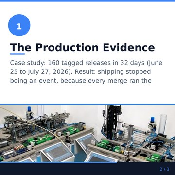
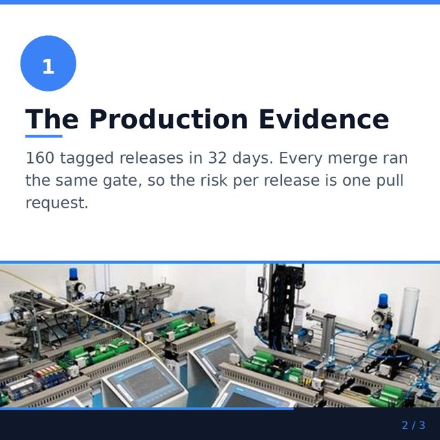
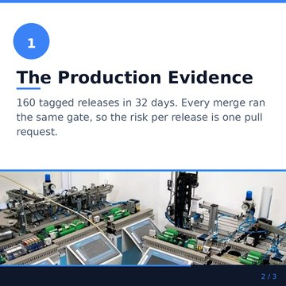
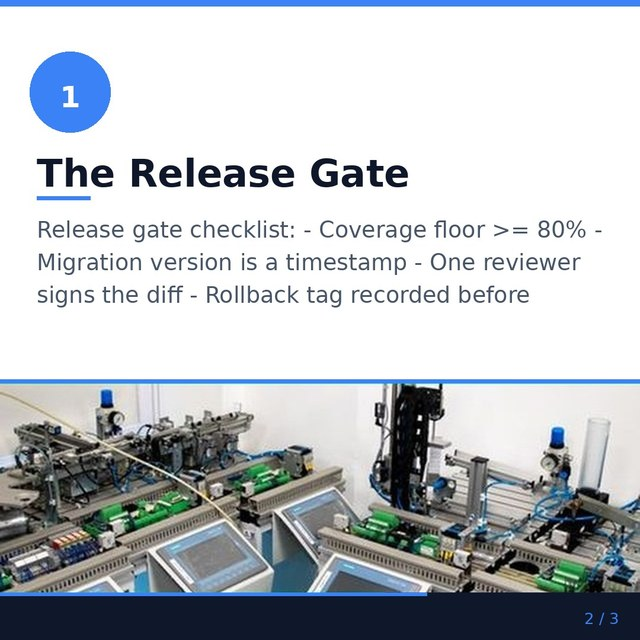
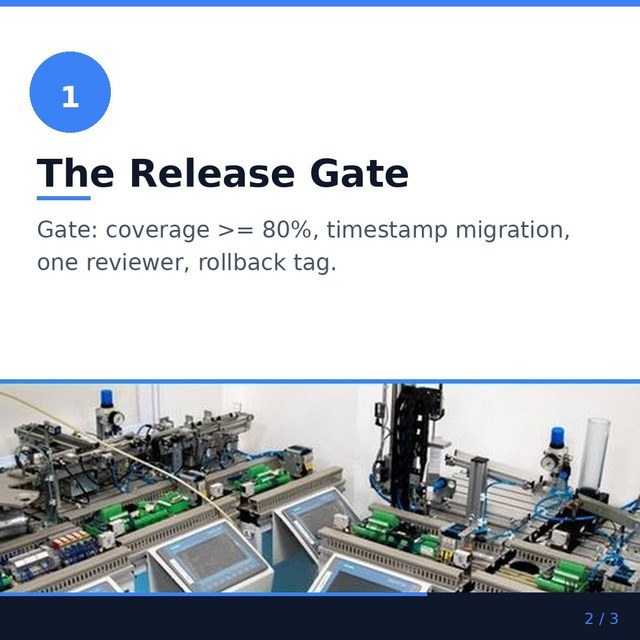
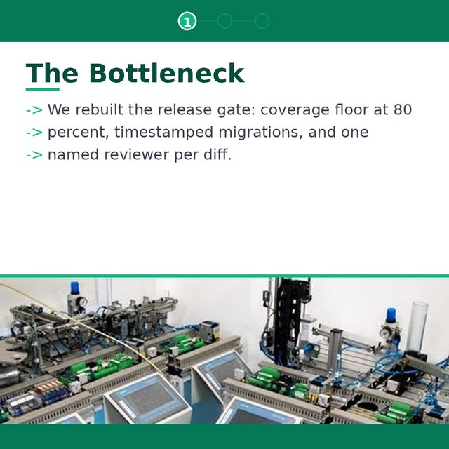

# Content-quality audit — LEM's CAROUSELS

Issue #1139. Audited 2026-08-14 against `main` @ `a6d46b0d`.

The deck already has two graders. `deck_reference_report` (#728) asks whether every body slide
carries something reusable, and `_report_carousel_fact_grounding` (#619/#728) asks whether the
specifics are backed by the story bank. Both grade the **generated JSON**. This audit asks the
question neither of them can — *what does the reader actually see on the slide?* — and grades the
machinery that turns that JSON into 1080×1080 PNGs.

Owning pipeline: `create_carousel_content` → `_select_carousel_blueprint` →
`ai_helper.generate_carousel_content` → `carousel_creator.create_carousel_slide_images`
(`src/cqc_lem/app/run_content_plan.py`, `src/cqc_lem/utilities/carousel_creator.py`). Owning docs:
`docs/content-core.md`, `docs/image-stack.md`.

**Headline:** the writer side and the render side were never compared, and the render side always
wins silently. The generator is told a slide body may be **200 characters**; the schema accepts
**500**; the four layouts the plan actually selects draw at most **99–193**, and every one of them
is under the 200 the prompt hands the writer. The overflow
is not shrunk, wrapped or marked — `_draw_block` simply stops at its `max_lines` and the rest of
the sentence is gone. The same renderer discards the line structure the deck was written with (a
checklist arrives as run-on prose), invents structure it was not given (`step_framework` stamps an
arrow bullet on every WRAPPED line, so one sentence becomes three bullets), and stamped
*"Leave a comment below"* onto the closing slide of the default template — the exact engagement
bait `save_worthy_directive` forbids the writer, baked into an image no gate can strip (F4, fixed
in #1511). None of it
failed, because on every one of these seams the two sides never read each other.

---

## 1. What could and could not be sampled

The issue asked for 8–12 recently-shipped carousels via `db.py`, a real high-engagement LinkedIn
carousel fetched with LEM's scraper, and rendered before/after slides. A **Decision Comment** on
#1139 recorded that none of the live inputs are reachable from a headless agent worktree; the owner
answered **`1A 2A 3A`** on 2026-08-10: run the code-grounded audit, ship no code in this PR, and use
an in-repo gold standard as the reference exemplar. This section states the limits that answer left
standing.

| Asked for | What was actually available | Why |
|---|---|---|
| 8–12 shipped decks via `db.py` | **0 deck rows.** Slide-level evidence comes from the 6 REAL shipped slides already committed to this repo by the #1292 phase-2 pass (`assets/1292/car8{6,7}_slide*.jpg`, posts 86 and 87) | Reading `posts` / `post_carousel_slides` needs production MySQL credentials the pipeline runbook forbids touching. Owner option **1A** |
| A real fetched LinkedIn exemplar | **Not fetched.** Rubric-only, plus the named in-repo exemplar in §4 | A live authenticated Selenium session is a runbook escalation. The issue's own fallback clause covers it; owner option **3A** picked the in-repo standard |
| Rendered before/after slides | **Rendered here** — §5. Every image in §5 comes out of the REAL `create_carousel_slide_images`, run locally against this branch | The renderer is pure Pillow: no DB, no LLM, no network. That is the read path this audit is built on, and it is why the numbers in §2/§3 are measurements rather than estimates |
| Per-deck quality telemetry | **None exists.** `content_quality.surface` is `post` / `comment` / `newsletter` — there is no deck surface, and `post_outcome` carries no post type | Finding **F6** |

**How the measurements were taken.** A probe wrapped `PIL.ImageDraw.text` to record every string the
renderer actually paints, rendered decks through the unmodified `create_carousel_slide_images`, and
diffed the input slide body against the painted text. "Capacity" below is the largest body that
reaches the image intact, per template, per slide role, measured — not derived from font metrics.
The probe itself is deliberately NOT committed (option 2A is docs-only), and it is four lines:
monkeypatch `PIL.ImageDraw.ImageDraw.text` to append its string to a list, monkeypatch
`carousel_creator.select_slide_image` to return a fixed local JPEG (the band branch is the
production one), render a deck, then check whether the whole normalised body appears in the
recorded strings — ignoring the layout chrome the same call draws (`->`, `1 of N`, `n / total`).
Sweeping the body length in 5-char steps gives the table below.

### Measured render capacity — the largest slide body that survives, in characters

| Template | Selected for | Cover | **Body slide** | CTA |
|---|---|---|---|---|
| `bold_listicle` (`DEFAULT_TEMPLATE`) | awareness | 117 | **142** | 117 |
| `step_framework` | consideration | 133 | **193** | 142 |
| `stat_reveal` | decision | 142 | **99** | 133 |
| `story_arc` | personal / story (preview route) | 133 | **142** | 142 |
| `minimal_dark` | nothing — Content Studio override only | 200 | **148** | 205 |

Body-slide figures are measured **with the photo band**, which is every body slide in production:
`CAROUSEL_IMAGE_RATE` defaults to `1.0` and `CAROUSEL_IMAGES_ENABLED` to `True`, so every content
slide asks for an image and the band branch takes the tighter of the two line caps. Text-only, the
same layouts hold 254–290. Every stage-selected template — all four of them — holds **less than the
200 characters the generator prompt allows**.

**These are per-STRING measurements, not constants — never size a budget at a figure in this table.**
The wrap is greedy on word boundaries, so where a line breaks (and therefore how many characters the
last drawn line carries) depends on the words, not only on their count. Each figure above is the
largest length that survived for the probe string used here, refined to the character at the
boundary. Re-measuring the same layouts with a DIFFERENT body — a second sweep in 5-char steps,
reported at the last surviving step — moves them by up to 8 characters in either direction:
`bold_listicle` 125 / ≤140 / 125 (cover / body / CTA) against 117 / 142 / 117 here, `stat_reveal`
140 / 100 / 135 against 142 / 99 / 133, `story_arc` 135 / 145 / 145 against 133 / 142 / 142. The
band is stable; the exact number is not. Read the table as "this layout holds roughly this much",
and treat any character budget a fix adopts as something to VERIFY by rendering — which is F1's
missing test, not a number to copy out of here.


**Read the capacities as this branch's behaviour, not as a threshold.** They say what the layout can
hold, not what a slide SHOULD hold. Published 2026 guidance converges on ~25–50 words (≈150–300
chars) per slide, so most of these caps are defensible on their own terms — `stat_reveal`'s 99 chars
(~15 words) is the one that is tight even by that standard. The defect is not the size of the cap.
It is that nothing upstream knows the cap exists.

---

## 2. The rubric

Grounded in this repo's own invariants, not generic taste. Each row names the ONE place that owns
it, and the verdict is against what the pipeline does today.

| # | Rubric row | Owned by | Verdict |
|---|---|---|---|
| R1 | **The first slide earns the swipe** — a promise, not a title page | `save_worthy_directive`, `hook_constraint_directive` (only when the archetype has hook styles), `_*_cover` layouts | **PASS on the writer side, UNCHECKED on the render side.** The directive requires the cover to promise what the reader gets and how many parts it has, and every cover layout renders a `1 of N` pill and a swipe hint. Nothing measures the cover the way `hook_report` measures a post's first line, and the cover's own body clips at 117 chars on the default template (F1) |
| R2 | **Per-slide readability at LinkedIn's render size** | `_load_font` sizes + `_draw_block(max_lines=…)` | **FAIL.** Type size and contrast are fine — 36–38px body on 1080px is ~24pt, inside published guidance, and legible at the 360px feed width (§5). What fails is FIT: the body is silently amputated at the line cap (F1), and the deck's own line structure is destroyed (F2, F3) |
| R3 | **Slide count in the effective range for the family** | the `conlist` bounds on each carousel model + the `schema_hint` in `generate_carousel_content` | **PARTIAL.** Educational/Insights ask for 2–4 body slides (4–6 total), CaseStudy renders 5–6, ProductDemo 4–5, and the schema floor allows a **3-slide deck** (cover + 1 + CTA). Published 2026 consensus is 6–10 slides. LEM sits at or below the bottom of that band by construction, and nothing enforces even its own 2–4 ask. Sized, not calibrated — no measured corpus here, so no number is moved |
| R4 | **Visual consistency + the image-stack rules** | `CAROUSEL_TEMPLATES`, `avatar/guardrails.avatar_allowed_for`, `build_image_brief(surface="carousel")` | **PASS on the rules, ABSENT on the brand.** No text or logo is ever rendered into a generated slide image (the brief engine owns the prompt, #1290 wired the vision gate + focal concept), and a likeness only appears where the guardrails allow. But the palette is one of five fixed template palettes chosen by BUYER STAGE, so a user's decks change look between stages, and `client_logo_url` is consumed by no layout — there is no per-user brand anywhere in a deck |
| R5 | **Per-slide copy quality — the same bar as a text post** | `evaluate_post_gates` (caption only), `deck_reference_report` (slides) | **FAIL.** The caption runs the full suite; the SLIDES run one gate. `slop_lint`, `AI_TELL_WORDS`, `POST_BANNED_SCAFFOLDS`, the bait-closer check, the similarity gate and the authenticity judge never see a slide body — and on a document post the slides ARE the post. A carousel is also never authenticity-scored at generation at all (F5) — **both halves addressed in #1512**: the slides now get the existing slop lint (advisory), and the caption is judged at generation like any other post |
| R6 | **Blueprint-to-buyer-stage fit** | `_select_carousel_blueprint` → `carousel_blueprint_directive`, `_template_by_stage` | **PASS, and the strongest part of the pipeline.** Carousels rotate through the SAME post archetype menu as text posts and write into the same V51 shape history, so a deck cannot repeat the shape the last text post used; fact-anchored archetypes are taken OFF the menu when the writer has no verified anchor, precisely because slide text cannot be corrected after the render |
| R7 | **A real closing CTA slide, not a trailing summary** | the `call_to_action` field on every carousel model; `_*_cta` layouts | **PARTIAL → the worst live failure.** Structurally every deck ends on a dedicated CTA slide, and `save_worthy_directive` asks for a soft "save this for the next time you…". In production that slide (a) rendered a hardcoded **"Leave a comment below"** bait pill on the default template until #1511 replaced it with the directive's own save ask (F4) and (b) clips at 117 chars, which is how post 87 shipped its closing ask as *"Save this for your next sprint retrospective to spark the"* |
| R8 | **The slide's photo depicts the slide's idea** | `derive_image_query` → `get_pexels_image_path` | **FAIL, unchecked.** `CAROUSEL_IMAGE_RATE` defaults to 1.0, so every body slide gets a photo band; the query is 2–4 keywords from an `lem-simple` call (heuristic fallback) and the first Pexels hit is used with no relevance check. The `lem-vision` gate #1290 wired covers only the AVATAR generation path, which is off by default (`CAROUSEL_REPLICATE_ENABLED=False`). This is the mechanism behind the two off-topic bands #1292 already recorded — a PLC photo under a software-release claim, a CD wallet under an agent-pipeline claim |

---

## 3. Findings

Nothing in this section is fixed in this PR — owner option **2A** made it audit-only, so every
finding is filed and linked in §6.

### F1 — Three different slide-length contracts, and the shortest one wins silently → **#1375**

| Layer | What it allows | Where |
|---|---|---|
| Schema | **500 chars** | `CarouselSlide.content = Field(..., max_length=500)` |
| Prompt | **"1-3 engaging sentences (max 200 chars)"** | `generate_carousel_content` |
| Renderer | **99–193 chars** on a body slide, 117–142 on a cover or CTA (stage-selected templates, production config, §1) | `_draw_block(..., max_lines=3 if band_top else 7)` and its siblings |

`_draw_block` iterates `lines[:max_lines]`. There is no ellipsis, no shrink-to-fit, no warning, and
no telemetry: the remaining lines are simply never drawn. Because `CAROUSEL_IMAGE_RATE` defaults to
**1.0**, every body slide gets a photo band, which is the branch with the SMALLER cap on every
layout — the production case is always the tighter one.

The compounding factor is that the pipeline actively pushes toward the overflow. `reference_slide_directive`
tells the writer to put a real command, threshold, number or checklist on every body slide and
"say it in full", and `deck_reference_report` **regenerates the deck** when it does not. A deck that
passes the reference gate is denser — and therefore likelier to be cut — than one that fails it.

**This corrects the diagnosis on #1375**, which attributes the clipping to python-pptx painting past
a placeholder. The published slides are not PPTX: `create_carousel_slide_images` composes them in
Pillow and `create_ppt` writes a separate downloadable deck. The fix belongs in `_draw_block` /
`_wrap_text` and in the prompt's character budget, not in the PPTX path. Measurements and
before/after renders are attached to that issue.

**FIXED in #1375.** `fit_text_block` now sits between the wrap and the paint on every block of every
layout: it re-wraps at a smaller size until the whole string fits the SAME pixel box the layout
reserved (down to `CAROUSEL_MIN_FONT_SCALE`, 0.7), and only then truncates — with
`CAROUSEL_TRUNCATION_MARKER` and a `log_warning`. `_draw_block` no longer takes a line cap, so the
silent-drop path is gone rather than guarded. The writer side reads the same constant the renderer
honours, `CAROUSEL_SLIDE_BODY_MAX_CHARS` (**150**), which is what `generate_carousel_content` states
in the prompt. Per the addendum above, that number is not copied out of the capacity table: it is
VERIFIED by rendering — `tests/unit/utilities/test_carousel_text_fit.py` renders a body of exactly
that length on all five templates in all three slide roles, with the photo band present, and asserts
the painted strings still contain the whole body. The four slides §5 recorded shipping clipped are
in the same test and render intact.

A character budget is not a pixel budget, so that test renders the budget in FOUR word shapes (prose,
all-caps, long-word, short-word): the same 150 characters set ~30% wider in caps, and three blocks
whose line caps were too tight to honour the budget at any shape — `bold_listicle`'s cover and CTA
subtitles (3 lines, now 4) and `stat_reveal`'s banded body (2 lines, now 3) — only showed up under
them. Those caps had no geometric reason to be that tight: with a body block ending ~590px the
`stat_reveal` photo band starts at 660px, and the cover/CTA subtitles end ~830px against a footer at
~1000px. A cap here is a text budget, not a layout edge — raise it rather than let a within-budget
body degrade.

### F2 — The renderer flattens the line structure the deck was written with → **#1510**

`_wrap_text` starts with `text.split()`, which splits on newlines as well as spaces. A slide body
written as the checklist the reference gate asks for:

```
Release gate checklist:
- Coverage floor >= 80%
- Migration version is a timestamp
- One reviewer signs the diff
- Rollback tag recorded before deploy
```

renders as one run-on paragraph — *"Release gate checklist: - Coverage floor >= 80% - Migration
version is a timestamp - One reviewer signs the diff - Rollback tag recorded before"* — and loses
its last word to F1 on the way (§5). `slide_artifacts` scores that exact text as
`['checklist', 'threshold', 'metric']`, so the deck passes the reference gate on the strength of a
structure the reader never sees.

**FIXED in #1510.** A newline is now the unit the renderer wraps: `_wrap_text` splits the body into
POINTS first (`_split_points` — one per non-empty source line, blanks dropped so they never spend a
line of a layout's cap) and wraps each on its own, so the checklist reaches the PNG as a checklist on
every layout. `_wrap_points` returns the same lines GROUPED by point, which is what a layout needs
when it draws a marker per point rather than per line (F3).

**Words outrank shape**, though, and structure costs vertical space: four points need four lines
where the flattened paragraph needed three, and a content slide carrying a photo band reserves
three — so honouring the line breaks ALONE cut a 112-character checklist (well inside
`CAROUSEL_SLIDE_BODY_MAX_CHARS`) on four of the five templates, trading F2 for F1. `_fit_flow` is the
ladder that keeps both: points first, then the type shrinks (#1375), then the points REFLOW to one
paragraph, and only a body that overflows even flattened is truncated. `_step_content` groups
against the text `_fit_flow` actually laid out, so a reflowed body is ONE bullet — never one per
wrapped line, which would be F3 by another road.

### F3 — `step_framework` bullets every WRAPPED line, not every point → **#1510**

`_step_content` draws a `->` marker per line returned by `_wrap`, so line breaks chosen by the
wrapper become bullet points:

> -> We rebuilt the release gate: coverage floor at 80
> -> percent, timestamped migrations, and one
> -> named reviewer per diff.

One sentence, three bullets, each starting mid-clause. `step_framework` is the CONSIDERATION-stage
default (`_template_by_stage`), i.e. the case-study deck. The marker is also drawn as ASCII `->`
because `_norm` maps `→` to `->` for the font's sake.

**FIXED in #1510.** `_step_content` bullets the author's points: it strips a leading marker the
writer typed (`_strip_point_marker` — `-`, `*`, `+`, `->` followed by a space; `1.` numbering is
content and is kept), fits the joined points through the same `fit_text_block` path as every other
block, then re-attaches the fitted lines to their points with `_group_fitted_lines` — recomputed at
the font actually DRAWN, so a shrink or a truncation cannot desynchronise the grouping. One `->` per
point at `PAD`, every line of that point (first and continuation alike) at the indent.
`tests/unit/utilities/test_carousel_line_structure.py` asserts the drawn line set — arrow count,
marker column, and that a wrapped sentence is ONE bullet — rather than that files were produced.

### F4 — The closing slide renders engagement bait the writer is forbidden to write → **#1511**

`save_worthy_directive` ends with: *"the call to action closes with a soft 'save this for the next
time you...' — **never engagement-bait**, never 'follow for more'"*. `_listicle_cta` then draws a
pill reading **"Leave a comment below"** above whatever CTA the model wrote. It is on the
awareness-stage default template and on `DEFAULT_TEMPLATE`, it is in the shipped
`assets/1292/car87_slide05.jpg`, and unlike a caption it cannot be repaired: `strip_engagement_bait`
and the `bait_closer` slop check operate on text, and this is pixels.

**FIXED in #1511.** The save ask is ONE constant in `content_framework`: `SAVE_ASK_STEM`
("save this") builds both `SAVE_ASK_PHRASE`, which `save_worthy_directive` hands the WRITER, and
`SAVE_ASK_PILL` ("Save this for later"), which `_listicle_cta` paints — so the render side cannot
ask for something the writer side forbids, the same one-list invariant `POST_BANNED_SCAFFOLDS`
carries for prompt vs lint. `tests/unit/utilities/test_carousel_cta_bait.py` renders every template
and asserts no slide PAINTS a bait imperative, judged by `contains_engagement_bait` (the ONE
detector) plus the literal imperatives it does not cover ("leave a comment").

### F5 — Slide text passes no text-quality gate at all → **#1512** (`risk:product-decision`)

What the CAPTION gets (`evaluate_post_gates`): slop lint (HARD holds), meeting-ask CTA, affiliate,
near-duplicate similarity, focus alignment, fact grounding, authenticity. What a SLIDE gets:
`deck_reference_report` and an advisory fact-grounding log. So a slide may carry a tier-1 tell word,
a `POST_BANNED_SCAFFOLDS` opener, an em-dash pileup or a bait closer and nothing anywhere records
it — on the format where the slides are what the reader reads.

Related and separately true: **a carousel post is never authenticity-judged.**
`_score_and_persist_authenticity` is called from `create_text_post` and `rescore_post` only, so
`authenticity_score` is NULL for a generated deck and the authenticity gate in `evaluate_post_gates`
is skipped by its own `is not None` guard. The caption of every carousel ships unjudged.

Filed as `risk:product-decision` because the useful version of the fix asks whether a slide-level
lint may HOLD a post. `_report_carousel_fact_grounding`'s advisory-only posture is deliberate and is
**not** touched by this audit or its PR, per the issue's own scope rule.

**SHIPPED (#1512).** `_report_carousel_slide_slop` now runs the EXISTING `slop_lint_report`
over the concatenated slide text (`_deck_text`, cover and CTA included — the reference gate's
`graded` exemption is about reusable artifacts, not about text quality) and records the verdict as
the ADVISORY `slide_ai_slop` finding on `posts.gate_reason`. Two mechanics make it readable: the
note is written where the slide text exists and re-read by `evaluate_post_gates`
(`_recorded_slide_slop_notes`) the same way the video probe's reason is, and a regenerated clean
deck clears it. `demoted=False` always — so nothing about which posts publish changes.

**Both product calls are now answered** — owner reply on PR #1554, recorded here because a decision
that lives only in a merged thread is a decision nobody can find later:

- **(a) A slide-level lint may NOT hold a post — advisory only.** Slide text is baked into rendered
  images with no review queue, so unlike the caption's `ai_slop` hold this one cannot be cleared by
  editing and re-scoring: the only remedy is regenerating the whole deck (a fresh
  `generate_carousel_content` call plus a full Pillow slide render and PPTX write, per held deck),
  and the slides then change wholesale. `slide_ai_slop` therefore stays `demoted=False` until the
  advisory finding has given us a base rate for how often a hold would fire. `slide_slop_finding`
  takes `demoted` as an argument, so flipping the posture later is one call site.
- **(b) A carousel IS authenticity-judged at generation.** `_score_carousel_caption_authenticity`
  scores the deck's CAPTION inside `create_carousel_content` — ONE judge call per deck
  (`score_authenticity` runs on `lem-medium`, not the `lem-complex` the Decision Comment estimated;
  the cost is smaller than that comment stated, and small next to generating the deck) — so
  `posts.authenticity_score` is populated and `evaluate_post_gates`' authenticity gate stops
  skipping itself on this post type. A low-scoring deck is now demoted to PENDING exactly as a text
  post is, and re-score works on it normally. The SLIDES are not judged: their reading is the
  deterministic lint above, because the judge grades text a reviewer can edit.

Both halves leave `_report_carousel_fact_grounding` advisory-only, as the audit's scope rule
requires.

### F6 — Carousels have no rendered-asset telemetry and no deck surface → **#1513**

Video posts got asset telemetry in #1281: `score_video_asset` records render outcome, duration,
aspect ratio and a file probe on the nightly beat. Carousels got no equivalent — the nightly pass
scores a carousel's CAPTION as `surface="post"` and never opens a slide. Consequences, all live
today:

- `content_quality.surface` has three values (`post`, `comment`, `newsletter`); a deck is not a
  surface, so there is no carousel trend line.
- `post_outcome` carries no post type, so "do carousels out-reach text posts?" is unanswerable from
  telemetry — for the format the whole save-worthy strategy is built on.
- Every finding above is invisible to monitoring. F1 has been shipping since the renderer existed
  and was found by a human looking at a JPEG.

**FIXED in #1513.** The renderer now writes a render receipt (`deck_render.json`, one row per slide:
role, written body length, characters drawn, characters DROPPED, photo band) next to the slides, and
the nightly beat turns it into ONE reading on a new `surface="carousel"`. What #1375 left visible on
one render — `_fit` marks and logs the cut it could not shrink away — is now a trended number across
all of them (`deck_chars_dropped` / `deck_slides_clipped`), rather than a human looking at a JPEG,
and `post_outcome` carries `post_type`, so reach and `saves` split by format. What #1513 does NOT do
is grade slide PROSE — that is F5/#1512, which grades it on the POST rather than as a deck
dimension — and the capacities in §1 stay measurements, not
thresholds: the deck reading reports what was dropped, it holds nothing.

### F7 — Observations recorded, not actioned

- **`minimal_dark` is unreachable from the plan.** `_template_by_stage` maps the four stages to
  `bold_listicle` / `step_framework` / `stat_reveal` / `story_arc`; `minimal_dark` is offered only
  through the Content Studio's explicit template override. Not a defect — it is a user-pickable
  style — but it is the one template whose capacities nothing in the scheduled path exercises.
- **Cover capacity is the tightest thing nobody looks at.** `bold_listicle` covers hold 117 chars of
  subtitle. The cover is where the promise lives, and R1 has no measurement.
- **`derive_image_query` spends an `lem-simple` call per body slide** (`CAROUSEL_IMAGE_QUERY_LLM`
  defaults on) to produce ≤4 keywords for a stock search that is then never checked (R8). Whether
  the call earns its keep is worth measuring once F6 exists.
- **A 3-slide deck is schema-legal.** `conlist(min_length=1)` plus cover and CTA. No deck observed
  here is that small, but nothing prevents it.

---

## 4. Reference-exemplar comparison (gauntlet-loop fallback, and why)

`.claude/skills/gauntlet-loop/SKILL.md` runs builder/critic pairs and blind-compares a BUILD against
a named reference exemplar. Owner option **2A** removed the build half of that loop — there is no
candidate change in this PR to compare — and option **3A** named the exemplar. So what ran is the
skill's discipline without its agents: a structured comparison of the carousel pipeline against a
named in-repo gold standard, stated as such rather than dressed up as a verdict trail.

**Reference exemplar (owner option 3A): the TEXT-POST quality contract** — `post_writing_directive()`
+ `POST_BANNED_SCAFFOLDS` + `slop_lint.canned_scaffold` + the #617 comment contract, audited in
`docs/content-quality-audits/text.md`. It is the right standard for three reasons: it solves the
same problem (templated sameness on a LinkedIn writing surface), it is the repo's own worked answer
to "the writer side and the checking side drifted apart", and both surfaces draw from the SAME
`content_framework` core, so a difference between them is a real gap and not a difference of medium.

| Property the exemplar has | Carousel equivalent today | Verdict |
|---|---|---|
| ONE shared list the prompt names and the lint greps (`POST_BANNED_SCAFFOLDS`), so writer and checker cannot drift | The slide length budget is stated in the prompt (200), in the schema (500) and implemented in the renderer (99–193). Three numbers, no shared constant, no test | **Gap — F1.** This is the exemplar's central invariant and the carousel path violates it three ways |
| A deterministic check with a named severity, reported per finding (`slop_lint`, WARN vs HARD) | `deck_reference_report` is deterministic and reason-carrying — genuinely exemplar-grade — but it grades reusability only. Nothing grades the slide's PROSE | **Partial — F5.** The mechanism exists and is good; the coverage stops at one dimension |
| The gate grades the artifact that ships (#1264 moved the authenticity call to the end for exactly this) | Every carousel grader reads the JSON. The artifact that ships is a PNG, and nothing reads it | **Gap — F1/F6.** The deck's own graders can pass a slide whose rendered text ends mid-word |
| One retry, then keep, with the reason logged — never an unbounded loop, never a silent drop | `deck_reference_max_attempts()` = 2, reasons logged, keeps the previous deck on a failed retry | **Match.** The one place the carousel path is fully exemplar-grade |
| A regression test pinning writer and checker to each other (`test_post_prompt_scaffold_drift.py`) | `tests/unit/utilities/test_carousel_slide_images.py` asserts file count and paths. No test renders text and measures whether it survived | **Gap — F1.** The absent test is what let F1 ship |

**Stated limitation:** this is a comparison, not a blind A/B. No builder or critic agent was run, no
output was label-stripped, and no round was capped — because with no code change in scope there was
nothing to compare blind. Read §4 as reasoning against a named standard, which is what the skill
exists to force, not as a gauntlet-loop result.

---

## 5. Before / after — rendered slides

Every image below is real output of `create_carousel_slide_images` on this branch (`bold_listicle`,
one body slide, photo band present — the production configuration). The ONLY difference between a
"before" and its "after" is the input string: **no code was changed to produce the afters.** The
band photo is cropped from a slide LEM actually shipped (`assets/1292/car87_slide03.jpg`), so the
image path is real too. Each pair is also shown at **360px — the width a LinkedIn feed gives an
image on mobile**, which is where readability is decided.

### Pair 1 — a body slide written to the prompt's own 200-char allowance

| | Slide | At feed width (360px) |
|---|---|---|
| **Before** — 196 chars written |  |  |
| **After** — 107 chars written |  |  |

| Measure | Before | After |
|---|---|---|
| Body chars written | 196 (inside the prompt's "max 200") | 107 |
| Body chars rendered | **139** | 107 |
| Chars silently dropped | **57** | **0** |
| Where the sentence stops | *"…because every merge ran the"* | it doesn't |
| Slide states its number | yes (160 releases / 32 days) | yes — the specific survives the cut |

The "before" is not a pathological input. It is a slide written to the generator's own instruction,
carrying exactly the reference value `deck_reference_report` demands, and it is the same failure the
live post 87 shipped (`assets/1292/car87_slide03.jpg`).

### Pair 2 — the checklist slide the reference gate asks for

| | Slide | At feed width (360px) |
|---|---|---|
| **Before** — 5 lines, 150 chars |  |  |
| **After** — one line, 71 chars |  |  |

| Measure | Before | After |
|---|---|---|
| Line breaks the writer supplied | 4 | 0 |
| Line breaks that survive the render | **0** | n/a |
| Chars dropped | 7 (*"…recorded before"*, losing "deploy") | 0 |
| `slide_artifacts` verdict | `['checklist', 'threshold', 'metric']` | `['threshold', 'metric']` |
| What the reader sees | a paragraph with stray hyphens | a sentence that fits |

The gate scores the "before" HIGHER (it sees a checklist) than the slide that actually reads as one.
That is F2 in one table: **the reward and the render disagree**, and the reward wins the regeneration
loop.

### Evidence — `step_framework` bullets the wrapper's line breaks (F3)



115 chars, nothing dropped, and still wrong: one sentence rendered as three arrow bullets breaking
at *"…at 80 / percent,"*. No before/after here on purpose — the fix is a layout change, which is
#1510's, not this PR's.

---

## 6. What shipped in this PR, and what was filed

**Code changed: none.** Owner option **2A** — this PR is the audit document, its rendered evidence,
and the follow-ups. No prompt, preset, gate, threshold or severity is touched; in particular
`_report_carousel_fact_grounding` keeps its advisory-only posture, per #1139's own scope rule.

Shipped:

- `docs/content-quality-audits/carousel.md` (this file) and `docs/content-quality-audits/assets/1139/`
  — 5 rendered slides plus their feed-width copies, all real output of the unmodified renderer.
- One pointer from `docs/content-core.md`'s deck-reference-gate section, which is where the "both
  graders read the JSON, nothing reads the PNG" gap belongs.

Filed and linked:

| # | Finding | Why it is not here |
|---|---|---|
| **#1375** (existing, `priority:high`) | F1 — silent clipping | Already open; this audit added the measured capacities, the corrected diagnosis (Pillow `_draw_block`, not python-pptx) and the before/after renders as a comment |
| **#1510** (shipped) | F2 + F3 — the renderer destroys the deck's line structure and invents its own | A layout change to `_wrap_text` / `_step_content`; 2A; fixed since — see the FIXED notes under F2 and F3 |
| **#1511** | F4 — hardcoded "Leave a comment below" bait on the CTA slide | 2A |
| **#1512** (shipped) | F5 — slide text passes no text-quality gate; carousels are never authenticity-judged | Asked whether a slide lint may HOLD a post — a product call, per the issue's own rule; answered on PR #1554 (advisory lint, caption judged at generation) — see F5 |
| **#1513** (shipped) | F6 — no deck surface in `content_quality`, no rendered-asset probe, no post type on `post_outcome` | 2A; fixed since — see F6 above and `docs/content-quality-telemetry.md` |
| **#1515** (`needs-human`) | The corpus §1 could not read — 8–12 real decks scored from the production read path | Needs production credentials and an owner authorisation, exactly like #1292 |

Still not answered, and honestly so: **no real carousel corpus was read and no live LinkedIn
exemplar was fetched** (§1). Every number in §1–§3 describes the CODE's behaviour, measured exactly;
none of them describes how LEM's decks perform in a feed. That is **#1515** — phase 2, the same
shape #1292 took for images: sample 8–12 shipped decks from the production read path, score them
against §2, and report characters-dropped as a RATE rather than as the anecdotes this pass could
reach.
