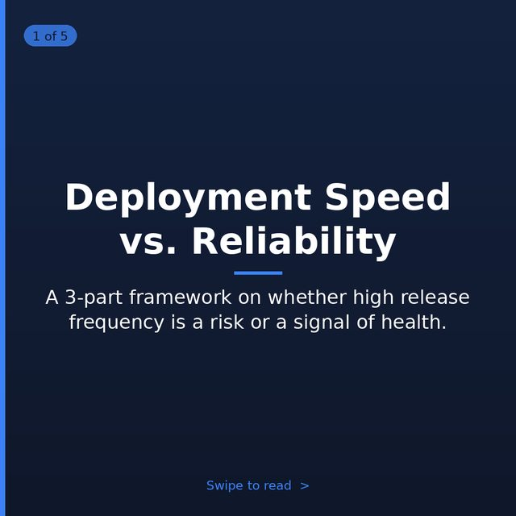
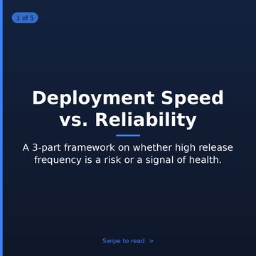
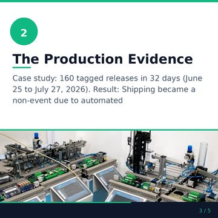
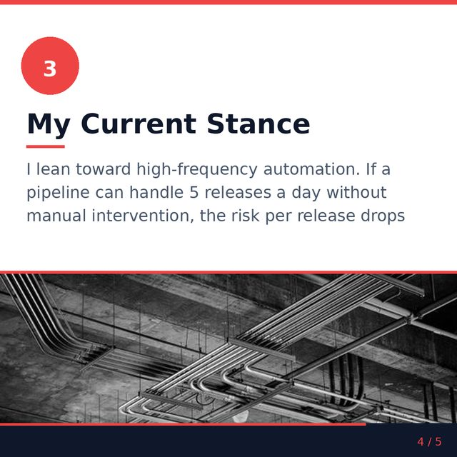
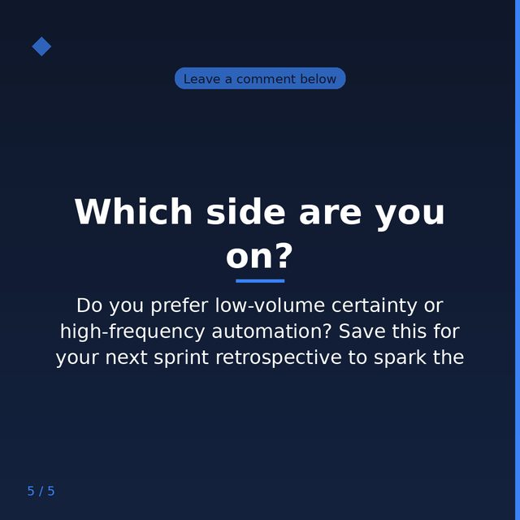
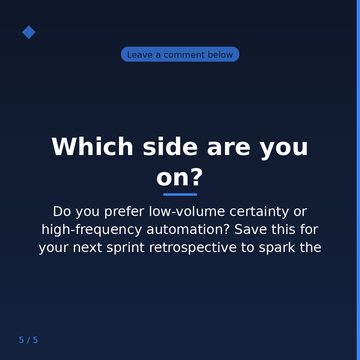
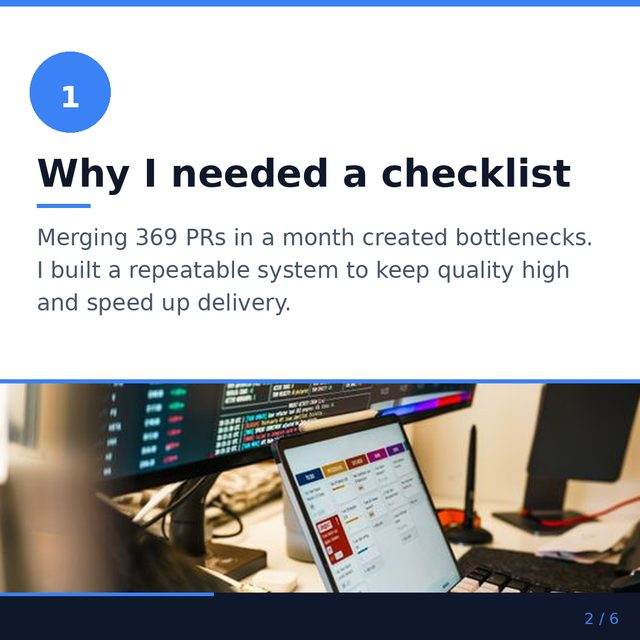
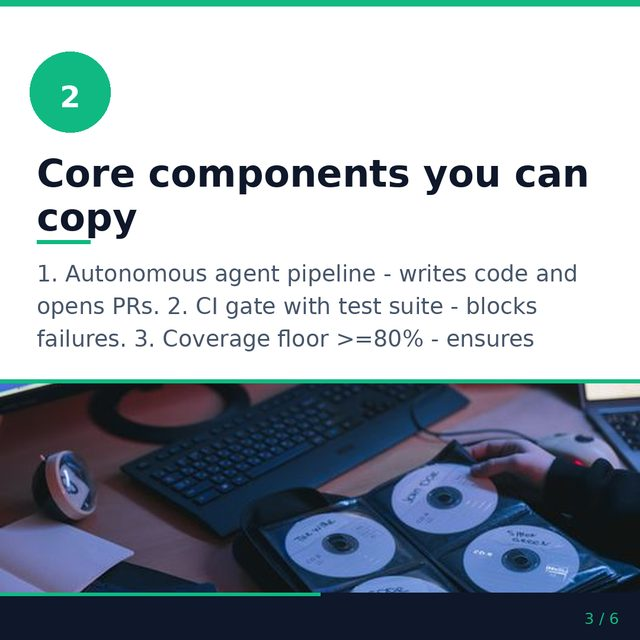
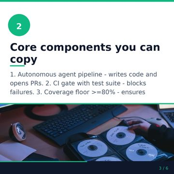

# Content-quality audit — LEM's GENERATED IMAGES

Issue #1141. Audited 2026-08-10 against `main` @ `54ae3735`.

`render_image_gated` already asks a cheap machine question before an image ships — *is anything
garbled, deformed, or off-topic?* This audit asks the human-editor question it cannot: *does this
image stop a thumb in a LinkedIn feed, read at mobile size, and look like it belongs to this brand
rather than to generic AI stock?* — and grades the machinery that produces it.

Owning pipeline: `utilities/ai/image_brief.py` (prompt authoring, presets), `utilities/ai/image_gen.py`
(render + the vision gate), `utilities/post_image.py` (a POST's image). Owning doc:
`docs/image-stack.md`.

**Headline:** the engine is one prompt author, one renderer and five per-surface presets — and only
**two of the five surfaces are fully wired to it**. `thumbnail` was never reachable at all: no caller
ever passed that surface, so the one place that wanted a thumbnail hand-wrote its own prompt, in
negation ("No text, no logos") that the FLUX backend renders rather than avoids. The `thumbnail`
preset itself asked for an *illustration* — the exact word the shared system prompt in the same
request calls a dead word. `video` briefed a square composition and rendered it vertical. And the
vision gate's repair round pasted the defect it had just rejected straight back into the next FLUX
prompt. None of it failed, because on every one of these seams the two sides were never compared.

---

## 1. What could and could not be sampled

> **Superseded in part by §7.** Phase 2 (#1292) ran from the VPS, read the assets volume and the
> production rows, and scored 10 real renders across all four wired surfaces — including the
> feed-width check this section could not make. The limits below are what was true for the
> machinery audit; §7.4 lists which of them still hold.

The issue asked for 10–15 recently-shipped images across surfaces and a real high-engagement
LinkedIn post as the reference exemplar. Both were bounded by where this audit ran, and the limits
are stated here rather than papered over:

| Asked for | What was actually available | Why |
|---|---|---|
| 10–15 shipped image FILES across surfaces | **0 files.** The scorecard below is built from `media_cost` telemetry and PostHog Logs instead | The renders live in a root-owned Docker volume on the VPS, and `posts.image_url` needs production MySQL credentials the pipeline runbook forbids touching. Telemetry is the read path that needs neither |
| The per-surface split of those renders | **Not available at all** | `track_media_cost` records provider, model, cost, size and quality — and no `surface`. This is finding **F5**, filed as **#1291** |
| A real, fetched LinkedIn exemplar image | **Not fetched.** Rubric-only, plus an in-repo exemplar per gauntlet piece (§4) | Fetching one means a live authenticated Selenium session — a runbook escalation trigger, not something to do headless. The issue's own fallback clause covers this |
| Rendering the sample and grading it visually | **Not done** | No image files, and no render credentials in the worktree. Tracked as **#1292** |

**Read the scorecard as sizing, not calibration.** 33 renders from one account can show that a gap
exists; it cannot set a threshold. Nothing below moves a threshold.

### Scorecard — every image LEM has rendered (`media_cost`, `kind='image'`, 60 days to 2026-08-10)

| Date | Backend | Model | Renders |
|---|---|---|---|
| 2026-08-02 | openai | gpt-image-2 | 17 |
| 2026-08-02 | replicate | `lemcqv1-avatar-60` (LoRA) | 10 |
| 2026-08-02 | replicate | `black-forest-labs/flux-dev` | 2 |
| 2026-08-05 | openai | gpt-image-2 | 1 |
| 2026-08-07 | replicate | `lemcqv1-avatar-60` (LoRA) | 3 |

What the numbers say on their own, before any rubric:

- **33 renders, one account, six days.** Nothing before 2026-08-02 — that is the #936 image engine
  going live, not a quiet period.
- **A third of them are avatar LoRA renders**, i.e. FLUX. That matters for F3 below: the FLUX path
  is not an edge case, it is the likeness path, and every likeness render is FLUX.
- **Which surface any of these was for is unknowable.** No `surface` on the cost row (F5).
- **7 briefs fell back to the deterministic template on 2026-08-02** — `post_image` ×6,
  `newsletter` ×1 — on the same day 30 of the 33 renders happened. A fallback brief is bland by
  design; it is the "generic stock-AI output" the issue is asking about, generated on purpose
  because the author was unavailable. Only the last of the seven carries a reason
  (`JSONDecodeError: Expecting value: line 1 column 1`), because the `reason=` field landed that
  same afternoon.
- **Zero vision-gate verdicts in the entire retention window.** Not zero rejections — zero
  *records*: the gate logs its verdict at INFO and prod forwards at WARNING, and it emits no event.
  How often the gate rejects a render is currently unanswerable (F5, #1291).

---

## 2. The rubric

Grounded in this repo's own invariants, not generic taste. Each row names the ONE place that owns
it, and the verdict is against what the pipeline actually does today.

| # | Rubric row | Owned by | Verdict |
|---|---|---|---|
| R1 | **Thumb-stopping at feed thumbnail size** — legible when scaled down, not just at 1024px | The per-surface presets in `_STYLE_PRESETS` | **PARTIAL → improved here.** `newsletter` and `post_image` both state the legibility constraint; `carousel` and `video` state composition without it; `thumbnail` asked for "calm, simple shapes" and never reached a render anyway. Rewritten for the one surface whose whole job is reading small (F1) |
| R2 | **No text, letters or logos rendered INTO the image** | `_SYSTEM_PROMPT` (author side) + `with_no_marks` (render side) | **PASS, and belt-and-braces** — the brief is told never to name marks, and the renderer appends the constraint per backend so a hand-written or retried prompt cannot lose it. Two leaks found and fixed: the tutorial thumbnail's hand-written prompt (F1) and the gate's repair round (F3), both of which reintroduced marks by NAMING them on a backend that renders what it is told |
| R3 | **Brand/avatar consistency** — a likeness renders only where the guardrails allow | `avatar/guardrails.resolve_avatar_for`, `apply_subject_clause` | **PASS, untouched.** The avatar is resolved BEFORE the brief is authored on every wired surface, so the declared subject clause leads the prompt (#744). Nothing in this PR reaches the guardrails |
| R4 | **Not an anonymous stock person** | `_NO_ANONYMOUS_PERSON` | **PASS.** When no likeness is available the brief is explicitly steered off "a confident business professional" and onto an object or environment — the exact stock-photo failure this engine exists to replace |
| R5 | **Per-surface fit** — a carousel slide is composed differently from a feed image | `_STYLE_PRESETS` + the `ratio` each caller passes | **FAIL → partly fixed here.** Five presets, two surfaces fully wired. `thumbnail` was unreachable (F1); `video` briefed 1:1 and rendered 9:16 (F2); `carousel` reaches the preset but not the gate (F4) |
| R6 | **Focal-concept clarity** — the render depicts the brief's stated idea | `ImageBrief.focal_concept` → `inspect_render_quality` | **PARTIAL.** Wired on `post_image` and `newsletter`; **dropped** on `carousel` and `thumbnail`, which both author a `focal_concept` and then render through the ungated `render_image_from_prompt` (F4, #1290). On the repair round the concept was never named back at the renderer at all — fixed here (F3) |
| R7 | **The gate is a safety net, not a quality bar** — it fails open | `render_image_gated`, `QualityVerdict.checked` | **PASS, deliberately.** A vision outage must never take a cover down with it, and for covers the human `pending_review` gate sits behind it. Unchanged by this PR — but see F5: an *unchecked* render is currently indistinguishable from a passed one in telemetry |

---

## 3. Findings

### F1 — The `thumbnail` surface was never wired, and its preset contradicted the shared prompt *(fixed in this PR)*

Two halves of the same defect.

**The preset asked for a medium the system prompt forbids.** `_STYLE_PRESETS["thumbnail"]` read
*"A clean, flat product-tutorial thumbnail **illustration**. Calm palette, simple shapes, one clear
subject."* — pasted into the same request as a system prompt whose hard rule is *"Photography
vocabulary only. A single word like illustration, painting, render, CGI, artstation or stock photo
drags the image away from a photograph"*, under an instruction to act as *"a professional
photographer writing the brief for ONE real photograph"*. Nothing compared the two.

**And no caller ever selected it.** `grep -r 'surface="thumbnail"' src/` returned nothing. The one
surface that wants a thumbnail — `marketing/video_tutorials.generate_thumbnail` — hand-wrote its
own prompt and sent it straight to the renderer:

```python
f"Clean, flat product-tutorial thumbnail illustrating: {flow.title}. "
"No text, no logos, calm blue palette."
```

That is three violations at once: a per-content-type prompt helper, which CLAUDE.md bans outright;
two negations, on a path whose FLUX fallback renders what a prompt names — *"No text, no logos"* is
how text and logos get there; and no `focal_concept`, so a render on that path has nothing to be
graded against.

**Fixed:** `generate_thumbnail` calls `build_image_brief(..., surface="thumbnail", ratio="16:9")`
like every other surface, and the preset is rewritten in photography vocabulary. `DEAD_STYLE_WORDS`
and `DEAD_QUALITY_TAGS` are now ONE list that the system prompt names and the tests grep, so the
writer side and the checking side cannot drift again.

**Not fixed, and it is the same gap as F4:** the thumbnail now *authors* a `focal_concept` and still
discards it, because `generate_thumbnail` renders through the ungated `render_image_from_prompt`.
Grading it means a `lem-vision` call on a surface that is not in `IMAGE_QUALITY_GATE_SURFACES`, i.e.
a render-cost change, which #1141 routes to a separate `risk:*` issue — so it is carried on **#1290**
alongside `carousel` rather than half-done here.

### F2 — The video source frame was briefed square and rendered vertical *(fixed in this PR)*

The system prompt composes framing *"phrased to suit the requested aspect ratio"*, so the ratio
handed to the brief is a real instruction, not metadata. `_generate_video_src` briefed
`ratio=DEFAULT_IMAGE_RATIO` (1:1) unconditionally and then rendered the premium source frame at
`ratio="9:16"` — a composition written for a square, cropped to a portrait. Every premium avatar
video since the engine shipped got its subject framed for the wrong shape.

**Fixed:** one `source_frame_ratio`, decided from the tier, used by both the brief and the render.

### F3 — The vision gate's repair round re-requested the defect it had just rejected *(fixed in this PR)*

`inspect_render_quality` returns issues that name what is WRONG — *"garbled text on whiteboard"*,
*"six fingers on the left hand"*. The retry pasted them into the next prompt verbatim:

```python
fixes = "; ".join(verdict.issues) or "low relevance to the subject"
current_prompt = (f"{prompt}\n\nThe previous render was rejected for: {fixes}. "
                  f"Avoid those problems entirely in this render.")
```

Correct for gpt-image, which follows instructions. Backwards for FLUX, which has no negative
prompting, largely ignores negation, and renders what a prompt names — the module's own
`_NO_MARKS_FLUX` constant exists for exactly that reason, four lines above. `render_avatar_image_gated`
is **always** FLUX, so every likeness repair asked for the defect a second time, inside a two-render
budget.

**Fixed:** `repair_directive(issues, backend, focal_concept)` — the same backend split, and the same
reason, as `with_no_marks`. gpt-image keeps the explicit prohibition; FLUX is told what the image
must SHOW, and an off-topic verdict names the focal concept back rather than repeating "the stated
subject".

The split is keyed on **the backend that actually rendered, not the one configured** — which is not
the same question under the default `IMAGE_BACKEND=auto`, where gpt-image leads and FLUX silently
catches its failures. A config-derived answer would have named the defect back at FLUX on exactly
the runs where gpt-image is down, i.e. left the fixed bug live on the default configuration. So
`render_image_from_prompt` is now a thin wrapper over `_render_with_backend`, which reports which
one answered, and the gate phrases the retry from that.

### F4 — Carousel slides author a `focal_concept` and throw it away → **#1290**

`_generate_avatar_slide_image` builds a real brief and then hands only `brief.prompt` to
`generate_post_image`, which renders through the ungated `render_image_from_prompt`. So the one
format where a bad image repeats across ten slides is the one format the vision gate never sees.
`thumbnail` is now in the same position (F1). Not fixed here: routing either through the gate means
moving where `resolve_avatar_for` is called and adding a `lem-vision` call on a surface outside
`IMAGE_QUALITY_GATE_SURFACES`, and #1141's own scope rule sends avatar-guardrail and render-cost
changes to a separate `risk:*` issue.

### F5 — Image quality has no trend line → **#1291**

`media_cost` carries no `surface`, and the gate logs its verdict at INFO while prod forwards at
WARNING. Between them: no way to say how many covers vs slides vs post images were rendered, how
often the gate rejected one, or how often it could not run at all. Text has had this since #630;
images have never had it. This is the finding that made §1's limits table necessary.

### F6 — Observations recorded, not actioned

- **The deterministic fallback brief is generic across all five surfaces.** It prepends the preset
  and then adds "eye-level medium shot", which now mildly contradicts the thumbnail preset's
  "shot close and off-center". Bland beats broken is the fallback's whole design, and 7 of them
  shipped in one day (§1) — worth a look when there is a corpus to grade, not worth a change on
  this evidence.
- **Both `newsletter` and `thumbnail` presets pre-empt the system prompt's COMPOSITION step** by
  stating legibility-at-size themselves. The round-1 critic named this (§4). Kept deliberately: what
  "small" means differs per surface, and that is surface-specific art direction, which is what a
  preset is for.
- **`IMAGE_QUALITY_GATE_SURFACES` defaults to `newsletter,post_image`** — the same two surfaces
  that are fully wired. Whether `carousel` or `video` should join it is a cost question, and it
  belongs to #1290, not here.

---

## 4. Gauntlet-loop verdict trail

Run per `.claude/skills/gauntlet-loop/SKILL.md`. Two pieces, one builder and one **fresh-context**
critic each, blind A/B (labels stripped, order shuffled, critics barred from reading the module the
outputs came from), capped at 3 rounds.

| Round | Piece | Reference exemplar | Builder proposal | Critic verdict (fresh context, blind) | Resolution |
|---|---|---|---|---|---|
| 1 | **The `thumbnail` preset** | `_STYLE_PRESETS["newsletter"]` — this repo's gold standard for per-surface art direction that states what a surface is FOR without restating the shared photographic fundamentals | A bold, high-contrast photograph, one tangible object tied to the tutorial's subject, shot close and off-center, framed to read at player-tile size | **Build wins.** *"Concrete, testable art direction… that maps directly onto why a thumbnail needs to read at tiny scale, whereas [the exemplar's] 'bold scene… with environmental depth' is generic enough to describe almost any editorial photo."* Biggest gap named **in the build**: nothing stops the object reading as an isolated e-commerce shot on a seamless backdrop — the stock look the engine exists to avoid | Shipped with that one gap fixed: the object now sits *"on a real, textured working surface rather than an empty backdrop"*. The critic's second point (both presets restate legibility) is recorded as F6, not actioned |
| 1 | **The gate's FLUX repair clause** | `with_no_marks` + `_NO_MARKS_GPT` / `_NO_MARKS_FLUX` — this repo's existing answer to "state a constraint per backend, positively on FLUX" | A keyword map from the verdict's issue phrases to positive counter-directives, backend-split, with a generic fallback | **Build wins.** The exemplar *"appends a fixed, verdict-blind suffix identical on every render… it never reads `issues`, so it cannot steer away from whatever the gate just named."* Biggest gap named **in the build**: the anatomy bucket keyed on `hand`/`finger`/`anatomy`/`limb`/`knuckle` misses real gate phrasings — *"extra digit on right hand"*, *"malformed face"* — which fall through to a fallback saying nothing about anatomy | Shipped with that gap fixed (`digit`, `malform`, `torso`, `extra ` added; regression cases pinned in the tests). The critic's second warning — that a "positive" fix can still name the defect (*"never legible marks"*, *"no overlap with objects"*) — was applied as a rule: every shipped counter states only the desired state |

Neither piece hit the 3-round cap; nothing is parked `needs-human`.

**Stated limitation:** the comparison was label-blind, not indistinguishable. Each critic was given
the two outputs with no labels and barred from opening the module they came from, but a critic
comparing a newsletter preset with a thumbnail preset can tell which surface is which. The verdicts
are comparative judgements against this project's invariants, not a true double-blind.

---

## 5. Before / after, per surface

The pipeline could not be run end to end here (no render credentials in the agent worktree), so
these are the **prompts each surface actually produces**, which is the thing this PR changes.
Every "after" string below is real output from the merged code.

### `thumbnail` — the surface that had no brief at all

| | Prompt sent to the renderer |
|---|---|
| **Before** | `Clean, flat product-tutorial thumbnail illustrating: {title}. No text, no logos, calm blue palette.` |
| **After** | authored by `build_image_brief(surface="thumbnail", ratio="16:9")` off the same title, against the preset: *"A bold, high-contrast photograph for a product-tutorial video thumbnail, framed to read at player-tile size. One tangible object tied to the tutorial's subject, shot close and off-center on a real, textured working surface rather than an empty backdrop."* |

| Measure | Before | After |
|---|---|---|
| Negations in the prompt (`no text`, `no logos`) | **2** | **0** |
| Reaches the `thumbnail` preset | ✗ | ✓ |
| Authors a `focal_concept` | ✗ | ✓ (still discarded — the render is ungated, #1290) |
| Per-content-type prompt helper (CLAUDE.md ban) | yes | no |

### `video` — the surface briefed for the wrong shape

| Measure | Before | After |
|---|---|---|
| Ratio handed to the brief (premium tier) | `1:1` | `9:16` |
| Ratio the source frame renders at | `9:16` | `9:16` |
| Composition instruction the model receives | *"composed for a 1:1 aspect ratio"*, then cropped vertical | matches the frame |

### `post_image` and `newsletter` — the repair round

Both fully wired surfaces already; what changes for them is the retry after a rejected render.
Verdict `["six fingers on the left hand", "does not relate to the stated subject"]`, focal concept
*"a dispatcher checking a loading dock"*:

| Backend | Before | After |
|---|---|---|
| gpt-image | `The previous render was rejected for: six fingers on the left hand; does not relate to the stated subject. Avoid those problems entirely in this render.` | unchanged — it follows instructions |
| FLUX (every likeness render) | *the same string* — "six fingers" handed to a renderer that draws what it is named | `Render this scene again with hands relaxed and out of frame, the subject framed above the waist; a literal, concrete depiction of a dispatcher checking a loading dock, in a real setting.` |

### `carousel` — a finding, not a fix

The meaningful finding for this surface is F4: it authors a `focal_concept` and discards it, and its
renders never reach the vision gate. There is no before/after here on purpose — the fix moves where
the avatar guardrails are resolved, which #1141 explicitly routes to a separate `risk:*` issue.
Filed as **#1290**.

---

## 6. What shipped in this PR

- `image_brief.DEAD_STYLE_WORDS` / `DEAD_QUALITY_TAGS` — ONE vocabulary ban list, interpolated into
  the system prompt the model reads AND read by the tests, so the presets and the prompt cannot
  disagree again.
- The `thumbnail` preset, rewritten in photography vocabulary via the gauntlet loop (§4).
- `video_tutorials.generate_thumbnail` routed through `build_image_brief` — the ONE brief engine,
  no per-content-type prompt helper, no negation. It adds one `lem-medium` brief call per tutorial
  thumbnail, on a feature that is OFF unless `TUTORIAL_THUMBNAIL_ENABLED`; no change to render
  spend.
- `_generate_video_src` briefs and renders one `source_frame_ratio`.
- `image_gen.repair_directive` — backend-aware re-render clause, positive on FLUX, naming the focal
  concept on an off-topic verdict. **No threshold moved, no bound changed, no new hold**: the gate
  still fails open, still runs at most `IMAGE_GATE_MAX_ATTEMPTS` renders, and still enforces only on
  `IMAGE_QUALITY_GATE_SURFACES`. What changed is what the second render is ASKED for.
- `tests/unit/utilities/ai/test_image_preset_drift.py` — the regression guard whose absence let all
  of F1 happen: no preset may use a word the system prompt bans, none may phrase a constraint as
  negation, and **every preset must be named by a real caller** (that last assertion is what would
  have caught a dead `thumbnail` preset on day one).
- `tests/unit/utilities/ai/test_image_repair_directive.py` — the repair clause, including the
  critic's phrasings (`extra digit`, `malformed face`, `distorted torso`) as regression cases.
- Follow-ups filed and linked: **#1290** (carousel gate + focal concept, `risk:product-decision`),
  **#1291** (surface attribution + gate verdict telemetry), **#1292** (score the real rendered
  images once they can be read).

---

## 7. Phase 2 — the REAL renders, scored (#1292)

§1 recorded that 0 image files could be read and the visual question therefore went unanswered.
This section answers it. Run 2026-08-10 from the VPS, where the assets volume and production
`posts` rows are both readable, under an explicit owner authorisation for live LEM and LinkedIn
pulls (`1A 2A` on #1292).

**Sample:** 10 renders across all four wired surfaces, newest first — pulled from
`/var/lib/docker/volumes/lem_assets/_data` and paired with `posts` / `newsletter_editions` rows via
`cqc_lem.utilities.db`. Every image below is the actual shipped file, resized for the repo. Each is
shown twice: at reading size, and **at 360 px — the width LinkedIn gives a feed image on mobile**,
which is where R1 is decided and is exactly the check §1 could not make.

### 7.1 The scored table

| # | Surface | Source | Render | At feed width (360px) | Passes | Fails |
|---|---|---|---|---|---|---|
| 1 | `post_image` | post 84 · `myth_vs_reality` · 1024×1024 |  |  | R2, R3, R4, R7 | **R6** — a plain portrait depicts no idea; nothing in it says "myth vs reality". **R5** — 1:1, see P5 |
| 2 | `newsletter` | ed10 · "AI Governance: Your Steering Wheel, Not a Brake Pedal" · 1536×1024 |  |  | **R1, R2, R4, R6, R7** — the steering wheel IS the title's metaphor, and it still reads at 360px. The best render in the sample | R5 — 3:2, neither 1:1 nor 4:5 |
| 3 | `newsletter` | ed9 · "Hidden Cost Ceiling in Your AI Line…" · 1536×1024 |  |  | R1, R4, R7 | **R2 — hard fail.** The laptop screen renders four logo tiles including a recognisable third-party mark and the letters "AI". Still legible at 360px. See P2 |
| 4 | `carousel` | post 87 slide 1/5 · hook · 1080×1080 |  |  | R1, R5, R6, R7 | — (title holds at 360px; "Swipe to read" does not, but carries no meaning) |
| 5 | `carousel` | post 87 slide 3/5 · body |  |  | R5 | **Truncated** — "…became a non-event due to automated". **R6** — a PLC/industrial photo under a software-release claim. See P1 |
| 6 | `carousel` | post 87 slide 4/5 · body |  |  | R5 | **Truncated** — "…the risk per release drops" |
| 7 | `carousel` | post 87 slide 5/5 · **CTA** |  |  | R1, R5 | **Truncated on the closing ask** — "Save this for your next sprint retrospective to spark the" |
| 8 | `carousel` | post 86 slide 2/6 · body |  |  | R1, R5 | **R6** — a trading-desk stock photo under "Why I needed a checklist" |
| 9 | `carousel` | post 86 slide 3/6 · body |  |  | R5 | **Truncated** — "…Coverage floor >=80% - ensures". **R6** — a CD-wallet photo under an agent-pipeline claim |
| 10 | `video` (source frame) | post 83 · 720×1280 · frame 0 |  |  | R2, R3, R4, R7 | **R6** — a smiling portrait; the `industry_observation` idea is not depicted |

**Aggregate: 4 of 8 sampled carousel/body slides ship a sentence cut off mid-word-group, and 5 of
10 renders fail R6.** R2 held on 9 of 10 — the one leak is on the live render path, not a
hand-written prompt, which is what makes P2 different from F1/F3.

### 7.2 New findings — all filed separately, per the issue's own rule

| ID | Finding | Evidence | Filed |
|---|---|---|---|
| **P1** | **Carousel body text is truncated mid-sentence, systematically.** Not one bad slide: 4 of 8 body slides across BOTH sampled posts, including post 87's closing CTA — the slide whose entire job is the ask. No ellipsis, no reflow, no smaller type; the sentence simply stops | rows 5, 6, 7, 9 above | #1375 |
| **P2** | **A newsletter cover rendered third-party logos and the letters "AI" into the image** — R2's exact prohibition, on the gated live path rather than a hand-written prompt. `cover_image_status` was `pending_review`, so the human gate is the only thing between this and a public brand asset | row 3 | #1376 — **control shipped, §7.6** |
| **P3** | **`posts.image_url` / `video_url` can point at files that no longer exist**, and nothing detects it. 3 of the sampled rows dangle — posts 79 and 82 (`images/posts/{79,82}/out-0.webp`) and post 85's video — and all three are `posted` | volume listing vs DB rows | #1377 |
| **P4** | **`ImageBrief.focal_concept` is never persisted with the render**, so R6 is unauditable after the fact — this audit could only infer intent from the post's topic and archetype. There is no `media_cost` table at all in production; the cost path writes `cost_ledger` | schema read | #1377 |
| **P5** | **No surface renders 4:5.** `post_image` and `carousel` are 1:1, `newsletter` 3:2, `video` 9:16. Published 2026 guidance is consistent that 1080×1350 (4:5) takes the most mobile feed real estate and is the thumb-stopping format — LEM never asks for it | dimensions above | #1375 |

### 7.3 The exemplar — fallback restated (option 2A)

No live authenticated LinkedIn fetch was performed, so **no real high-engagement post image is
embedded here**, and this is the second audit to say so. The authorisation to do live pulls was
granted and the recommendation on #1292 was still to defer it: a fetched competitor image is a
third-party asset this public repo would then hold, and the R1 question does not need one — R1 is
decided by shrinking LEM's OWN render to feed width, which §7.1 now does for every row.

In place of a fetched exemplar, the reference standard used for R1 and P5 is published 2026 LinkedIn
format guidance: **1080×1350 (4:5) portrait maximises mobile feed real estate**, 1080×1080 is the
square baseline, and images featuring real people measurably lift engagement — which is the
external corroboration for R4 and for keeping the avatar path. Sources:
[draftly](https://www.draftly.so/blog/linkedin-image-size-guide),
[postiv](https://postiv.ai/blog/linkedin-posts-specs),
[dsmn8](https://dsmn8.com/blog/engaging-images-linkedin-content/).

### 7.4 What this changes about §1

§1's four "not available" rows are now three answered and one deliberately deferred:

| §1 said | Now |
|---|---|
| 0 image FILES | **10 files, all four wired surfaces**, §7.1 |
| Per-surface split unavailable | Read from the volume's own directory layout (`images/posts/`, `images/carousel/<post_id>/`, `images/newsletter_covers/`, `videos/`) — but still absent from telemetry, which is why #1291 stands |
| No real exemplar fetched | Still not fetched, **by choice** — §7.3 |
| Sample never graded visually | **Graded**, §7.1 |

The machinery grades from §3 are unchanged. What this pass adds is that the machinery being right
does not make the output right: R2 held in the prompt layer and still leaked once, and the largest
defect found here (P1) is not in the image engine at all — it is in the carousel's text layout.

### 7.5 What #1377 changed for the NEXT pass (P3, P4)

Both findings were the same gap from two sides — nothing tied a stored media URL to the render
behind it. `utilities/media_provenance.py` is now that tie; full posture in `docs/image-stack.md`
("Media retention, and what a dangling URL means").

| §7.2 said | Now |
|---|---|
| P3 — dangling URLs, nothing detects them | `auto_media_integrity_scan` grades every media-bearing row weekly and emits one `media_integrity` event. **Read it from PostHog, not the volume** — the count that matters is `dangling` (media gone from a row that has NOT published). The three sampled rows that started this are all `posted`, which the report classes as `missing_expected`: `purge_post_assets` removes a published post's local media on purpose, and that is now written down rather than accidental |
| P4 — `focal_concept` never persisted, so R6 is unauditable | A generated render stores its brief beside itself, keyed by the stored URL: `read_brief_receipt(posts.image_url)` returns `focal_concept`, the render prompt, surface, preset and the gate verdict. It survives publication like the caption sidecar |

Two limits this pass should still state rather than paper over. The receipts only exist for renders
made AFTER #1377 shipped — every image in §7.1 stays unauditable for R6, permanently, and inferring
intent from `posts.topic` is still the only option for them. And a render is only covered where the
brief reaches the store: **post images and post videos**. Newsletter covers and carousel slides
write no receipt yet, so R6 on those surfaces is still scored the way §7.1 scored it.

### 7.6 P2's control — the screen, not the caller (#1376)

Row 3 is the only R2 failure in the sample, and the only one of the three R2 leaks this audit has
found that nothing explains as a caller mistake. F1 was a hand-written prompt bypassing the brief
engine; F3 was the repair round reintroducing marks by naming them. Row 3 travelled the whole
belt-and-braces path — `image_brief` authored it, `with_no_marks` appended the gpt-image
prohibition, `render_image_gated` took a `lem-vision` verdict — and the laptop in it came back with
four logo tiles anyway.

So the control is aimed at the **surface**, not at a caller:

| Half | What changed | Why that half |
|---|---|---|
| Author (`image_brief._SYSTEM_PROMPT`) | Build the scene around a tangible object rather than a screen; a screen that genuinely belongs is stated switched off and dark | A screen is where marks appear even when the brief never asked for one — the writer can decline to put one at the centre of the frame |
| Render (`image_gen.with_no_marks`) | A prompt NAMING a mark-carrying surface gains that surface's blank-state clause, positive on both backends, split by surface class | A blanket "no logos" is a prohibition about content; what holds is a statement of what the surface SHOWS. Positive on gpt-image too, so a hand-written or retried prompt gets the same phrasing |
| Check (`inspect_render_quality`) | The gate names screens as the place to look, and reads at `detail="high"` | At `low` a 1536×1024 cover is downsampled to ~512px, where four logo tiles on a laptop screen are not resolvable. The gate was asked a question it could not see the answer to |

**The gate is still fail-OPEN (R7).** Being part of the mark control changes what it detects, never
what it blocks — a vision outage leaves the human `pending_review` gate standing alone, exactly as
before.

The regression lives on the render side (`tests/unit/utilities/ai/test_image_render_mark_guard.py`),
mirroring `test_image_preset_drift.py` on the author side, and makes no live model call: every
assertion is against the string handed to a patched renderer or vision client. `NEGATION_MARKERS`
moved into `image_brief` so both guards grep ONE list.

**What is NOT closed by this:** ed9's own cover, which is a production asset, not code. Two states are
possible and only the box can say which. If the edition is still queued (`draft`/`approved`), it is in
the newsletter review queue carrying the NEEDS YOUR APPROVAL badge, and the owner clears it there —
**Remove cover** drops the file and the edition publishes coverless, **Generate with AI** re-renders
it through the control above. If ed9 has since reached its slot, `_approved_cover_path` already
dropped the unapproved cover at publish, so the render never reached LinkedIn and what remains is an
orphan PNG under `images/newsletter_covers/1/`. **Neither state was reachable from this branch** —
both are prod, and re-rendering is a prod render.
