# Graph: Agent / Issue-Shipping

## What this graph does

This is the graph that ships LEM's own code: a GitHub issue, once labelled `agent:ready` by
someone with standing to do so, is picked up by `tick.sh` (a cron on the VPS, `scripts/agent-pipeline/`)
which drives it through an isolated-worktree build, a phase-guard scope check, CI, an adversarial
self-review (or a metered Copilot review on risky work), a human sign-off gate for anything touching
migrations/security/live LinkedIn/product decisions, a merge, and a batched release to production —
one label state machine, one runner, ten `MODE=*` steps, no separate orchestrator agent spawning a
swarm underneath it.

## Current state

```mermaid
flowchart TD
  H[Human files issue\nContext/Scope/Acceptance] --> L1{Flow label?}
  TR["scripts/triage_issues.py\ndaily cron: milestone+priority\n+ 1 lem-medium call"] --> L1
  FB["POST /api/feedback\n(unauth) -> issue_service.py"] -.->|"never grants agent:ready\n(FEEDBACK_MAY_GRANT_AGENT_READY=False)"| L1
  L1 -- "no flow label" --> INV[Invisible to pipeline\nhuman must triage]
  L1 -- "agent:ready applied" --> TRUST{tick.sh trust check\nauthor_trusted AND\nlabel_actor_trusted}
  TRUST -- unreadable/fails --> SKIP[Skip this candidate\nwalk rest of queue]
  TRUST -- pass --> START["MODE=start\nworktree, branch\nfeature/claude-issue-N"]

  START --> SPEC["spec-first: Spec/Verifier/Environment\nbefore implementation"]
  SPEC --> BUILD[Implement + tests\ncommit + push]
  BUILD --> GAUNTLET{"ui/-touching or\nUX-sensitive?"}
  GAUNTLET -- yes --> GL["gauntlet-loop (optional)\nbuilder/critic vs named exemplar\ncapped 3 rounds"]
  GAUNTLET -- no --> PHASEGUARD
  GL --> PHASEGUARD
  PHASEGUARD["Self-applied phase-guard scope check\nbefore writing Closes #N"] --> PR["PR opened, label agent:working\n(closes #N) in title"]

  PR --> RISK{"risk:* label?\nmigration/security/\nlive-linkedin/product-decision"}
  RISK -- yes --> DC["needs-human + agent:blocked\n+ Decision Comment\n(lettered options + recommendation)"]
  DC -- "owner (@gitchrisqueen) replies\nok / 1A 2B / off-menu" --> REVISE["MODE=revise\napply the answer"]
  DC -- "hold-off / bare question" --> DC
  REVISE --> CI
  RISK -- no --> CI["CI gates:\nUnit Tests (3.12), Integration Tests,\nUI Build, Migration Versions,\nGitGuardian Scan, CodeQL PR Quality Gate\n(+ non-required Docstring & Lint Gate, CodeQL Security)"]

  CI -- red --> FIX["MODE=fix\n<=4 attempts"]
  FIX --> CI
  FIX -- "4th failure" --> ESCH[needs-human + assignee]
  CI -- "Docstring & Lint Gate fails" --> DOCFIX["MODE=docfix\nratchet vs .ruff-baseline"]
  DOCFIX --> CI

  CI -- green --> SELFREV["MODE=selfreview (default)\nfresh invocation, adversarial\nposts marker: 'Claude adversarial review'"]
  CI -- "green + risk:*/review:copilot" --> COPILOT["Runner requests\nGitHub Copilot review (metered $)"]
  COPILOT --> COPTHREADS{"unresolved\nCopilot threads?"}
  COPTHREADS -- yes --> MODEREV["MODE=review\naddress + resolve each thread"]
  MODEREV --> COPTHREADS
  COPTHREADS -- no --> MERGEGATE
  SELFREV -- "findings, fixable" --> BUILD
  SELFREV -- "marker posted (PASS or FIXED n)" --> MERGEGATE
  SELFREV -- "unsafe to fix alone" --> DC

  MERGEGATE{"Merge gate:\nCI green + fresh review evidence\n+ zero unresolved threads\n+ phase_guard_ok"}
  MERGEGATE -- "closes issue w/ undisclosed\nlater phase, no follow-up linked" --> PHASEFIX["MODE=phasefix (mechanical)\nfile+link follow-up, self-resolve"]
  PHASEFIX -- "2 failed passes" --> DC
  PHASEFIX --> MERGEGATE
  MERGEGATE -- pass --> MERGE[Runner merges to main]

  MERGE --> FASTLANE{"release:now?\n(agent self-applies per policy,\nverified via TRUSTED_LABELLERS)"}
  FASTLANE -- yes --> RP1["release-please batches this commit\nships at next successful run"]
  FASTLANE -- no --> RP2["Batches into release-please PR\nnext window: 05/11/17/23 UTC"]
  RP1 --> TAG[Tag vX.Y.Z]
  RP2 --> TAG
  TAG --> IMG["build-and-push.yml\n-> ghcr.io image"]
  IMG --> DEPLOY["deploy.sh on VPS:\nflyway migrate, blue/green compose up,\n/health check, auto-rollback to .last_good_tag"]
```

1. **Intake.** An issue arrives either hand-written by a human in the `## Context / ## Scope / ##
   Acceptance` shape (`docs/AGENT_WORKFLOW_PLAYBOOK.md`), or organized by the daily
   `scripts/triage_issues.py` cron (milestone/priority/flow labels + one `lem-medium` call), or —
   deliberately never with `agent:ready` — auto-filed from the unauthenticated `POST /api/feedback`
   loop via `utilities/feedback/issue_service.py` (`FEEDBACK_MAY_GRANT_AGENT_READY = False`,
   `docs/contribution-security.md` §2).
2. **Trust-gated promotion.** Only a human, or `triage_issues.py` acting on an `OWNER`/`MEMBER`/
   `COLLABORATOR`-authored issue, may apply `agent:ready`. Without it the issue is, in the
   playbook's own words, "invisible to the pipeline."
3. **`tick.sh` polling + provenance check.** The cron's `select_next_issue` walks the whole
   `agent:ready` queue in priority order (`priority:critical`/`high` jump the line, then milestone
   number, then `priority:medium`/`low`, then issue number) and checks two independent things per
   candidate — `author_trusted` and `label_actor_trusted` (last labeller in
   `AGENT_LABEL_TRUSTED_ACTORS`) — refusing (never blocking the rest of the queue) on an unreadable
   answer.
4. **`MODE=start`.** Fresh git worktree, branch `feature/claude-issue-<N>`. The `spec-first` skill
   runs before implementation (Spec/Verifier/Environment); the agent implements, adds tests, commits,
   pushes.
5. **Optional `gauntlet-loop`** for `ui/`-touching or otherwise UX-sensitive issues — builder/critic
   blind comparison against a named reference exemplar, capped at 3 rounds, parks `needs-human` with
   the last critic verdict if it never wins.
6. **Self-applied phase-guard.** Before writing `Closes #N`, the agent re-reads the issue for
   unchecked boxes or "Phase 2/follow-up/deferred" prose and either files+links a follow-up or drops
   the closing keyword (`AGENT_WORKFLOW_PLAYBOOK.md`, "Phased work").
7. **PR opened**, labelled `agent:working`. If the issue carries a `risk:*` label
   (`risk:migration`/`risk:security`/`risk:live-linkedin`/`risk:product-decision`), the PR is instead
   parked `needs-human` + `agent:blocked` with a **Decision Comment** — numbered questions, lettered
   options, a `✅ recommended` pick, and an explicit recommendation line — and the owner
   (`@gitchrisqueen`, replies from anyone else are silently ignored) answers on either the PR or the
   issue thread. `ok` / `1A 2B` / an off-menu answer routes to `MODE=revise`; "hold off" or a bare
   question leaves it parked.
8. **CI gates** — the six required contexts named in CLAUDE.md (`Unit Tests (Python 3.12)`,
   `Integration Tests`, `UI Build`, `Migration Versions`, `GitGuardian Scan`,
   `CodeQL PR Quality Gate`), plus the non-required `Docstring & Lint Gate` (ratchet against
   `.ruff-baseline`, routes `MODE=docfix`) and non-required `CodeQL Security Analysis`. A red run
   routes to `MODE=fix`, capped at 4 attempts before escalation to `needs-human`.
9. **Review.** Default reviewer is `MODE=selfreview` — a fresh Claude invocation explicitly told
   "you did NOT write this code," which posts a comment starting `🔎 Claude adversarial review`
   (the merge gate's literal review-evidence marker) reporting PASS or `FIXED n findings`. On
   `risk:*`/`review:copilot` PRs the runner additionally requests one metered GitHub Copilot review
   after CI is green; `MODE=review` addresses and resolves every unresolved Copilot thread (the
   runner will not merge with one open).
10. **Merge gate.** Requires CI green + a fresh review (adversarial marker newer than the head
    commit, or Copilot) + zero unresolved Copilot threads + `phase_guard_ok`. A PR that closes an
    issue with an undisclosed later phase and no linked follow-up is held and routed to
    `MODE=phasefix` — mechanical, self-resolved by an agent, escalated to the owner only after two
    failed passes.
11. **Merge and release.** Merged PRs batch into a release-please PR that ships at the next window
    (05/11/17/23 UTC) unless an agent self-applies `release:now` under the policy in
    `docs/release-fast-lane.md` (verified at merge time against `TRUSTED_LABELLERS`, same
    provenance-not-presence pattern as `agent:ready`). Tag → `build-and-push.yml` → GHCR image →
    `scripts/deploy.sh` on the VPS: Flyway migrate, blue/green `compose up`, `/health` check,
    auto-rollback to `.last_good_tag` on failure.

## Rubric scorecard (current state)

| Criterion | Verdict | Why |
|---|---|---|
| Removes fake waiting | ✅ | `tick.sh` only spends Claude tokens when there's real work — CI-pending and merge-waiting ticks are cheap `gh` reads, per `scripts/agent-pipeline/README.md`. The one place work sits idle without proceeding is the `needs-human` park, and that idleness IS the point (a real decision is pending). Release batching (4×/day) delays a merged PR by a median 168 min, but that's a deliberate cost/safety trade-off, not idle waiting doing nothing — and the `release:now` fast lane exists specifically so urgent work skips it (`docs/release-fast-lane.md`). |
| Separates worker from checker | ⚠️ | For `risk:*`/`review:copilot` PRs this is real: GitHub Copilot is a genuinely independent reviewer from the Claude implementer. For the default lane (the majority of PRs), the "separate" reviewer is `MODE=selfreview` — a fresh Claude invocation with an adversarial framing and no view of the builder's reasoning, which is a real improvement over the builder grading its own diff in the same context. But it is still the same model/identity/credentials reviewing its own pipeline's output, and `docs/contribution-security.md`'s own "Known gaps" section names this directly: *"Self-review. With no Copilot review requested… the merge gate is satisfied by the same agent reviewing its own work."* The graph is honest about the gap rather than hiding it, which counts for something, but the gap is real. |
| Human gate at the expensive-mistake point | ✅ | `risk:migration`/`risk:security`/`risk:live-linkedin`/`risk:product-decision` land the Decision Comment exactly on schema changes, auth/security surface, live-LinkedIn actions, and spend/policy calls — the categories where a wrong autonomous call costs real money, a banned account, or a bad product bet. It is not skipped at the expensive point (build proceeds, merge does not) and not imposed at cheap ones (routine PRs merge on CI + adversarial review alone). One caveat worth naming: `contribution-security.md` also flags `risk:*` itself as "advisory" — no merge-gate code reads the `risk:*` label directly, the hold is carried entirely by `needs-human` being co-applied by procedure (`MODE=start` step 8 in `RUNBOOK.md`). It works because the runbook enforces the pairing every time, not because the code can't merge a `risk:*` PR that forgot the human label. |
| Leaves a trail (residue) | ✅ | Real, and read by the next run, not just recorded: a Decision Comment's owner reply is parsed as an instruction that `MODE=start`/`MODE=revise` explicitly implement (letters, off-menu answers, side-asks becoming linked issues); phase-guard follow-up issues are filed, linked, and then genuinely picked up as ordinary `agent:ready` work; the `🔎 Claude adversarial review` marker is checked programmatically by the merge gate (existence + freshness) *and* human-readable as a paper trail; `docs/triage/` dated reports from `triage_issues.py` feed deterministic staleness/phase-drop detection off issue history. The weaker case is the adversarial-review and Copilot-thread comments themselves — they're gate evidence and a human-readable log, but nothing algorithmically mines their *content* to make a later run smarter (no learning loop over past review findings). |
| Avoids the agent-count/coordination-cost trap | ✅ | One runner, one label state machine, ten `MODE=*` steps executed one at a time by a single agent identity per tick — not a swarm of coordinating agents. `tick.sh` is explicitly serial (cap=1 PR in flight for the build lane), so there's no fan-out to reconcile. `gauntlet-loop` is opt-in only for UX-sensitive pieces, not a standing tax on every issue. Copilot is an external, already-existing GitHub feature invoked selectively (only `risk:*`/`review:copilot`), not an added agent to coordinate. This is close to the minimal shape the rubric asks for. |

## Spec — what this graph is for

Ship a GitHub issue to a merged, deployed change with the smallest correct diff, without an
unauthorized actor ever getting code executed under the owner's credentials, and without a
multi-phase issue silently losing its later phases when the first phase merges. The graph's own
spec format (`## Context` / `## Scope` / `## Acceptance` in `docs/AGENT_WORKFLOW_PLAYBOOK.md`) is
also literally the Spec layer of `spec-first` applied to every issue that enters it — "agents only
know what's written here" is stated as a repo rule, not an aspiration.

## Verifier — what "good" means for THIS graph

No single check; a stack of them, each owned by name:
- **Build correctness**: the six required CI contexts (CLAUDE.md's CI Gates table) plus ≥80% patch
  coverage (Codecov).
- **Review correctness**: the `🔎 Claude adversarial review` marker (existence + freshness) for
  default-lane PRs, a resolved-Copilot-threads state for `risk:*`/`review:copilot` PRs.
- **Scope correctness**: `phase_guard_ok` at the merge gate — a closed issue may not carry an
  undisclosed later phase.
- **Trust correctness**: `author_trusted` + `label_actor_trusted` (issue intake) and
  `TRUSTED_LABELLERS` (the `release:now` fast lane) — an unreadable answer refuses rather than
  guesses.
- **Policy/risk correctness**: a human, via the Decision Comment reply — explicitly not a test,
  per `docs/spec-verifier-environment.md`'s own Verifier table ("Risky merge (`risk:*`) | A human,
  via the Decision Comment").
- **Deploy correctness**: `/health` check + auto-rollback to `.last_good_tag` at the very end of
  the chain.

## Environment — owning docs/modules

- `docs/AGENT_WORKFLOW_PLAYBOOK.md` — the label state machine, Decision Comment protocol, phased-
  issue rules; authoritative for everything in this graph.
- `scripts/agent-pipeline/RUNBOOK.md` — the per-`MODE` instructions the runner hands to each
  invocation; the mechanical detail behind every box in the flowchart above.
- `scripts/agent-pipeline/tick.sh` — the actual state machine implementation (`select_next_issue`,
  the merge gate, the phase guard, the trust checks).
- `docs/contribution-security.md` — the four boundaries (integrity filtering, who may create the
  trust signal, untrusted-text-as-data, permission separation) and the explicitly named "Known
  gaps" (shared identity, self-review, `risk:*` advisory-ness) that this scorecard draws on
  directly rather than re-deriving.
- `docs/spec-verifier-environment.md` — the Spec/Verifier/Environment framing this doc's own
  sections above are borrowed from; also the authoritative Verifier table.
- `docs/release-fast-lane.md` — the `release:now` provenance check and agent policy for when to
  self-apply it.
- `docs/gauntlet-loop.md` — the optional pre-PR quality gate for UX-sensitive pieces.
- `.claude/skills/ship-issue/SKILL.md`, `.claude/skills/spec-first/SKILL.md`,
  `.claude/skills/gauntlet-loop/SKILL.md` — the three skills an agent actually loads while
  traversing this graph.

## Reference exemplar candidate (for Phase 2)

Yes — this graph is a strong candidate to serve as the reference exemplar the other five are
compared against, with the caveat named honestly in the scorecard above (default-lane review is
adversarially-framed self-review, not an independent party) rather than glossed over. What makes it
strong specifically: the human gate is placed by *category of consequence*
(migration/security/live-LinkedIn/product-decision) rather than by *stage of the pipeline*, which is
exactly the rubric's "not at a cheap point, not skipped at an expensive one" criterion stated as
code; the trail is demonstrably consumed by the next run (Decision Comment replies are parsed as
instructions, phase-guard follow-ups become real queued issues) rather than merely archived; and the
whole thing runs as one sequential state machine with one agent identity per tick, which is the
rubric's coordination-cost criterion satisfied by *not building* the more-agents version rather than
by successfully coordinating one. The known, named gaps (self-review by the same identity on the
common path; `risk:*` being advisory rather than code-enforced; shared identity between agent and
owner) are real and worth carrying into Phase 2, but they are gaps the repo's own docs already
identify and reason about — not blind spots this review is the first to notice.
