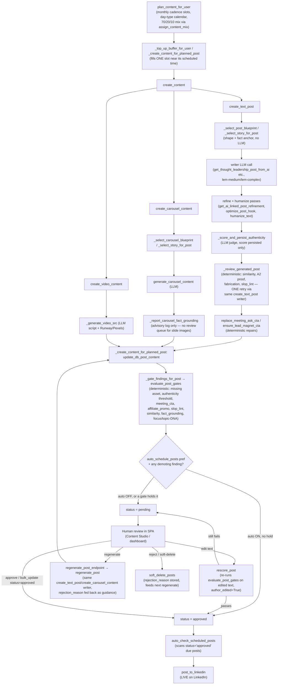
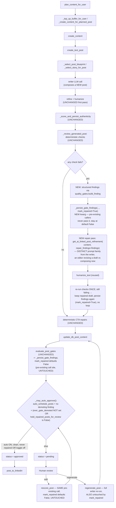

# Graph: Content Generation

## What this graph does

Turns a content-plan slot (a day + post type + buyer stage + 70/20/10 mix class, already decided
by the monthly planner) into a post row that is either auto-queued for publishing or held for a
human to review. It is the pipeline behind `app/run_content_plan.py`: `plan_content_for_user`
lays out empty slots for the month, then a second pass — `auto_create_weekly_content` /
`_top_up_buffer_for_user` → `_create_content_for_planned_post` — fills each slot's content
shortly before it's needed, running the writer, the deterministic checkers, and the
approve/hold decision in one task.

## Current state

**As reviewed** — this is the graph the rubric below scores, i.e. the state BEFORE the redesign at
the end of this document shipped (issue #1134). The one step it now gets wrong is I1: the review
gate's second attempt is an editor repair, not another draft from the writer. Everything else still
reads true.

Numbered walkthrough (function names as read in `src/cqc_lem/app/run_content_plan.py`):

1. **`plan_content_for_user`** lays out the month's *empty* slots: `_cadence_slots` picks which
   weekdays get a slot (`posts_per_week` × `posting_days`, issue #621/#581), `assign_content_mix`
   (content_alignment) stamps each slot's 70/20/10 class, `day_type_stage` sets its buyer stage.
   No LLM call here — it's arithmetic over dates and counts. This does **not** write content, only
   `posts` rows with a scheduled time, type, stage, and mix.
2. **`_create_content_for_planned_post`** (called from `_top_up_buffer_for_user` /
   `auto_create_weekly_content`, close to the post's scheduled time, per issue's buffer design)
   is where the real work happens for one slot. It calls **`create_content`**, which dispatches by
   `post_type` to `create_text_post`, `create_carousel_content`, or `create_video_content`.
3. **`create_text_post`** (text posts, the highest-volume path): picks a shape with
   `_select_post_blueprint` (rotation/performance-weighted, no LLM) and a fact anchor with
   `_select_story_for_post` (story bank, #620), calls one of the per-post-type writer functions
   (`get_thought_leadership_post_from_ai`, `get_personal_story_post_from_ai`, etc. — LLM,
   `lem-medium`/`lem-complex` per `ai_helper.py`), then runs deterministic refine/hook/sanitize
   passes and `humanize_text`. `_score_and_persist_authenticity` then runs a **second, separate**
   LLM call (the authenticity judge) that only writes a score — it does not gate here.
   `_review_generated_post` is the deterministic checker pass: near-duplicate similarity
   (`find_most_similar`), the A2 first-person-proof check, story-bank fabrication check
   (`_fabricated_specifics`), fact-grounding (`fact_grounding_report`), and `slop_lint_report`'s
   HARD checks. Any hit triggers **one** retry by re-invoking `create_text_post` itself with an
   explicit avoid/proof/no-invention directive — same writer, not a different model or process.
   `replace_meeting_ask_cta` and `ensure_lead_magnet_cta` do final deterministic repairs
   (banned meeting-ask CTA → artifact CTA; lead-magnet keyword restored if a rewrite dropped it).
4. **`create_carousel_content`** mirrors steps 2–3 for decks: `_select_carousel_blueprint` +
   `_select_story_for_post`, `generate_carousel_content` (LLM), then
   `_report_carousel_fact_grounding` — **advisory only**, logged, never held, because slide text is
   baked into rendered images with no review queue to hold it in.
5. **`create_video_content`** → `_generate_video_src`: LLM script + Runway/Pexels render. Its
   checker is purely presence/absence (`_post_missing_required_asset` downstream), not a content
   quality pass.
6. Back in `_create_content_for_planned_post`: `update_db_post_content` persists the text, then
   `_gate_findings_for_post` → **`evaluate_post_gates`** runs the FULL deterministic gate suite
   one more time on the finished, persisted content — missing asset, authenticity-score threshold,
   `meeting_cta`, `affiliate_promo`, `slop_lint`, similarity, `fact_grounding`, focus/topic-DNA
   (`_check_post_alignment`). This is a **different function from `_review_generated_post`** (no
   LLM regen here — it only produces `findings`, never rewrites).
7. Status decision: `auto_schedule_posts` preference picks the *default* (`approved` vs
   `pending`), then `demoting_findings(gate_findings)` can only ever pull an `approved` post back
   to `pending` — it never promotes a `pending` one. This is the one human-gate branch point in
   the whole graph.
8. **`approved`** posts are picked up by `auto_check_scheduled_posts` (run_scheduler.py), which
   only ever selects `status = 'approved'` rows due within its window, flips them to `scheduled`,
   and dispatches `post_to_linkedin` — the point where content actually goes live.
9. **`pending`** posts sit in the SPA review queue. A human can: edit text and call
   `rescore_post` (re-runs `evaluate_post_gates` on the edited text with `author_edited=True`,
   promotes to `approved` only if `auto_schedule_posts` is on and every gate now passes); call
   `regenerate_post_endpoint` → `regenerate_post` (same writer functions, fed the stored
   `rejection_reason` as guidance); bulk-approve via `/posts/bulk_update/`; or soft-delete
   (`soft_delete_posts`), which stores a rejection reason that seeds the next regeneration attempt.

## Rubric scorecard (current state)

| Criterion | Verdict | Why |
|---|---|---|
| Removes fake waiting | ✅ | No step blocks without doing real work. The only "review window" pattern in this codebase is the weekly-group-post beat (a different graph); here, `pending` is not a timer — it is a real, indefinite queue state a human clears at their own pace, and the buffer top-up (`_top_up_buffer_for_user`) generates content close to when it's needed rather than idling. `_report_carousel_fact_grounding` is advisory-only but it is a real (cheap) check being logged, not a no-op wait. |
| Separates worker from checker | ⚠️ | Genuinely two code paths — `slop_lint.py`, `fact_grounding_report`, `find_most_similar`, `has_first_person_proof` are pure deterministic/regex/embedding functions with **no LLM call**, structurally unable to rubber-stamp what the writer produced. That is real separation for those checks. But the *retry* loop (`_review_generated_post`) resolves a failing deterministic check by calling `create_text_post` again — the same writer, same model tier, same prompt family, now with an extra directive — so the "second opinion" on a failed draft is not an independent judge, it's the original author trying again. The one LLM-based checker (`score_authenticity`, the authenticity judge) is at least a separate prompt/function from the writer prompts, but it's the same model tier calling the same proxy, and it only writes a score — the actual demote-to-pending decision is made by the deterministic `evaluate_post_gates`, which is real separation of *decision* from *judgment*. Net: the deterministic gates are a real checker; the "fix a failing draft" loop is not independent of the worker. |
| Human gate at the expensive-mistake point | ✅ | `evaluate_post_gates` → `pending`/`approved` sits right before `auto_check_scheduled_posts`, which is the only path to `post_to_linkedin` (the point content goes live and becomes visible/irreversible on a real professional network). Nothing downstream of `approved` has a human checkpoint — `auto_check_scheduled_posts` only checks `status='approved'` and `scheduled_time`, no second look. So the review gate is placed at the single most expensive point in the graph (going live), not at a cheap intermediate step (e.g., not at blueprint selection or story-bank pick, which are silent). The one soft spot: if `auto_schedule_posts` is on and every gate passes, a post can go from freshly-generated straight to `approved` and then live with **zero** human eyes on it ever — the gate exists but a user can configure themselves out of it, and that's a real per-user choice already surfaced as a preference, not a hidden default. |
| Leaves a trail (residue) | ✅ | Substantial durable residue feeds the next run: `update_db_post_shape` (V51 rotation history so the next post/carousel avoids the same archetype/hook), `record_story_bank_use` (so the next post draws a different anecdote), `_persist_gate_findings`/`update_db_post_gate_reason` (the exact reason a post is held, shown in the review UI), `update_db_post_authenticity_score` and `_score_and_persist_dwell` (scores persisted even when they don't gate, feeding `auto_nightly_content_quality` trend telemetry), and rejection reasons on soft-delete feeding the next `regenerate_post` call. This is the strongest row in the graph — almost every step writes something that changes the next slot's generation or review. |
| Avoids the agent-count/coordination-cost trap | ✅ | This is a small number of sequential functions in one process/task, not a multi-agent negotiation. The "second opinion" is a retry of the same function, not a new agent; the deterministic gates are cheap regex/embedding checks, not LLM roundtrips fanning out. The one place complexity is real (the branching writer dispatch across text/carousel/video, each with its own blueprint-selection/fact-anchor/regen sub-flow) is inherent to three genuinely different content shapes needing different generators — not accidental process sprawl. |

## Spec — what this graph is for

Given a planned slot (user, post type, buyer stage, 70/20/10 mix class, scheduled time), produce
LinkedIn-ready content that is either safe to auto-publish or correctly held with an actionable
reason, such that:

- The post is in the user's voice (`profile_synthesis`), grounded only in facts the user actually
  supplied (story bank, #620), and matches their declared focus topics (topic-DNA gate).
- It is not a near-duplicate of the user's last ~50 posts (`POST_SIMILARITY_MAX`).
- It carries no banned CTA shape (meeting ask) and, if promo-class, is a forced `case_snapshot`
  closing on an owned artifact, never a meeting ask.
- It fails no HARD `slop_lint` check, and any fact-anchored archetype's numbers are either
  verified against the story bank or explicitly placeholdered for the author to fill.
- A post that fails any of the above never reaches `approved` — it is held `pending` with the
  specific reason recorded, not silently degraded or silently dropped (the exception being
  carousel slide text, which cannot be held post-render and is only logged).

## Verifier — what "good" means for THIS graph

The concrete, already-existing check for "did this graph do its job":
`evaluate_post_gates(post_id, content, post_type, ...)` returning `[]` (no demoting findings) is
the pass condition for auto-publish eligibility; `demoting_findings(gate_findings)` is the
authoritative "hold it" decision, and `_gate_findings_for_post` / `rescore_post` are the two call
sites that apply it (generation time and re-score time respectively). A regression here shows up
as either (a) a post reaching `approved` that a gate should have caught — checkable by replaying
`evaluate_post_gates` against a known-bad fixture and asserting a finding — or (b) a good post
wrongly held, checkable the same way with a known-good fixture. `tests/unit` around
`run_content_plan.py` (fixtures for `slop_lint_report`, `fact_grounding_report`,
`find_most_similar`) is the existing lane for this; `content_quality_telemetry` (#630) is the
trend-line verifier, not a gate, and should not be treated as pass/fail.

## Environment — owning docs/modules

- `src/cqc_lem/app/run_content_plan.py` — the graph itself (planning, per-type writers, gates,
  status-setter, rescore/regenerate entry points).
- `src/cqc_lem/utilities/ai/content_framework.py` — blueprint/archetype menus, day-type calendar,
  V51 shape rotation, similarity/proof directives.
- `src/cqc_lem/utilities/ai/content_research.py` — research layer feeding the writers.
- `src/cqc_lem/utilities/ai/content_alignment.py` — voice synthesis, `assign_content_mix`,
  artifact-CTA policy, meeting-ask repair.
- `src/cqc_lem/utilities/ai/story_bank.py` — the fact layer (`select_story`, `fact_sources`,
  `unsourced_specifics`).
- `src/cqc_lem/utilities/ai/slop_lint.py` — the deterministic HARD/WARN lint.
- `docs/content-scheduling.md` — cadence/posting-days contract (issue #621/#581).
- `docs/content-core.md` — story bank, comment quality contract, carousel deck-reference gate,
  slop lint, 70/20/10 governor, newsletter blog alignment.
- `src/cqc_lem/app/run_scheduler.py` (`auto_check_scheduled_posts`) — the publish trigger that
  consumes this graph's `approved` output; out of scope for this doc but is the graph's exit.
- `src/cqc_lem/api/main.py` (`/user/post/rescore`, `/user/post/regenerate`, `/posts/bulk_update/`,
  `/posts/` delete) — the human-gate surface (SPA review queue).

## Reference exemplar candidate (for Phase 2)

The deterministic-gate design (`evaluate_post_gates` producing structured, explainable findings
that a human or a re-score can act on, plus the V51 rotation/story-bank residue that measurably
changes the next generation) is the strongest candidate piece to hold up as a reference pattern
for the other five graphs — worth naming explicitly in Phase 2 as "the gate returns *why*, not
just pass/fail, and every generation writes something the next generation reads." The weakest
piece to flag for redesign consideration is the retry-is-the-same-worker pattern in
`_review_generated_post`: a failing deterministic check invoking the identical writer function
again is not a second opinion, just a second attempt.

## Gauntlet-loop redesign — WINS (3 rounds)

Per `docs/gauntlet-loop.md`: builder proposes a redesign against this doc's Verifier, a fresh-context
critic blind-judges it against the named reference exemplar, loop until it wins or hits the 3-round
cap. This piece won on round 3.

**Reference exemplar:** this graph's OWN `evaluate_post_gates` design — it already produces
structured, explainable findings (not just pass/fail) that a human or a re-score can act on.

**Round 1 → round 2:** critic found the fix was sound, but `ever_gate_demoted` unconditionally
overrode a user's own `auto_schedule_posts=true` choice — silently taking away configured autonomy
rather than exposing a control (per the corrected product-goal framing: LEM's engagement/content flows
are supposed to be autonomous by default; the right criterion is user configurability, not mandatory
review). Round 2 fix: added a per-user toggle, `hold_repaired_posts_for_review`, default ON.

**Round 2 → round 3:** critic found `ever_gate_demoted` fired from ANY call to
`_persist_gate_findings` — including the two *pre-existing* call sites (`_gate_findings_for_post` at
generation time, `rescore_post`'s promote-on-pass path) — so the new toggle's default silently blocked
already-shipped behavior for a much broader population than "posts that needed the new repair pass."
Round 3 fix: a new `mark_repaired: bool = False` kwarg on `_persist_gate_findings`, passed `True` only
from the new repair-path call sites; every pre-existing caller is untouched and defaults to `False`.

**Final verdict (round 3): WINS.** The critic checked the live source and found a third pre-existing
caller the proposal didn't enumerate (`_finish_regenerated_post`/`regenerate_post`) — but confirmed
this doesn't break correctness: an unmentioned, unmodified call is exactly the case Python's
default-argument semantics protect against.

### Proposed redesign

**What changed:** the repair pass moves off the composer (`create_text_post`) onto the existing editor
function (`get_ai_linked_post_refinement`, already used one step earlier for the first-pass refine) —
a genuinely distinct prompt family. `ever_gate_demoted` now only fires from the new repair path, gated
by a per-user toggle that defaults ON but is fully reversible.

**What did not change:** the deterministic check functions, `evaluate_post_gates`, the authenticity
score, carousel/video paths, `regenerate_post` — and critically, all pre-existing callers of
`_persist_gate_findings` (step L, `rescore_post`, and `_finish_regenerated_post`) are byte-for-byte
unchanged, since `mark_repaired` defaults to `False` and none of them pass it.

**Residual caveats (non-blocking, noted by the final critic):** the doc undercounts pre-existing
callers at two when there are three — doesn't affect correctness, worth correcting in the write-up.
Add a one-line code comment on `_persist_gate_findings` warning future editors that a forgotten
`mark_repaired=True` fails safe (under-protects) rather than over-triggers.

### Shipped (issue #1134)

The redesign above is the code as it stands. Three corrections to the write-up, made while building
it:

- **There are THREE pre-existing callers of `_persist_gate_findings`**, not two — the generation-time
  gate pass, `rescore_post`'s promote-on-pass path, and `_finish_regenerated_post`. All three are
  unchanged and stay at `mark_repaired=False`; the docstring says so, and says which way a forgotten
  `mark_repaired=True` fails (safe: the post under-reports having been repaired).
- **The retry did not call `create_text_post` any more when this landed** — #1217 had already moved
  it to `_compose_draft`, the generate/refine core. That is still the same author having a second go
  at the same brief, which is what the redesign replaces: `_repair_draft` hands the failing draft to
  `get_ai_linked_post_refinement` with the findings, then re-runs the deterministic passes
  (sanitise, bait strip, humanize) so the repaired text is graded on the same footing.
- **The two missing finding shapes are `proof_finding` and `fabrication_finding`** in
  `utilities/quality_gates.py`. Neither is built by `evaluate_post_gates` — they exist so the repair
  brief and the review queue speak one vocabulary, and nothing is ever HELD on them. Both are built
  `demoted=False` for exactly that reason: `demoting_findings` and the SPA's `holdingFindings` read
  that flag as "this is the finding holding the draft", which these two never are.
- **The editor needs the writer's material, not just the findings.** The redesign as written handed
  `get_ai_linked_post_refinement` the findings alone, which makes a proof or fabrication finding
  unanswerable: it asks for a real first-person specific while forbidding invention, and the editor
  can see only the draft. `_repair_draft` therefore also passes `ctx.story_directive` — the exact
  string `_draft_from_source` gave the writer, carrying the bank's own "these facts are the ONLY
  personal specifics allowed" rule — as `repair_source_material`, above the repairs in the prompt.

`_may_auto_approve(user_id, post_id, auto_schedule, findings)` is the one approve decision, read by
both call sites. It fails OPEN on an unreadable flag or prefs row, matching the gates' own posture:
a DB hiccup costs the extra review, never the publish.
