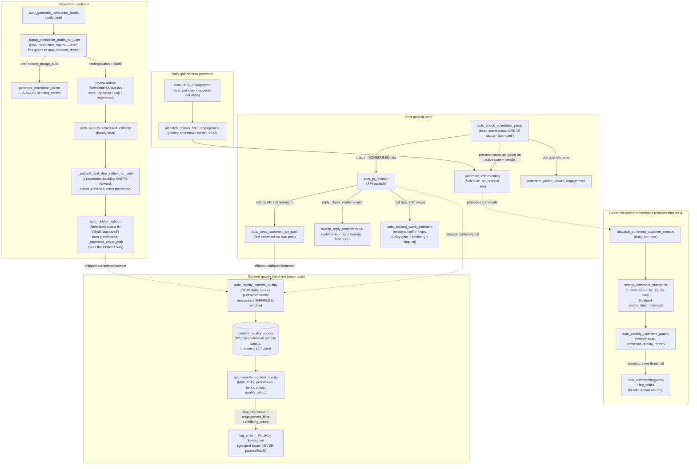
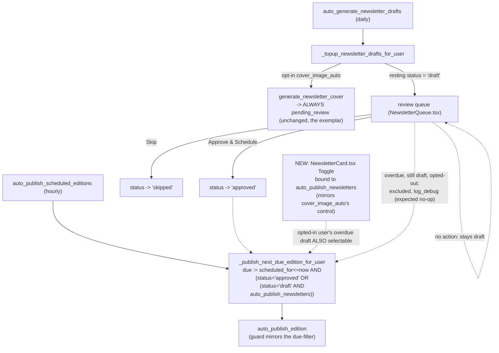

# Graph: Content Scheduling & Quality Loop

## What this graph does

Takes already-generated content (posts, newsletter editions) through publish, the golden-hour
presence work that surrounds a publish, and the read-only telemetry that scores what shipped —
never the writing itself (that's the sibling Content Generation graph). Four beats anchor it, all
in `app/run_scheduler.py`: `auto_check_scheduled_posts` (post publish + pre-post warm-up),
`dispatch_golden_hour_engagement` (daily presence independent of any one post),
`_topup_newsletter_drafts_for_user` / `auto_publish_scheduled_editions` (newsletter cadence), and
`auto_nightly_content_quality` / `auto_weekly_content_quality` (the quality trend line). A fifth
thread — comment-outcome sweeps feeding `auto_weekly_comment_quality` — is included because it is
the one place in this graph where a checker's verdict actually acts (a HOLD), which sharpens the
contrast with the telemetry beats that deliberately never act.

## Current state

### Walkthrough

1. **`auto_check_scheduled_posts`** (Celery beat, `QueueOnce`) scans posts `status='approved'` due
   between yesterday and `CQC_LEM_POST_TIME_DELTA_MINUTES` from now, flips each to `SCHEDULED`, and
   dispatches `post_to_linkedin` at its `eta` — a REST/API publish, deliberately never gated on the
   Selenium throttle (`POSTING is API-driven and deliberately NOT gated`). In the same pass it
   dispatches the pre-post Selenium warm-up: `automate_commenting` (feed commenting ~15 min before,
   own `se_prepost` queue lane, issue #553) and `automate_profile_viewer_engagement`, both skipped
   (and the skip **recorded**, not silently dropped — `record_pre_post_skipped`) when the user isn't
   active/connected or the account is throttled. It also re-queues posts orphaned in `scheduled`
   for >2h (container restart recovery).
2. **`post_to_linkedin`** publishes via the `/posts` API. On success it: dispatches
   `auto_seed_comment_on_post` at +3 min (first comment on the user's own post, API not Selenium,
   so immune to the feed-navigation 429); dispatches `sweep_reply_comments` at several offsets
   across the first hour when `reply_check_mode='event'`; and dispatches
   `auto_second_wave_comment`'s **first hop** when the second-wave feature is enabled.
3. **`auto_second_wave_comment`** is not a single long countdown — because Celery's
   `task_acks_late` would let the broker redeliver an unacked 6-8h-out message every
   `visibility_timeout` (~75 min) and post the comment several times, the task re-checks the post's
   real age each hop and re-arms itself (`second_wave_hop_seconds`) until due. When due, it drafts
   through the same #617 quality-contract + similarity gate as any comment; a draft that never
   clears the gate ships **nothing** (`_record_golden_hour_report` still logs the `gate_failed`
   outcome so the miss is visible, not silent).
4. **`auto_daily_engagement`** (separate daily beat) gives every active user a golden-hour feed
   presence even on days with no scheduled post: per-user staggered slots (`_stagger_due`, #554)
   spread the fleet across the `se_engage` lane instead of firing everyone on one crontab, and the
   dispatch carries a pacing countdown via the `dispatch_golden_hour_engagement` shim (kept
   separate from `automate_commenting` itself so the countdown doesn't hold the user's `QueueOnce`
   lock and silently swallow a concurrent pre-post dispatch, per its own docstring).
5. **Newsletter cadence** runs on a producer/reviewer/publisher split: `auto_generate_newsletter_drafts`
   (daily) calls `_topup_newsletter_drafts_for_user`, which plans a batch of distinct blueprints
   (`plan_newsletter_topics`, steered away from prior subjects/openers/formats) and writes one
   edition per open queue slot up to `max_queued_drafts`, each pre-assigned a `scheduled_for` slot.
   `cover_image_auto` (opt-in) queues `generate_newsletter_cover`, whose output **always** lands
   `pending_review` regardless of the trigger (per-edition button or the auto setting) — a
   generated cover is a public brand asset and is never self-approved.
6. The edition then sits in the review queue (`NewsletterQueue.tsx`, `PUT /user/newsletter-draft`)
   where a human may `save` (edit only), `approve`, `skip`, or trigger `regenerate_newsletter_edition`.
   **`draft` is the resting status** the generator leaves it in, and it is a non-terminal,
   publishable status: `auto_publish_scheduled_editions` → `_publish_next_due_edition_for_user` →
   `auto_publish_edition` treats `status IN ('draft', 'approved')` as equally publishable. An
   edition nobody touches still ships at its slot; only an explicit `skip` keeps it from going out.
   `generate_lead_days` (default 3) is the lead time this relies on as a review window, the same
   shape as the weekly group-post draft/publish split — but unlike that beat (and unlike scheduled
   *posts*, which require `status='approved'`), CLAUDE.md does not call this out as an intentional
   "silence ships it" contract for newsletters.
7. **`auto_publish_edition`** loads the (draft-or-approved) edition, fills LinkedIn's article
   editor, and attaches a cover **only** via `_approved_cover_path` — the one place that reads
   `cover_image_status`, so a `pending_review` AI cover can never reach LinkedIn even though the
   edition body around it can. A backlog of >1 due edition publishes only the oldest and **shifts**
   the rest forward onto future cadence slots (`_reschedule_pending_editions_forward`) so a
   subscriber never gets several editions at once and nothing is silently dropped.
8. **Comment-outcome feedback** (adjacent to, and feeding, this graph's quality question):
   `dispatch_comment_outcome_sweeps` runs `sweep_comment_outcomes` read-only at T+24h per comment
   (replies, likes, LinkedIn's own "Most relevant" survival, three-valued so an unreadable card
   never counts as a demotion). `auto_weekly_comment_quality` rolls that into a scorecard
   (`comment_quality_report`) and — the one actor in this whole graph — calls `hold_commenting`
   plus `log_critical` when the demotion rate crosses threshold on a real sample. The hold does not
   self-clear; only a human resuming automation lifts it.
9. **`auto_nightly_content_quality`** (02:40 UTC, after the 23:00 stats scrape and 23:40 follower
   capture have landed) scores every post/comment/newsletter **shipped** in the window: weighted
   slop score, self-similarity against that surface's own history (one `lem-embedding` call per
   surface, explicit `llm_attribution(user_id=...)` scope so the spend bills the right account),
   #382's **stored** authenticity score (never re-judged), hook length, and engagement rate once
   impressions exist. Every dimension a piece can't measure records `None`, excluded from *its own*
   sample count — never charted as zero. It is strictly read-only: "it never edits, holds, or
   re-generates anything."
10. **`auto_weekly_content_quality`** (Mon 09:45) reads two periods of nightly scores back and
    compares them against the account's **own prior week** (`quality_rollup`), the one exception
    being the engagement floor (an absolute, benchmark-backed threshold). A qualifying regression
    rides the *existing* alerting pipe — `log_error` → PostHog `$exception` → the same grouped-issue
    path as any other error — rather than a bespoke channel. Per CLAUDE.md and
    `docs/content-quality-telemetry.md`: **this subsystem never pauses anything**; that is
    explicitly #629's suppression tripwire's job, not this one's.

## Rubric scorecard (current state)

| Criterion | Verdict | Why |
|---|---|---|
| Removes fake waiting | ✅ | The 6-8h second-wave delay is served in re-arming hops that do real work each time (re-check due-ness, re-check pause state), not one blocking countdown — explicitly engineered to dodge Celery's `visibility_timeout` redelivery trap. Pre-post Selenium warm-up windows are clamped/skipped rather than dispatched with a past `eta` that Celery would fire immediately as a no-op wait. The newsletter `generate_lead_days` gap is a genuine review window, not idle time — it exists so a human *can* act before the slot, even though (see below) nothing forces them to. |
| Separates worker from checker | ⚠️ | Real splits exist and are enforced structurally: a generated newsletter **cover** always lands `pending_review` regardless of trigger, checked by `_approved_cover_path` at a different place than generation (`newsletter_cover.py` generates, `engagement/newsletter.py` gates); comment-outcome scoring (`sweep_comment_outcomes`) is a separate T+24h read against LinkedIn's own UI, not a self-report from the commenting task. But the newsletter **body** has no equivalent separation — the same beat that writes it (`_topup_newsletter_drafts_for_user`) also pre-assigns it a publishable `scheduled_for` slot, and nothing downstream re-checks the content before `auto_publish_edition` ships it. And the content-quality nightly pass partly grades generation against itself: authenticity is `#382`'s **stored** score from generation time, not an independent read. |
| Human gate at the expensive-mistake point | ⚠️ | Scheduled **posts** are a hard gate — `get_ready_to_post_posts` only ever selects `status='approved'`, so nothing publishes without an explicit approval. Newsletter **editions are not**: `draft` (the resting, untouched status) is publishable exactly like `approved`, so a generated public LinkedIn article — arguably a bigger reputational unit than a single post — ships on silence unless a human actively clicks Skip. This is the same "silence ships it" shape CLAUDE.md documents and names for the weekly group post, but is not called out (or obviously intended) for newsletters, and it sits right next to a cover-image gate on the *same edition* that IS a hard approval requirement — an inconsistency worth flagging. The comment-quality HOLD, by contrast, puts the gate exactly where a wrong call is expensive (a demotion pattern spending the day's whole comment cap on invisible comments) and requires a human to explicitly resume. |
| Leaves a trail (residue) | ✅ | This is the strongest row. Pre-post skips are recorded with a reason (`record_pre_post_skipped`), not just dropped. `content_quality_scores` persists a durable, per-dimension-sampled trend rather than a pass/fail verdict — explicitly built so an unmeasured dimension (`None`) can never be mistaken for a clean or a collapsed reading, and a truncated run logs exactly what was dropped and why (`CONTENT_QUALITY_MAX_ITEMS`). `comment_outcomes` is the same shape one layer down. The weekly rollup measures against the account's **own** prior period rather than a fixed target, so every run makes the next comparison sharper. The one gap: the newsletter planner explicitly avoids prior *subjects/openers/formats* (real residue feeding the next draft), but nothing in this graph feeds "which drafts got Skipped and why" back into what gets planned next. |
| Avoids the agent-count/coordination-cost trap | ✅ | No new agents here — every step is a single deterministic Celery beat or a plain read/write function; the "checker" roles (`sweep_comment_outcomes`, `auto_weekly_content_quality`) are scheduled functions reading durable rows, not a second LLM agent re-judging a first LLM agent's output. The one LLM call in the entire quality trend line is the embedding call for self-similarity, explicitly scoped to avoid double-billing. The graph's complexity is temporal (staggering, hops, backlog-shifting) rather than agent-count — a defensible trade given Celery's at-least-once redelivery semantics, not empire-building. |

**Weakest rows:** *Human gate at the expensive-mistake point* and *Separates worker from checker*,
both centered on the same finding — the newsletter body has no structural approval requirement
(unlike scheduled posts, and unlike its own cover image) even though a published edition is a
public, harder-to-retract artifact than a single feed post.

## Spec — what this graph is for

- A post that reaches `status='approved'` at its scheduled time publishes via the API, on time,
  exactly once, with its pre/post-publish Selenium presence work (warm-up commenting, seed comment,
  reply sweeps, second wave) landing inside their designed windows even under retries, container
  restarts, or an open 429 breaker.
- A newsletter queue stays topped up to its cap with distinct, on-brand drafts ahead of their
  cadence slots, and publishes at most one edition per user per run with backlog reshuffled forward
  rather than dropped or batch-dumped.
- Content-quality telemetry produces a trend a human (or a later automated policy) can act on —
  never blocks or silently skews a metric when a dimension can't be measured — while the
  suppression/comment-hold safety nets remain the only paths that actually stop automation.

## Verifier — what "good" means for THIS graph

- A post at `status='approved'` with a past-due `scheduled_time` is published (or lands in `error`
  with a specific, human-actionable reason) within one scan interval; it is never published twice
  (`get_post_status(post_id) == POSTED` short-circuit) and never silently dropped.
- Every pre-post Selenium dispatch that does NOT happen has a `record_pre_post_skipped` reason
  attached — a missing dispatch and a recorded skip are distinguishable by reading the DB, not by
  inference from absence.
- `content_quality_scores` for a given (user, surface, ref_id) exists at most once per scoring run
  and every dimension is either a real number with a `*_sample` count or explicitly `None` —
  `summarize_scores`/`quality_rollup` must never coerce an unmeasured dimension into 0.
- A weekly alert (`slop_regression` / `engagement_floor` / `similarity_creep`) only fires with a real
  sample (`CONTENT_QUALITY_MIN_SAMPLE`) on both sides of the comparison, and never calls
  `pause_automation` / `hold_commenting` — that boundary is a testable invariant, not a style choice.
- A generated newsletter cover is attached to a published article if and only if
  `cover_image_status == 'approved'` — `_approved_cover_path` is the one function this can be
  asserted against.

## Environment — owning docs/modules

| Concern | Module | Doc |
|---|---|---|
| Post publish + pre/post-publish dispatch | `app/run_scheduler.py` (`auto_check_scheduled_posts`), `app/engagement/posting.py` (`post_to_linkedin`) | — |
| Cadence / posting-days invariants | `utilities/ai/content_framework.py` (`POST_DAY_TYPES`) | `docs/content-scheduling.md` |
| Golden-hour presence, second wave, reply sweeps | `utilities/golden_hour.py`, `app/engagement/posting.py` (sweeps), `app/engagement/feed.py` (second wave) | `docs/engagement-automation.md` (golden-hour + second-wave sections) |
| Comment outcome tracking + hold | `utilities/comment_outcomes.py`, `app/run_scheduler.py` (`auto_weekly_comment_quality`) | `docs/engagement-automation.md` (#628 section) |
| Newsletter drafting/cadence/publish | `utilities/newsletter.py`, `app/run_scheduler.py` (`_topup_newsletter_drafts_for_user`, `auto_publish_scheduled_editions`) | — |
| Newsletter cover gate | `utilities/newsletter_cover.py`, `_approved_cover_path` in `app/engagement/newsletter.py` | `docs/newsletter-covers.md` |
| Newsletter blog alignment | `utilities/blog_source.py` | `docs/content-core.md` |
| Content-quality telemetry (nightly + weekly) | `utilities/content_quality.py` | `docs/content-quality-telemetry.md` |
| Suppression tripwire (adjacent safety net, NOT this graph's alerting path) | `utilities/suppression.py`, `app/run_scheduler.py` (`auto_suppression_tripwire`) | referenced in CLAUDE.md "Engagement automation" |

## Reference exemplar candidate (for Phase 2)

The **comment-outcome → `auto_weekly_comment_quality` → `hold_commenting`** thread is the strongest
candidate reference inside this graph: worker (comment) and checker (T+24h outcome read against
LinkedIn's own rendering) are genuinely different processes at different times; the human gate sits
at the point where continuing would actively waste the day's cap on invisible comments (expensive);
and it leaves a typed, three-valued trail (`visible_most_relevant`) that a thin sample can't turn
into a false alarm. The newsletter draft→publish path is the weakest and the most useful *contrast*
case for Phase 2: it has the right shape (producer beat, review queue, separate publish beat) but,
unlike its own cover-image gate on the same row, the body ships on silence rather than on approval.

## Gauntlet-loop redesign — WINS (3 rounds)

Per `docs/gauntlet-loop.md`: builder proposes a redesign against this doc's Verifier, a fresh-context
critic blind-judges it against the named reference exemplar, loop until it wins or hits the 3-round
cap. This piece won on round 3.

**Reference exemplar:** this graph's OWN comment-outcome → `hold_commenting` thread, and even more
directly, the SAME newsletter edition's own cover-image gate (`pending_review` default, not
publishable until approved) — the body should adopt the exact posture its own cover already has.

**Round 1 → round 2:** critic found the hard `status == 'approved'` filter made autonomous newsletter
publishing structurally unreachable for every user, forever — not a safer default, an eliminated
option (in tension with the corrected product-goal framing that engagement/content flows should stay
user-configurable, autonomous by default). Round 2 fix: added a per-user `auto_publish_newsletters`
toggle (mirrors `cover_image_auto`'s shape), with a two-step migration backfilling existing users to
`true` (no regression) and defaulting new rows to `false` (safe default going forward).

**Round 2 → round 3:** critic verified the migration was correct MySQL/Flyway, but found the toggle
was wired through DB/API/types and a read-only queue-page copy branch — with no actual rendered
control anywhere in the SPA. A user at the new `false` default had no in-product way to opt back in.
Round 3 fix: added a real `Toggle` to `NewsletterCard.tsx`, mirroring `cover_image_auto`'s existing
control on the same form.

**Final verdict (round 3): WINS.** The critic independently read the live component and confirmed
the placement, the `setNl`/PUT-spread mechanic, and the "no new plumbing needed" claim all check out
against the real code.

### Proposed redesign

Newsletter cadence (post-publish path unchanged — it's the reference this borrows from):

**What changed:** `get_editions_due_to_publish`'s filter widens from `status IN ('draft','approved')`
to `status='approved' OR (status='draft' AND auto_publish_newsletters)`. Migration: `ADD COLUMN
auto_publish_newsletters DEFAULT 1` (backfills every existing row to `true`), then `ALTER ... SET
DEFAULT 0` (new rows only). A rendered `Toggle` in `NewsletterCard.tsx`, next to `cover_image_auto`,
gives the setting an actual control — no new mutation/endpoint/loading state, it rides the
component's existing spread-of-state PUT.

**What did not change:** the cover-image gate itself (deliberately gets no equivalent opt-out — a
generated cover is a public brand asset regardless of the body's setting); `_topup_newsletter_drafts_for_user`,
cadence math, `_reschedule_pending_editions_forward`, the comment-outcome thread, and the post-publish
path — all untouched.

**Residual caveats (non-blocking, noted by the final critic):** `NewsletterCard.tsx` has no companion
test file today, unlike sibling account cards — add one alongside this change given the 80%-patch-coverage
gate. The DB/API/types work from round 2 wasn't re-audited in round 3's pass and should be
sanity-checked end-to-end before merge.
