# Graph: Deploy / Release

## What this graph does

Turns a merged PR on `main` into running code on the Hostinger VPS with nobody typing a deploy
command: release-please accumulates Conventional-Commit merges into a version-bump PR, a 4x-daily
window (or an authorized `release:now` fast lane) merges that PR and cuts a tag, a GitHub Release
triggers an image build and push to GHCR, and `scripts/deploy.sh` runs a blue/green cutover on the
VPS — migrate, stand up the new color, health-check it, flip the nginx edge, drain and recreate
Celery, auto-rolling back to `.last_good_tag` if the new color never turns healthy. The job it exists
to drive is: **ship every green merge to production on a predictable cadence, without a human
touching the deploy step, while making a bad deploy cost nothing (auto-rollback) and a mid-deploy
crash lose nothing (drain + `task_acks_late`).**

## Current state

```mermaid
flowchart TD
  A["Dev branch, PR opened to main"] --> B{"PR Lint: Validate PR title\n(Conventional Commits)"}
  A --> C["6 required CI gates:\nUnit Tests (3.12) / Integration Tests /\nUI Build / Migration Versions /\nGitGuardian Scan / CodeQL PR Quality Gate"]
  C --> D{"merge_group: same 6 gates\nre-run in the merge queue"}
  D --> E["PR merges to main\n(required_approving_review_count = 0 —\nreview is not enforced)"]

  E --> F["release-please.yml\non push to main"]
  F --> G["Opens/updates ONE accumulating\n'chore: release X.Y.Z' PR\n(release-please-config.json)"]

  subgraph BATCH["Batched release window"]
    H["release-auto-merge.yml\ncron 05:00/11:00/17:00/23:00 UTC"] --> I["gh pr merge --auto\non the release PR"]
    J["release:now label applied,\nPR closes merged=true"] --> K{"Verify labeller is in\nTRUSTED_LABELLERS\n(timeline API, fails closed)"}
    K -->|refused| L["::warning:: fast lane refused\nships at next scheduled window"]
    K -->|ok| M["Wait up to 10 min for\nrelease-please's OWN run\non this merge SHA to finish"]
    M --> I
  end
  G --> H
  G --> J

  I --> N["Release PR re-runs the same\n6 CI gates + merge queue"]
  N --> O["Release PR merges:\npyproject.toml version bump,\nCHANGELOG.md, git tag vX.Y.Z,\nGitHub Release published"]
  F -.->|"release_created==true\n(direct dispatch)"| P
  Q["ensure-release-tag job\n(merge-queue SHA-rewrite safety net)"] -.->|tag missing| P

  O --> P["build-and-push.yml\non release: published"]
  P --> R["build-and-push job:\ndocker build (compose/local/Dockerfile),\npush ghcr.io/.../cqc-lem:tag + :latest"]
  R --> S["deploy job\nenvironment: production\n(required-reviewer gate REMOVED —\ngreen releases auto-deploy)"]
  S --> T["SSH to VPS, run\nscripts/deploy.sh <tag>\n(up to 5 attempts, backoff to ~6.5min)"]

  T --> U["deploy.sh: checkout tag,\ncheck_env.sh, GHCR login,\nselenium topology guard,\npull images, run Flyway (idempotent)"]
  U --> V["Bring up standby color\n(web_api_blue/green) on new tag"]
  V --> W{"color_healthy?\n/health up to HEALTH_TIMEOUT=180s"}
  W -->|no, active untouched| X["Restore standby to PREV_TAG,\ngit checkout back, maint end,\nabort — ZERO user-facing downtime"]
  W -->|yes| Y["Flip nginx edge to new color\n(graceful nginx -s reload),\nverify edge /health end-to-end"]
  Y -->|edge check fails| X2["Flip edge back to old color,\nmaint end, abort"]
  Y -->|edge ok| Z["Persist .last_good_tag / IMAGE_TAG\n— web tier is LIVE on new tag"]
  Z --> AA["Enter maintenance mode:\nstop celery_beat, pause dispatch,\ndrain in-flight tasks\n(DRAIN_TIMEOUT=180s, best-effort)"]
  AA --> AB["converge_stack: recreate workers/\nbeat/standby color on new tag\n(retries once on #831 'no such\ncontainer' race)"]
  AB --> AC{"verify_stack_running:\nevery expected service up?"}
  AC -->|no| AD["ERROR: partial deploy —\nworker tier may be down;\nmaint end; exit 1"]
  AC -->|yes| AE["Restart litellm if\n.litellm/config.yaml changed;\nmaint end; prune old images"]

  R --> AF["Purge Cloudflare cache\n(continue-on-error)"]
  R --> AG["Post release annotation to PostHog\n(continue-on-error, scripts/posthog_annotate.py)"]

  AD -.->|"ssh-action step failed\n(set -e)"| T

  MAN["Manual: gh workflow run deploy-vps.yml\n-f tag=vX.Y.Z [-f rollback=true]"] -.-> T
  MAN -.->|rollback=true| RB["scripts/rollback.sh <tag>:\ncheckout, pull, up -d --remove-orphans,\nno migrations, no drain, no blue/green"]
```

Numbered walkthrough (job/file names are exact):

1. **PR opened to `main`.** `PR Lint` (`.github/workflows/pr-lint.yml`, job `Validate PR title
   (Conventional Commits)`) checks the title format; the six branch-protection-required contexts
   listed in root `CLAUDE.md` § CI Gates run in parallel: `Unit Tests (Python 3.12)`
   (`unit-tests.yml`), `Integration Tests` (`integration-coverage.yml`), `UI Build`
   (`ui-build.yml`), `Migration Versions` (`migration-check.yml`), `GitGuardian Scan`
   (`gitguardian-scan.yml`), `CodeQL PR Quality Gate` (`codeql-pr-gate.yml`). All six also declare
   `merge_group:`, so they re-run identically once the PR enters the merge queue.
2. **PR merges to `main`.** Per `docs/contribution-security.md` / root `CLAUDE.md`,
   `required_approving_review_count` is 0 — human review is not enforced at this gate, only the six
   automated checks are.
3. **`release-please.yml`** (`on: push: branches: [main]`) runs on every merge. It opens or updates
   ONE standing `chore: release X.Y.Z` PR (`release-please-config.json`, `release-type: python`),
   authored via `RELEASE_DISPATCH_TOKEN` so the PR's own CI runs without a manual "Approve and run"
   click. If `release_created` fires directly (not the normal batched path) it dispatches
   `build-and-push.yml` on the new tag itself. A second job, `ensure-release-tag`, is a merge-queue
   safety net: if the merge queue rewrote the SHA release-please expected and it silently skipped
   tagging, this job tags the untagged `pyproject.toml` version and dispatches the build anyway.
4. **Batching window.** `release-auto-merge.yml` fires on a fixed cron — **05:00 / 11:00 / 17:00 /
   23:00 UTC** — and enables `gh pr merge --auto` on whatever release PR is currently open, so
   PRs merged between windows all ship in one deploy. `docs/release-fast-lane.md` documents the
   measured cost: a release PR waits a median 168 min / p90 339 min this way.
5. **`release:now` fast lane.** The same workflow also listens on `pull_request_target: closed`. If
   the merged PR carries `release:now`, it (a) reads the PR timeline for the actor who applied the
   label and refuses (fails closed, `::warning::`, exit 1) unless that actor is in the hardcoded
   `TRUSTED_LABELLERS` list, then (b) polls up to 40×15s for **release-please's own run on that
   exact merge SHA** to conclude `success` before enqueuing — a deliberate fix for the v0.115.0
   incident where enqueuing on "a release PR exists" (not "is current") shipped a release
   omitting the very PR that triggered the fast lane, per the workflow's own inline comment.
6. **Release PR merges.** It runs the same six CI gates + merge queue as any PR, then merging it is
   what release-please turns into the version bump, `CHANGELOG.md` entry, the `vX.Y.Z` git tag, and
   a published GitHub Release.
7. **`build-and-push.yml`** (`on: release: types: [published]`) job `Build & Push to GHCR` builds
   `compose/local/Dockerfile` and pushes `ghcr.io/<owner>/cqc-lem:<tag>` + `:latest`.
8. **`deploy` job**, `environment: production`. The workflow's own comment on this job states the
   required-reviewer gate on this environment **was removed** so that "green releases auto-deploy";
   restoring it is noted as a manual repo-settings action, not something currently wired. SSH to the
   VPS runs `./scripts/deploy.sh <tag>`, retried up to 5 times with growing backoff (30s/60s/120s/
   180s) purely to ride out transient Hostinger network blips — each retry re-runs the same
   idempotent script.
9. **`scripts/deploy.sh`** (see `docs/zero-downtime-deploys.md` § "Deploy flow"): checks out the
   tag, validates `.env` (`check_env.sh`), logs in to GHCR, guards the Selenium standalone/grid
   topology transition, pulls images, runs Flyway (`compose run --rm flyway`, additive-only per
   root `CLAUDE.md`), brings up the **inactive** blue/green color on the new tag and health-checks
   it (`HEALTH_TIMEOUT=180s`). A failure here costs zero downtime — the active color was never
   touched, the standby is restored to `.last_good_tag`, and the script exits 1.
10. **Edge flip.** On success, `default.conf` is re-rendered to the new color, `nginx -t` validates
    it, `nginx -s reload` swaps traffic with no dropped connections, and the edge is re-probed
    end-to-end before `.active_color` is written. `IMAGE_TAG` / `.last_good_tag` are persisted
    immediately after the flip — while the serving tier is already live on the new tag — so a later
    worker-tier failure still leaves the box's recorded baseline correct (issue #831).
11. **Maintenance + worker converge, entirely post-flip / non-user-facing.** `celery_beat` stops,
    `maintenance begin` pauses dispatch and cancels consumers, `maintenance drain` waits up to
    `DRAIN_TIMEOUT=180s` for in-flight tasks (video generation, commenting loops, DM sweeps) — a
    timed-out drain is not a failure, since `task_acks_late` + `task_reject_on_worker_lost`
    re-deliver anything still running. `converge_stack` recreates workers/beat/standby on the new
    tag, retrying once on the documented Docker "no such container" rename race (#831).
    `verify_stack_running` checks every profile-filtered compose service is not
    `Created`/`Exited`/`Dead`/`Paused`/`Restarting`; a failure here is logged `ERROR` but the script
    still exits 1 without further automated remediation — the web tier stays on the new (good)
    code, but the worker tier can be left partially deployed until re-run or manual intervention.
12. **Best-effort tail**, both `continue-on-error: true` in `build-and-push.yml`: Cloudflare cache
    purge, and a PostHog release annotation (`scripts/posthog_annotate.py`) marking every insight
    graph with the deployed version (issue #654).
13. **Manual paths**, both `workflow_dispatch`-only: `deploy-vps.yml` ("Redeploy / Rollback VPS")
    re-runs `deploy.sh` (or `rollback.sh` with `-f rollback=true`, which skips migrations and the
    blue/green flip entirely — a single `up -d --remove-orphans` on the requested tag) against an
    already-built GHCR image; `deploy.yml` ("Deploy CDK Stack to AWS") is a **dead** workflow — the
    CDK tree it deployed (`src/cqc_lem/aws/`) was deleted in #973, and the `_CI/bootstrap.sh` /
    `_CI/deploy.sh` it sources both guard on `[[ -d "aws" ]]` — a repo-ROOT `aws/` that has never
    existed under that name — so a dispatch has always assumed the AWS role and then done nothing.
    Restoring the tree would not revive it. Never part of the live deploy graph; removing it
    needs the owner (the pipeline credential has no `workflows` permission).

## Rubric scorecard (current state)

| Criterion | Verdict | Why |
|---|---|---|
| Removes fake waiting | ✅ | The 4x-daily batching is deliberate and measured (`docs/release-fast-lane.md` quantifies the 168min median cost) with a documented, authorized escape hatch (`release:now`). Every other wait is doing real work: `DRAIN_TIMEOUT` protects live Celery tasks, `HEALTH_TIMEOUT`/edge-probe waits are the actual verification the flip depends on, and the SSH retry backoff exists to ride out a known Hostinger network flake, not to stall for its own sake. |
| Separates worker from checker | ⚠️ | Automated separation is real and good: six independent CI jobs gate every PR and the release PR alike, and the `release:now` fast lane is authorized by a *different* signal (timeline-actor identity) than the PR author. But there is no adversarial *human* checker in this graph — `required_approving_review_count = 0` means code review isn't enforced, and the deploy's only "checker" is `deploy.sh`'s own `/health` probe: an objective automated check, but the same script that performed the deploy is also the one deciding it succeeded, with no independent second opinion before the flip is made permanent. |
| Human gate at the expensive-mistake point | ❌ | The step where a mistake is most expensive — pushing a new image to the production VPS — is explicitly *not* human-gated: `build-and-push.yml`'s own comment states the `environment: production` required-reviewer gate "was removed so green releases auto-deploy." Everything from a green release PR to VPS cutover (batching window or `release:now`, build, SSH deploy, blue/green flip, worker converge) runs unattended. The only human-controlled point in the whole graph is optionally applying `release:now` (which only ever *accelerates* delivery, never reviews it) and the unenforced PR review upstream. The design instead leans entirely on automated after-the-fact safety (health-check-gated auto-rollback, drain, `task_acks_late`), which is real risk mitigation but is not a human gate. |
| Leaves a trail (residue) | ✅ | Strong and genuinely load-bearing: `.last_good_tag` / `.active_color` are durable state read by the next deploy; `converge_stack`'s per-container compose output is echoed to the deploy log specifically because — per the script's own comment — those lines were the only evidence that identified the #831 container-rename race both times it happened; `CHANGELOG.md` + GitHub Releases are generated automatically; PostHog gets a release annotation on every deploy; and the workflow/script comments themselves encode prior incidents (the v0.115.0 fast-lane failure, issue #549's drain ordering, issue #831's race) as inline rationale that shapes the current step order — a textbook case of a graph's residue making the next run start smarter. |
| Avoids the agent-count/coordination-cost trap | ✅ | No agents at all in the production path — it's a small number of purpose-built scripts and workflow files coordinating through plain files (`.env`, `.last_good_tag`, `.active_color`) and Redis-backed maintenance state, not through inter-agent messaging. `deploy.sh` is one linear script owning the entire cutover; the only "extra" coordination is the necessary kind (retry loops around a known flaky SSH link, a documented merge-queue safety-net job) rather than accumulated process for its own sake. |

## Spec — what this graph is for

The decision this graph drives: **is this exact set of merged commits, on this exact image, safe and
correct to be the code every LinkedIn Engagement Manager user's traffic hits right now** — and doing
so on a predictable cadence (4x/day, or immediately for an authorized urgent fix) without a human
manually SSHing in or clicking deploy. It is explicitly not a correctness-of-the-code decision (that
belongs to the six CI gates and, nominally, code review before merge) — it is a
readiness-of-the-running-system decision: did migrations apply, did the new color come up healthy,
does the edge actually route to it, did the worker tier converge cleanly, and if any of that is false,
did the system get back to a known-good state without a human being paged first.

## Verifier — what "good" means for THIS graph

- **No release ships a red build.** Testable directly: the release PR (like every PR) must pass the
  same six named contexts before `release-auto-merge.yml` can merge it — verify by confirming
  `gh pr merge --auto` was only ever enabled after `gh pr checks` shows all six green, and that no
  release tag exists whose corresponding release-please PR shows a failed run for its head SHA.
- **A failed health check never leaves users on broken code.** Testable: for every deploy where
  `color_healthy` returns false, `.active_color` must be unchanged from before the deploy attempt,
  and the previously-active `web_api_<color>` container must still be the one nginx routes to
  (`docker exec web_app` conf inspection). This is the auto-rollback contract in
  `docs/zero-downtime-deploys.md` and should be checkable purely from deploy logs + `.active_color`
  history without touching the running site.
- **`release:now` is never honored for an unauthorized actor.** Testable: grep the
  `release-auto-merge.yml` run logs for any `Verify who applied release:now` step that reached the
  merge step without an `::warning::` — cross-reference the resolved `actor` against
  `TRUSTED_LABELLERS`. A false positive here (an untrusted actor's fast lane executing) is the one
  failure mode this graph must treat as a security incident, not a bug.
- **A partial (worker-tier) deploy is detectable, not silent.** Testable: `verify_stack_running`
  failing must produce a non-zero exit and an `ERROR` log line naming the specific bad service(s) —
  never a `deploy.sh` that exits 0 while a service sits `Created`/`Exited` (the exact issue #831
  regression this function exists to catch).
- **In-flight work is never dropped by a deploy.** Testable per `docs/DEPLOYMENT.md` §"Deploys and
  in-flight Celery tasks": a task running when maintenance mode begins is either finished within
  `DRAIN_TIMEOUT` or re-delivered after the recreate (verify via `task_acks_late` +
  `task_reject_on_worker_lost` config and the `commented_posts` claim-ledger / `QueueOnce` locks
  that make a re-delivery idempotent rather than a duplicate action).
- **The expensive-mistake point has a named owner, if not a human gate.** Given the current ❌ on
  that rubric row, "good" for THIS graph should include the missing check explicitly: is there a
  human decision point — reviewer approval, an explicit "resume automation"/promote step, anything —
  between "release PR merged" and "traffic hits the new code"? Today the honest, verifiable answer is
  no; any redesign proposal should be graded on whether it adds exactly one deliberate, cheap-to-clear
  gate at that point without reintroducing per-merge deploy friction the batching was built to avoid.

## Environment — owning docs/modules

- `docs/DEPLOYMENT.md` — the full VPS runbook: architecture, one-time setup, routine deploys,
  version-milestone policy, in-flight Celery task handling, manual redeploy/rollback, backups,
  compose file layering, local hotfix fallback.
- `docs/zero-downtime-deploys.md` — the blue/green topology, `scripts/deploy.sh` flow in detail,
  worker-tier resilience (#831), release cadence, stale-lazy-chunk handling (#743).
- `docs/release-fast-lane.md` — `release:now`: who may apply it, the authorization gate, what
  actually happens, what it does not do (never skips CI/merge queue/blue-green/rollback).
- `docs/scaling-plan.md`, `docs/SELENIUM_GRID.md` — referenced by `deploy.sh`'s Selenium
  standalone/grid topology guard (not deploy-specific, but load-bearing for the deploy script).
- `.github/workflows/release-please.yml`, `release-auto-merge.yml`, `build-and-push.yml`,
  `deploy-vps.yml`, `pr-lint.yml`, `unit-tests.yml`, `integration-coverage.yml`, `ui-build.yml`,
  `migration-check.yml`, `gitguardian-scan.yml`, `codeql-pr-gate.yml` — the actual pipeline.
  `deploy.yml` drove the AWS/CDK path deleted in #973 — dead, kept only because removing a workflow
  needs the owner, and never part of the live graph.
  `release-please-config.json` — release-please's own config (release type, changelog behavior).
  `.github/CODEOWNERS`, `docs/contribution-security.md` — why `required_approving_review_count = 0`
  makes CODEOWNERS enforce nothing today, and the provenance-based label-trust model
  (`author_trusted` + `label_actor_trusted`) `release:now`'s verification step mirrors.
- `scripts/deploy.sh`, `scripts/rollback.sh`, `scripts/check_env.sh` — the actual deploy mechanics.
- `compose/prod/nginx/default.conf.tmpl` — the blue/green edge template `deploy.sh` renders.
- `src/cqc_lem/utilities/maintenance.py` (invoked as `python -m cqc_lem.utilities.maintenance`) —
  the maintenance-mode begin/drain/end contract `deploy.sh`'s `maint()`/`drain_workers()` call into.
- `scripts/posthog_annotate.py` — post-deploy PostHog release annotation (issue #654).

## Reference exemplar candidate (for Phase 2)

The weakest row is **"human gate at the expensive-mistake point"** (❌), with a secondary weakness in
**"separates worker from checker"** (⚠️) — both are really the same gap: nothing independent of the
automated pipeline itself signs off before the expensive action (production cutover) happens.

The best-fit exemplar is **LEM's own Agent/Issue-Shipping pipeline** (`ship-issue` skill +
`gauntlet-loop`), which the task brief already flags as a strong candidate — and it holds up on
inspection: it explicitly separates the builder (the agent implementing an issue) from an adversarial
*review* pass (`gauntlet-loop`'s builder/critic pairs, blind-compared against a named reference
exemplar, capped at 3 rounds before falling to `needs-human`) rather than letting the same actor that
wrote the change also be the only one that judges it. And per root `CLAUDE.md`'s Working Method
section, it gates `risk:*` work on a human **Decision Comment** — a deliberate, named point where a
person, not a script, has to weigh in before something risky proceeds. That is precisely the shape
missing from deploy/release: a cheap, explicit, named human checkpoint placed at the one step
(production cutover) where a wrong call is expensive, rather than relying solely on the pipeline
grading its own output. A Phase 2 redesign pass should compare the deploy graph's current "automated
health check is the only gate" pattern against this pipeline's "adversarial reviewer + human Decision
Comment for risky work" pattern and ask whether an equivalently cheap, equivalently rare gate
(not a per-PR reviewer requirement, which the review-count-0 setting and the fast lane both suggest
this team has deliberately avoided) belongs somewhere between "release PR merged" and "edge flips to
the new color."

## Gauntlet-loop redesign — WINS (3 rounds)

Per `docs/gauntlet-loop.md`: builder proposes a redesign against this doc's Verifier, a fresh-context
critic blind-judges it against the named reference exemplar, loop until it wins or hits the 3-round
cap. This piece won on round 3.

**Reference exemplar:** LEM's own Agent/Issue-Shipping pipeline (`docs/graphs/agent-issue-shipping.md`)
— specifically its `risk:*` label mechanism: work is built regardless, but a `risk:*` PR parks with
`needs-human` + a Decision Comment for owner sign-off before merge, gated by *category of consequence*
rather than pipeline stage.

**Round 1 → round 2:** critic found the REPLY→dispatch bridge was hand-waved (nothing in this repo
watches comments on a release-please PR — it carries no `agent:ready`/`needs-human` flow labels) and
the diff-source (`.last_good_tag`) wasn't reachable from a GitHub Actions runner. Round 2 fix: made
the unblock explicitly manual (owner runs `gh workflow run deploy-vps.yml` themselves — no automated
reply-parsing claimed) and switched the diff source to `gh release list`.

**Round 2 → round 3:** critic confirmed the manual-unblock fix was honest and real, but found
`gh release list --limit 2` assumed list positions 0/1 were always "this tag" and "the previous
one" — breaking under a race where a second release (a `release:now` fast-lane release, or the next
scheduled window) publishes while this run's `build-and-push` job is still building. Round 3 fix:
anchor the lookup to this run's own known tag (`needs.build-and-push.outputs.tag`, already wired
through the pipeline today) rather than trusting list position.

**Final verdict (round 3): WINS.** Confirmed `build-and-push.yml`'s `build-and-push` job already
exposes `outputs.tag` and the `deploy` job already consumes it — the fix reuses a wire already
proven in this exact pipeline, not a speculative mechanism.

### Proposed redesign

```mermaid
flowchart TD
  E["PR merges to main\n(unchanged: 6 CI gates,\nrequired_approving_review_count=0)"] --> F["release-please.yml"]
  F --> G["Standing 'chore: release X.Y.Z' PR"]

  subgraph BATCH["Batched release window — UNCHANGED"]
    H["cron 05/11/17/23 UTC"] --> I["gh pr merge --auto"]
    J["release:now label,\nverified via TRUSTED_LABELLERS"] --> I
  end
  G --> H
  G --> J

  I --> N["Release PR re-runs 6 CI gates"]
  N --> O["Release PR merges:\nversion bump, tag vX.Y.Z,\nGitHub Release published"]

  O --> P["build-and-push.yml"]
  P --> R["build-and-push job:\ndocker build, push\nghcr.io/.../cqc-lem:tag + :latest\n— ALWAYS runs, unattended, unchanged"]

  R --> RC{"NEW: release-risk-check job\n\nDiff source: THIS run's own tag,\nnever list position 0/1 —\nthe release tag this workflow ran on.\nFetch gh release list\n--json tagName,createdAt --limit 20,\nlocate the entry matching that tag,\ntake the NEXT-OLDER entry from THAT\nposition as 'previous release'\n(never .last_good_tag — VPS-local,\nunreachable from the Actions runner)\n\nDoes the commit range between that\nprevious tag and this run's own tag\nadd a new file under\ncompose/local/database/migrations/ ?\n\n(AS SHIPPED, #1590: migrations only.\nThe risk:* label half of this design\nwas dropped — see 'What shipped' below)"}

  RC -- "no — the common case" --> S["deploy job, environment: production\nfires immediately, unattended\n(EXACTLY today's behavior)"]

  RC -- "yes" --> HOLD["Skip the automatic deploy job.\nPost a Decision Comment on the\nrelease PR: which migration file(s),\nwhat's about to cut over,\nrecommended action"]
  HOLD --> NOTE["Decision Comment is AUDIT / NOTIFICATION\nONLY. No automation watches or parses\nreplies on this PR — release-please PRs\ncarry no agent:ready/needs-human labels\nand tick.sh never looks at them."]
  NOTE --> MANUAL["Owner (@gitchrisqueen) manually runs\n(CLI or Actions 'Run workflow' UI):\ngh workflow run deploy-vps.yml\n-f tag=vX.Y.Z\n— the SAME existing manual entrypoint,\nno new workflow, no new label,\nno new verification code, no bot\nre-triggering anything"]
  MANUAL --> T

  S --> T["SSH to VPS, run scripts/deploy.sh <tag>\n— UNCHANGED: checkout, Flyway,\nstandby color, /health check"]
  T --> W{"color_healthy?"}
  W -->|no| X["Restore standby, abort\n— ZERO downtime, UNCHANGED"]
  W -->|yes| Y["Flip edge, verify end-to-end\n— UNCHANGED"]
  Y --> Z["Persist .last_good_tag /\n.active_color — UNCHANGED"]
  Z --> AA["Maintenance mode, drain,\nconverge workers — UNCHANGED"]

  S --> AF["Cloudflare purge — UNCHANGED,\nbut it is a STEP OF THE deploy JOB,\nso a flagged release does NOT purge"]
  S --> AG["PostHog release annotation — UNCHANGED,\nalso a STEP OF THE deploy JOB,\nso a flagged release is NOT annotated"]
```

**One consequence of the hold, stated plainly:** the Cloudflare purge and the PostHog release
annotation are *steps of the `deploy` job*, not of `build-and-push`. A flagged release therefore
skips both, and `deploy-vps.yml` — the manual unblock entrypoint — has never done either. So a
migration release shipped by hand gets no CDN purge (a tab open across it can hold a stale
`index.html`; the three-layer mitigation in `docs/spa-deploy-freshness.md` still applies) and no
release annotation on PostHog insight graphs. That is a pre-existing property of the manual
entrypoint, not new code — but this gate makes that entrypoint the routine path for ~36% of
releases, so it is written down here rather than discovered later. Closing it means adding those
two steps to `deploy-vps.yml`, which is downstream of "deploy job fires" and explicitly out of
scope for #1133.

**What changed:** one new `release-risk-check` job between `build-and-push` and `deploy`, keyed on a
migration-path filter. On a flag, the automatic `deploy` job is skipped and a Decision Comment is
posted; unblocking is a genuinely manual `gh workflow run deploy-vps.yml -f tag=vX.Y.Z` by the
owner — stated plainly rather than dressed up as automated reply parsing, since nothing in this repo
watches comments on a release-please PR.

**What shipped (#1133 / PR #1590) — narrower than the design above.** The reviewed design flagged on
EITHER a migration OR a merged PR that closed a `risk:security` / `risk:live-linkedin` /
`risk:product-decision` issue. Replaying the built script against the last 14 real releases flagged
**10 of 14 (71%)**: `risk:product-decision` alone accounted for 15 of the 20 label hits, and
migrations for 5 of the 14. That would have made manual dispatch the normal way LEM reaches
production on a cadence whose whole point is that it does not need the owner — parked on a comment
nothing watches. It was also a second ask: `scripts/agent-pipeline/stage-pr.sh` already holds every
`risk:*` PR for a human to merge, so the deploy gate re-asked a question already answered on that
exact change. So the shipped job gates **migrations only**. A migration is the one thing in a release
range that no human re-reads at merge time AND that rolling the image back to `.last_good_tag` cannot
undo. Owner decision on PR #1590; the `risk:*` half is not deferred work, it is deliberately not
built.

**What did not change:** the 4×/day batching cadence, `release:now`, `TRUSTED_LABELLERS`, and
everything downstream of "deploy job fires" (`scripts/deploy.sh`, `/health`, blue/green flip,
auto-rollback, drain) — all untouched. No new agent, no new comment-watching workflow.

**Residual caveats (non-blocking, noted by the final critic):** the risk-check job needs `GH_TOKEN` in
scope; `gh release list`'s ordering should be sorted explicitly (`sort_by(.createdAt) | reverse`)
rather than trusted as API default order; `--limit 20` is a bound worth widening if release cadence
ever spikes. For the flagged risky subset, the wait is now unbounded on owner availability rather than
capped at the next batch window — a deliberate, stated trade, not an oversight.
