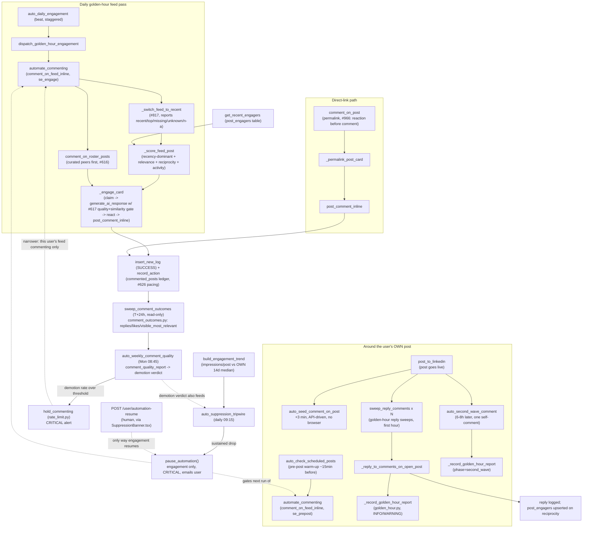
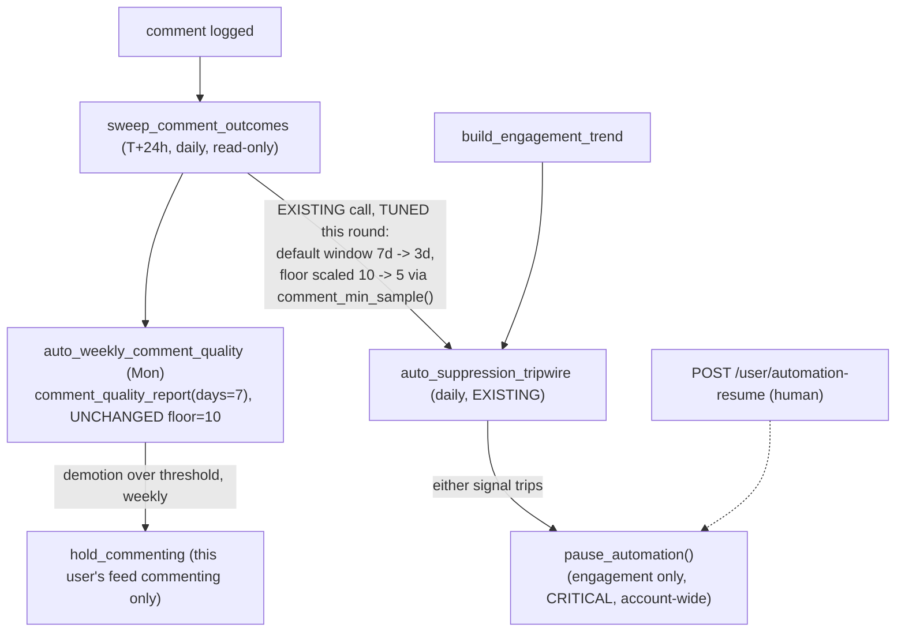

# Graph: Engagement — Feed & Reply

## What this graph does

The feed-and-reply half of `src/cqc_lem/app/run_automation.py` (the DM/outreach half is a sibling
graph, not covered here). It is LEM's autonomous commenting engine: it decides which posts to
comment on (own curated roster first, then the SDUI home feed, recency-dominant scoring), writes
and posts the comment through Selenium, seeds and amplifies the user's own posts in their first
hours of life, replies to comments left on the user's own posts, and then — after the fact —
checks whether any of that actually worked and pulls the plug on commenting if it didn't.

Nothing in this graph waits for a human to approve a specific comment before it posts. The only
brake is reactive: a daily tripwire that pauses engagement account-wide if reach or comment
visibility has collapsed.

## Current state

1. **Pre-post warm-up** — `auto_check_scheduled_posts` (run_scheduler.py) dispatches
   `automate_commenting` ~15 min before a scheduled post goes live, on the `se_prepost` queue, to
   warm the feed. It is throttle- and active-user-gated but not human-gated.
2. **Publish, then three API-driven follow-ups** — `post_to_linkedin` dispatches, from the same
   task (it needs the just-published post URL): `auto_seed_comment_on_post` (+3 min, no browser),
   a set of `sweep_reply_comments` golden-hour sweeps (first hour, spread across several
   `sweep_slot`s), and `auto_second_wave_comment` (6–8h later, gated on `second_wave_enabled()`).
3. **Golden-hour reply sweeps** — `sweep_reply_comments` locks per-user (`acquire_run_lock`),
   opens one Selenium session, and calls `_reply_to_comments_on_open_post` for each recent post;
   every post swept emits `_record_golden_hour_report`, logging INFO (in-window) or WARNING
   (late — the queue-backlog signal) and shipping `track_golden_hour_report`. A sweep that
   couldn't even run (429, session failure) still reports itself via `_retry_golden_hour_sweep`,
   bounded by attempts and by the window.
4. **Second wave** — `auto_second_wave_comment` re-arms itself in hops until 6–8h have passed
   (`second_wave_due_minutes`/`second_wave_hop_seconds`, sized off `CELERY_VISIBILITY_TIMEOUT`),
   then posts ONE self-comment through the same #617 quality+similarity-gate/slop-lint path as a
   feed comment, capped so seed + second wave never both land (`SELF_COMMENT_MAX_PER_POST=2`).
5. **Daily golden-hour feed pass** — `auto_daily_engagement` (beat, staggered per user) dispatches
   `dispatch_golden_hour_engagement` → `automate_commenting` → `comment_on_feed_inline`. Inside
   that: `comment_on_roster_posts` runs first (curated peers outrank the algorithmic feed),
   `_switch_feed_to_recent` flips + reports the feed's sort state (`recent`/`top`/`missing`/
   `unknown`/`n/a`, #817 — never silently assumed sorted), then candidates are scored by
   `_score_feed_post` (recency-dominant, plus relevance, reciprocity off `get_recent_engagers`
   reading the `post_engagers` table, and activity).
6. **Comment happens in `_engage_card`** — claim the post (`claim_post_for_comment`, at-most-once),
   generate via `generate_ai_response` (which runs the #617 quality contract + similarity gate +
   slop lint and can produce nothing), react, then `post_comment_inline`. Only on success:
   `mark_post_commented`, `insert_new_log(SUCCESS)`, `record_action` (spends the #626 pacing
   budget). This one function is where writer and poster are the SAME code path — see rubric row 2.
7. **Permalink path** — `comment_on_post` runs the identical engine against one URL
   (`_permalink_post_card`, #966): reaction happens before the comment, and a comment that fails to
   land is a FAILURE row, never a SUCCESS.
8. **Replies to comments on the user's own posts** — `automate_reply_commenting` is the legacy/
   manual-trigger entry point; the default path is `sweep_reply_comments` above, both funneling
   into `_reply_to_comments_on_open_post`. Landing a reply upserts into `post_engagers`
   (reciprocity signal consumed by step 5's `get_recent_engagers`).
9. **T+24h outcome sweep, read-only** — `sweep_comment_outcomes` → `_run_comment_outcomes_sweep`
   revisits comments posted a day earlier, reads (never writes to LinkedIn) author replies, thread
   replies, likes, and the three-valued `visible_most_relevant` (1 relevant / 0 demoted-to-'Most
   recent' / NULL unreadable), and records ONE `comment_outcomes` row per comment.
10. **Weekly quality verdict** — `auto_weekly_comment_quality` (Monday 08:45, after the daily
    08:00 outcome sweep) scores the trailing window via `comment_quality_report`; a demotion rate
    over threshold on enough readable samples calls `hold_commenting` (narrower than a full pause)
    and logs CRITICAL.
11. **Suppression tripwire** — `auto_suppression_tripwire` (daily 09:15, after the 08:00 outcome
    sweep so the demotion signal is fresh) compares each user's own trailing-14-day impressions/
    post median against today's reading (or folds in the #628 demotion verdict); a sustained drop
    calls `pause_automation()` — engagement only, posting untouched — emails the user, and logs
    CRITICAL. The pause re-arms daily while it stands; only a human clearing it via
    `POST /user/automation-resume` restarts engagement.

## Rubric scorecard (current state)

| Criterion | Verdict | Why |
|---|---|---|
| Removes fake waiting | ✅ | No step blocks without doing real work. The 6–8h second-wave delay and the T+24h outcome-sweep window are real waits for the world to change (a post needs to earn engagement before there's anything to measure), implemented as re-arming Celery hops/beats, not a sleeping worker. There is no preview/approval queue sitting idle waiting on a human either — the whole graph is fire-and-check, so there's nothing here that waits without purpose, but also nothing that waits *for* a checker. |
| Separates worker from checker | ⚠️ | Partially. `_engage_card`'s comment does pass through a real, separately-defined quality gate (#617 similarity + slop lint inside `generate_ai_response`) before it's allowed to post — that's a checker distinct from the generator loop. But nothing checks the POSTED comment's real-world outcome before the next one goes out: `sweep_comment_outcomes` is read-only and reports 24h later, into a weekly aggregate, not per-comment before the next comment fires. The generation-time gate and the outcome-time gate are different code, which is good, but neither is in a position to stop an individual bad comment from shipping — only a sustained pattern gets caught, after the fact. |
| Human gate at the expensive-mistake point | ⚠️ | Honest answer: there is no pre-publish human gate on any individual comment — this is fully autonomous, unlike the content-generation preview/approval flow the CLAUDE.md draws the contrast against. The suppression tripwire (`auto_suppression_tripwire`) is functioning AS the expensive-mistake gate here, but it is reactive, not preemptive: it only fires after a day (or several) of degraded reach has already happened, on a daily cadence, off a lagging trailing-median comparison. It is a real gate — it does auto-pause and does require a human (`POST /user/automation-resume`) to lift it — so it's not nothing, but it catches damage that already accrued rather than preventing it. The #617 similarity/slop gate is the closest thing to a pre-mistake check, and it only screens comment TEXT quality, not whether commenting was a good idea on that post/that day. |
| Leaves a trail (residue) | ✅ | Strong. `sweep_comment_outcomes` is the clean example: read-only, ONE row per comment in `comment_outcomes` (replies, likes, three-valued `visible_most_relevant`), feeding `auto_weekly_comment_quality`'s trend report and the demotion-hold decision — genuinely making the next run (and the next week's verdict) smarter than an unmeasured one. `golden_hour_report`/`track_golden_hour_report` similarly leave a structured, queryable record of every sweep's timing and outcome, in-window or not. `post_engagers` is durable reciprocity memory feeding `_score_feed_post`. The gap: none of this residue is surfaced back into an individual future COMMENT's generation (no "last time we said X to this author, they didn't reply" style feedback into the LLM prompt) — the residue drives macro decisions (hold, pause) but not per-comment learning. |
| Avoids the agent-count/coordination-cost trap | ✅ | Minimal. This is one large module with a handful of Celery tasks chained by dispatch (not separate agents debating each other), each doing one clear job: warm-up, seed, sweep, second-wave, outcome-check, quality-verdict, tripwire. No LLM-judge-of-an-LLM layering, no multi-agent negotiation. The one place it could be seen as adding steps is the two-stage outcome pipeline (daily `sweep_comment_outcomes` → weekly `auto_weekly_comment_quality` → daily `auto_suppression_tripwire` reading a demotion verdict) — three tasks, but each is doing a distinct, cheap, mostly read-only job on a sane cadence, not re-litigating the same decision. |

## Spec — what this graph is for

- Post a well-formed, on-voice comment on the right posts (own roster, then relevance/recency-
  ranked home feed) within the user's per-day cap and targeting preferences, without duplicating a
  comment already made (`claim_post_for_comment`, `commented_posts` ledger, `has_commented_post`).
- Amplify the user's OWN posts in the window that matters: a seed comment within minutes of
  publish, reply coverage across the first hour (golden-hour sweeps), and one substantive second
  wave 6–8h later — never stacking beyond `SELF_COMMENT_MAX_PER_POST`.
- Reply to comments left on the user's own posts in a timely way, replacing what used to be a
  24h polling loop that drove LinkedIn 429s.
- Detect, without LinkedIn ever announcing it, that either individual comments are being demoted
  (#628) or the account's overall reach has silently collapsed (#629), and stop spending the day's
  cap on engagement nobody can see — while never gating scheduled posting itself.

## Verifier — what "good" means for THIS graph

- A comment that lands is provably ours and provably new: keyed by URN (`_feed_post_identity`),
  never re-submitted (`has_commented_post`/`has_user_commented_on_post_url`), and it passed the
  #617 similarity/slop gate against the user's own recent comment history.
- `_switch_feed_to_recent`'s reported sort state is trustworthy — `recent` is returned ONLY when
  the control confirms it afterward, never assumed (#817). A scan that ran unsorted must be
  visibly unsorted in the funnel data, not silently read as recency-ranked.
- Every golden-hour sweep (on-post seed/reply/second-wave) emits exactly one
  `golden_hour_report`, measured off the REAL publish time from the post log, not
  `scheduled_time` — a late publish must read as a late sweep, not a broken amplifier.
- `sweep_comment_outcomes` is genuinely read-only (no comment/react side effects) and its
  `visible_most_relevant` reading is three-valued on purpose — NULL (unreadable) never pollutes
  the demotion rate's denominator.
- The suppression tripwire only trips on a real, sustained drop against the user's OWN baseline
  (never a cross-user or absolute threshold), never acts on a thin/cold baseline
  (`unknown`, not actioned), and never self-clears — only a human resuming via the API ends a
  standing pause.

## Environment — owning docs/modules

- `src/cqc_lem/app/run_automation.py` — `_score_feed_post`, `_switch_feed_to_recent`,
  `comment_on_feed_inline`, `_engage_card`, `post_comment_inline`, `_post_composer_for_card`,
  `comment_on_roster_posts`, `comment_on_post`, `_permalink_post_card`,
  `automate_reply_commenting`, `sweep_reply_comments`, `_reply_to_comments_on_open_post`,
  `auto_seed_comment_on_post`, `auto_second_wave_comment`, `_record_golden_hour_report`,
  `sweep_comment_outcomes`, `_run_comment_outcomes_sweep`.
- `src/cqc_lem/app/run_scheduler.py` — `auto_daily_engagement`, `dispatch_golden_hour_engagement`,
  `dispatch_comment_outcome_sweeps`, `auto_weekly_comment_quality`, `auto_suppression_tripwire`,
  and the beat schedule wiring (`my_celery.py`) that sequences 08:00 outcome sweep → 08:45 Monday
  weekly-quality verdict → 09:15 daily suppression check.
- `src/cqc_lem/utilities/golden_hour.py` — the ONE place golden-hour/second-wave timing is decided
  (`golden_hour_report`, `should_report`, `second_wave_due_minutes`, `second_wave_hop_seconds`,
  `self_comment_cap`/`SELF_COMMENT_MAX_PER_POST`).
- `src/cqc_lem/utilities/comment_outcomes.py` — `comment_quality_report`, the demotion verdict
  vocabulary (`VERDICT_HOLD`), `hold_seconds`.
- `src/cqc_lem/utilities/suppression.py` — `evaluate_suppression`, baseline/history-window config.
- `src/cqc_lem/utilities/linkedin/rate_limit.py` — `pause_automation`, `is_automation_paused`,
  `hold_commenting`, `is_measurement_paused`, `record_suppression_trip`, `suppression_trip_state`.
- `src/cqc_lem/utilities/db.py` — `get_recent_engagers`/`post_engagers` (reciprocity),
  `get_comment_outcome_targets`, `record_comment_outcome`, `claim_post_for_comment`,
  `has_commented_post`.
- `src/cqc_lem/utilities/linkedin/helper.py` — `find_first`/`click_first`/`find_all_first`
  resilient-selector primitives every lookup above is built on.
- `docs/engagement-automation.md` — the load-bearing detail this graph is drawn from (sections:
  "Feed commenting on the SDUI feed", "Golden-hour presence & second wave", "Comment outcome
  tracking", "Suppression tripwire").
- `docs/sdui-selenium-notes.md` — the SDUI selector invariants (`_post_composer_for_card` /
  `_reply_composer_for_comment` scoping, permalink engine reuse, three fix invariants #1013).

## Reference exemplar candidate (for Phase 2)

The T+24h `sweep_comment_outcomes` → `auto_weekly_comment_quality` → `hold_commenting` chain is the
strongest piece of this graph and a plausible reference exemplar for "leaves a trail that makes the
next run smarter": it is read-only, cheap, three-valued rather than lossy-boolean, and its output
directly narrows a specific lane (feed commenting for one user) rather than triggering a blunt
global pause. Any Phase 2 redesign of the pre-publish side of this graph (adding a real per-comment
checker, or moving part of the suppression tripwire's job earlier) should keep this chain's shape —
read-only measurement, durable per-item residue, a bounded-scope action — rather than replacing it.

## Gauntlet-loop redesign — WINS (3 rounds)

Per `docs/gauntlet-loop.md`: builder proposes a redesign against this doc's Verifier, a fresh-context
critic blind-judges it against the named reference exemplar, loop until it wins or hits the 3-round
cap. This piece won on round 3 — and the process caught something worth calling out on its own: the
"gap" being fixed turned out to be partially already-solved by existing code the first two rounds
never read.

**Reference exemplar:** this graph's own T+24h `sweep_comment_outcomes` → `hold_commenting` chain —
read-only, cheap, three-valued, bounded-scope.

**Round 1 → round 2:** critic found the daily read had a vague window ("day-scale") and reused the
weekly `min_visibility_sample()` floor (10) unmodified for a shorter window — meaning the new HOLD
path would likely never fire. Round 2 fix: explicit 3-day window, a separately-scaled floor (5) via
a new optional `min_sample` parameter defaulting to today's behavior.

**Round 2 → round 3:** critic found the fix was sound in isolation but wired onto an **invented,
parallel** edge — `src/cqc_lem/utilities/suppression.py` already has `auto_suppression_tripwire`
reading a comment-demotion signal daily via `comment_history_days()` (default 7, tunable via
`SUPPRESSION_COMMENT_DAYS`, zero code needed) and already folding it into `pause_automation()` — a
BROADER action than `hold_commenting`, already running every day. Round 3 fix: dropped the invented
edge entirely and applied round 2's real insight (shorter window needs a scaled floor) to the
*existing* call site — `comment_history_days()`'s default moves 7→3, plus the same `min_sample`
scaling, threaded into the one real call site.

**Final verdict (round 3): WINS.** The critic independently verified every claim against the live
source — `comment_history_days()`, its default, `auto_suppression_tripwire`'s real call chain into
`pause_automation()` (not `hold_commenting`), and a specific existing test
(`test_suppression.py:333`) that the proposal correctly flagged as needing an update.

### Proposed redesign

**What changed:** zero new edges — `T24 → SUP` already exists in shipped code; round 2's mistake was
drawing a second one. `comment_history_days()`'s default moves from 7 to 3 (one constant); a new
optional `min_sample` parameter on `quality_verdict()`/`comment_quality_report()` defaults to today's
behavior when omitted (so the weekly call site is byte-for-byte unchanged); a new `comment_min_sample()`
helper derives the scaled floor *from* `comment_history_days()` itself, so an operator who tunes
`SUPPRESSION_COMMENT_DAYS` gets a correspondingly-scaled floor automatically instead of two
independently-drifting knobs.

**What did not change:** no pre-publish check, no new Celery task/module. `auto_weekly_comment_quality`'s
`hold_commenting`/CRITICAL alert is untouched — still Monday-only, still the only caller of
`hold_commenting`. The proposal never claims that narrower action fires from the daily path;
`pause_automation()` (broader, account-wide) is what actually fires there, today and after this change.

**Residual caveats (non-blocking, noted by the final critic):** `suppression.py`'s module comment and
`comment_history_days()`'s docstring both narrate the current 7-day rationale and go stale once the
default moves to 3 — update in the same diff. `tests/unit/utilities/test_suppression.py:333` asserts
the literal `7` and needs updating alongside the change. The sensitivity/false-positive tradeoff of a
lower `min_sample` should be stated explicitly in implementation, not just as a mechanic.
