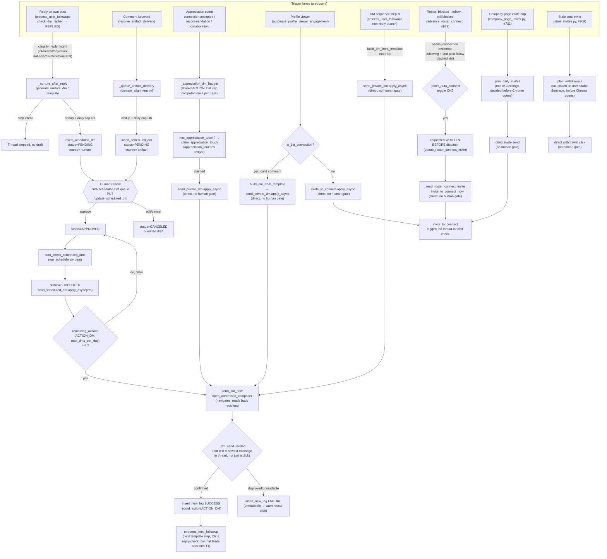
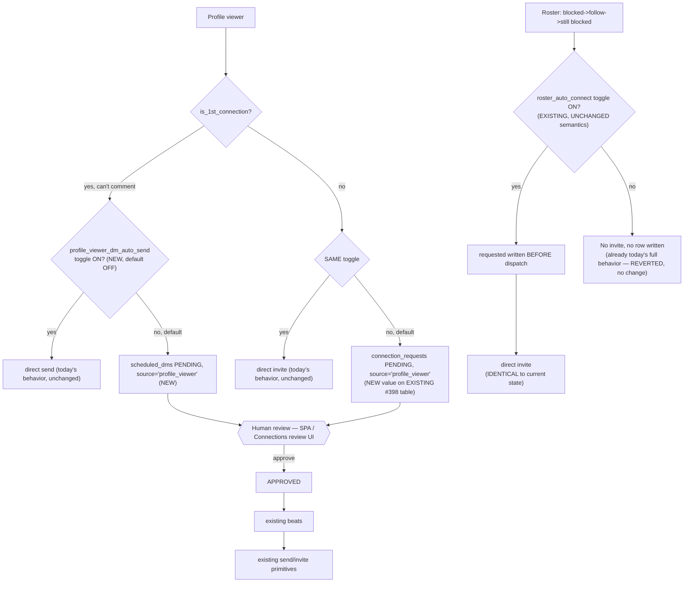

# Graph: Engagement — Outreach & DM

## What this graph does

The outreach/DM half of `app/engagement/outreach.py` (moved out of `run_automation.py` in #1154,
still answering to its `cqc_lem.app.run_automation.<fn>` wire names) + `app/run_scheduler.py` —
everything that puts a
message in a specific person's inbox or a connection request on their profile, as opposed to
commenting on the public feed (the sibling graph). Eight distinct trigger lanes converge on two
shared backbones: a **direct-send path** (Selenium dispatches immediately once deterministic gates
clear) and an **approval-gated path** (`scheduled_dms` `pending` row → human decision in the SPA →
beat scanner → send). All sending, whichever path got it there, funnels through the ONE
`send_dm_now` / message-thread ladder.

## Current state

## Numbered walkthrough

1. **Reply-triggered nurture** (`process_user_followups` → `check_dm_replied` returns
   `ThreadState.REPLIED`) hands the read reply to `_nurture_after_reply`
   (`utilities/ai/dm_nurture.py`). It classifies intent (`classify_reply_intent`); an explicit
   `is_stop_intent` ends the thread with no draft. Otherwise it dedups against an already-open
   nurture *or* artifact draft on the same thread, checks the daily nurture draft cap
   (`DM_NURTURE_MAX_PER_DAY`), drafts via `generate_nurture_dm` (falling back to
   `build_dm_from_template`), and calls `insert_scheduled_dm(..., status=PENDING, source='nurture')`
   — `ScheduledDmStatus.APPROVED` only if the operator has explicitly flipped
   `DM_NURTURE_AUTO_APPROVE` (off by default; a typo in that env var fails CLOSED to PENDING).
2. **Keyword-triggered artifact/lead-magnet delivery** (`resolve_artifact_delivery` in
   `content_alignment.py` + `_queue_artifact_delivery`) lands the same way: a `pending`
   `scheduled_dms` row, `source='artifact'`, blocked by an open draft from either mechanic in
   either direction, capped by `max_dms_per_day` at draft time and re-checked at send.
3. Both PENDING rows sit in the SPA's scheduled-DM queue (`GET /list_scheduled_dms`,
   `PUT /update_scheduled_dm`) until a human approves, edits, or cancels them. Nothing in either
   producer can send — `insert_scheduled_dm` only ever writes state, `send_scheduled_dm` is the only
   function that calls `send_dm_now`, and it refuses anything not `APPROVED`/`SCHEDULED`.
4. The beat `auto_check_scheduled_dms` (`run_scheduler.py`) scans for due, `APPROVED` rows on
   active/connected users, flips them to `SCHEDULED` (so a second scan can't re-dispatch), and
   fires `send_scheduled_dm.apply_async(eta=scheduled_time)`. `send_scheduled_dm` re-checks the
   per-day DM cap at send time and defers back to `APPROVED` (not a failure) if it's spent.
5. **Appreciation DMs** (`automate_appreciation_dms_for_user` → `_dispatch_appreciation_dms`) are a
   different shape entirely: three STANDING-list triggers (connection accepted, recommendation,
   collaboration/mention), a per-pass budget computed ONCE
   (`_appreciation_dm_budget` = the same `remaining_actions(ACTION_DM, ...)` every other DM lane
   spends), a durable dedup claim (`appreciation_touches`, checked before the LLM call, claimed
   after — a missing template never burns the one shot), and then **`send_private_dm.apply_async`
   directly** — no `scheduled_dms` row, no human approval step.
6. **Profile-viewer engagement** (`engage_with_profile_viewer`) branches on connection degree: a
   1st-degree viewer who has nothing new to comment on gets a `build_dm_from_template("profile_viewer", ...)`
   message deduped against DM history (`ai_check_message_history`) and sent via
   **`send_private_dm.apply_async` directly**; a non-1st-degree viewer gets a personalized
   connection request via **`invite_to_connect.apply_async` directly**. Neither branch touches
   `scheduled_dms`.
7. **Template follow-up sequence steps ≥1** (`process_user_followups`, the non-REPLIED /
   non-UNKNOWN branch): `build_dm_from_template(event_type, step=f["next_step"])` renders the next
   templated message and sends it via **`send_private_dm.apply_async` directly**, then
   `enqueue_next_followup` schedules the step after that (or, if the sequence's templates run out,
   a REPLY-CHECK row that later feeds back into step 1's nurture path — the #623 fix that makes
   nurture reachable at all).
8. **Roster connect escalation** (`advance_roster_connect`, #979): read-only advancement
   (`reconcile_roster_connect_state`) runs every visit for free; only a target carrying
   `needs_connection` (evidence: `following` + a SECOND post-follow blocked visit) and the opt-in
   `roster_auto_connect` toggle reaches `queue_roster_connect_invite`, which writes
   `ConnectStatus.REQUESTED` **before** dispatching `send_roster_connect_invite` (a thin wrapper
   over the existing `invite_to_connect_now` rail) — no new invite mechanic, and the invite is
   **auto-sent**, not queued for approval.
9. **Company-page invitations** (`plan_daily_invites`, #732) and **stale-invite withdrawal**
   (`plan_withdrawals`, #969) decide their day's allowance (smallest-of-three-ceilings; fail-closed
   unreadable "Sent … ago" reads) BEFORE any Chrome session opens, then dispatch directly — both
   are paced, budget-bounded, OFF-by-default lanes, and neither is approval-gated.
10. Every send that goes through `send_dm_now` (appreciation, profile-viewer, follow-up steps,
    scheduled/nurture/artifact) shares ONE core: `open_addressed_composer` navigates to a
    recipient-verified compose URL (never clicks a `Message` control), types and clicks Send, then
    `_dm_send_landed` checks the thread's newest message against what we sent — sent means
    **landed**, not that Send accepted a click. `insert_new_log` records SUCCESS/FAILURE either
    way, and a landed send calls `record_action(ACTION_DM)` against the shared #626 envelope.

## Rubric scorecard (current state)

| Criterion | Verdict | Why |
|---|---|---|
| Removes fake waiting | ✅ | `plan_daily_invites` / `plan_withdrawals` decide the day's allowance BEFORE a Chrome session opens — most runs cost zero slots, not a browser trip that discovers nothing to do. `_dm_send_landed` replaces "assume Send worked" with an actual read-back. `requested` is written before dispatch, not after, so a lost async task doesn't leave a target in limbo. The `scheduled_dms` PENDING state is not idle either — it's the point where a human decision is the next real step, not a timer. |
| Separates worker from checker | ⚠️ | Where a checker exists, it is a genuinely different party: `_nurture_after_reply` and `_queue_artifact_delivery` (the producers, LLM + template) never call `update_scheduled_dm_status` to APPROVED themselves — only a human via the SPA does, and `send_scheduled_dm` is a third function that refuses anything not already approved. But five of the eight trigger lanes (appreciation, profile-viewer, follow-up steps ≥1, roster-connect, company-page invites, stale-invite withdrawal) have **no checker at all** — the producer that drafts/decides the message is the same code path that dispatches it, gated only by deterministic budget/dedup/hold checks, not by a second party reviewing the actual content or target. |
| Human gate at the expensive-mistake point | ⚠️ | Real, but partial. Nurture replies and keyword-triggered artifact DMs — arguably the highest-stakes writes, since they're generated live against a stranger's actual words — are approval-gated exactly as CLAUDE.md claims. But appreciation DMs, profile-viewer DMs, connection requests, template follow-up sends, roster connect invites, company-page invites, and stale-invite withdrawals ALL reach a stranger's inbox or spend LinkedIn's connection tolerance with zero human review — they rely entirely on deterministic gates (`_appreciation_dm_budget`, `appreciation_touches`, `roster_auto_connect`/`STALE_INVITE_WITHDRAWAL_ENABLED` opt-in flags, the #626 envelope). A wrong template render or a misidentified profile-viewer degree ships without anyone seeing it first — the same class of mistake (unsolicited message to the wrong or wrong-context person) that the nurture path treats as review-worthy. |
| Leaves a trail (residue) | ✅ | Durable evidence at every layer: `appreciation_touches` (one row per (user, person, event_type), claimed before send), `requested`/`ConnectStatus`/`FollowStatus` ENUMs written before dispatch and re-read on later visits (`reconcile_roster_connect_state`, `reconcile_roster_follow_state`), `logs` rows (SUCCESS/FAILURE) for every DM/invite/withdrawal including the runs that do nothing (`company_page_invite_run`, `stale_invite_run` — a series with only successes would look identical to a silently broken lane), `_dm_send_landed`'s read-back rather than a trust-the-click assumption, and `get_dm_history_for_profile` / `ai_check_message_history` feeding prior sends back into the next draft so a re-run doesn't repeat itself. |
| Avoids the agent-count/coordination-cost trap | ✅ | Genuinely minimal reuse: ONE send primitive (`send_dm_now`) for every lane; roster-connect and company-page invites both ride the SAME pre-existing `invite_to_connect_now` rail rather than adding a second invite mechanic; nurture reuses the SAME `scheduled_dms` table/beat/scanner that manual scheduled DMs already used instead of a parallel approval system. The one real cost: two structurally different dispatch shapes coexist (direct-`apply_async` vs. `scheduled_dms`-mediated) for what is, from a "message reaches a stranger" standpoint, the same class of action — that duality is what produces the previous row's unevenness, not a proliferation of extra agents. |

## Spec — what this graph is for

Turn a detected signal about a specific person (they replied, they viewed the profile, they
recommended/mentioned/connected, a scheduled sequence step is due, a roster target's follow didn't
unlock commenting, a company-page credit is available, an old invite is stale) into the correct
one of: a sent DM, a sent connection request, a withdrawn invite, or nothing (dedup/cap/hold says
stop) — while never sending the SAME thing to the SAME person twice, never exceeding the account's
daily/day-shared budget, and never sending to a thread whose state (replied? still open? landed?)
couldn't be confidently read.

## Verifier — what "good" means for THIS graph

- A `pending` `scheduled_dms` row never transitions to `SENT` without a human `PUT /update_scheduled_dm`
  approval OR an explicit `DM_NURTURE_AUTO_APPROVE=true` operator opt-in — checkable by asserting
  `send_scheduled_dm` refuses any status other than `APPROVED`/`SCHEDULED`.
- No `appreciation_touches` / roster-connect / follow row is ever claimed or dispatched twice for
  the same (user, person, event) — checkable against the unique-key constraint and
  `has_appreciation_touch`/terminal-state guards.
- `_dm_send_landed` (or the equivalent `ThreadState` read for follow-ups) is what flips a send's
  logged result, never the mere fact that a Send click was dispatched.
- Every dispatch-capable lane emits a run-level event even on a zero-action run
  (`company_page_invite_run`, `stale_invite_run`, the follow-up run's `sent`/`nurtured`/`skipped`
  counts) — a lane that only ever logs successes is a false "everything's fine."
- A gate that fails to read (unreadable thread state, unreadable "Sent … ago" age, unreadable
  composer recipient) resolves to **not sending**, never to a best-guess send.

## Environment — owning docs/modules

- `docs/engagement-automation.md` — DM nurture, appreciation sources, message-thread ladder
  (#731/#1030), owned-asset CTA loop (#624), stale-invite withdrawal (#969), roster connect
  escalation (#979), company-page invitations (#732).
- `src/cqc_lem/app/engagement/outreach.py` (moved out of `run_automation.py` in #1154) —
  `_nurture_after_reply`, `process_user_followups`, `build_dm_from_template`,
  `enqueue_next_followup`, `_dispatch_appreciation_dms`, `automate_profile_viewer_engagement` /
  `engage_with_profile_viewer`, `send_dm_now`, `send_private_dm`, `send_scheduled_dm`.
- `src/cqc_lem/app/engagement/feed.py` — `queue_roster_connect_invite`, `advance_roster_connect`;
  `src/cqc_lem/app/engagement/invites.py` — `send_roster_connect_invite`.
- `src/cqc_lem/app/run_scheduler.py` — `auto_check_scheduled_dms` beat.
- `src/cqc_lem/utilities/ai/dm_nurture.py` — `classify_reply_intent`, `generate_nurture_dm`,
  `nurture_delay_hours`, `is_stop_intent`.
- `src/cqc_lem/utilities/linkedin/message_thread.py` — `open_message_thread`, `ThreadState`,
  `open_addressed_composer`, `compose_url_for`, `_dm_send_landed`.
- `src/cqc_lem/utilities/linkedin/company_page_inviter.py` — `plan_daily_invites`.
- `src/cqc_lem/utilities/linkedin/stale_invites.py` — `plan_withdrawals`.
- `src/cqc_lem/utilities/ai/content_alignment.py` — `resolve_artifact_delivery`.
- `src/cqc_lem/utilities/human_pacing.py` — `remaining_actions`, the shared #626 account envelope.
- `src/cqc_lem/api/main.py` — `POST /schedule_dm`, `GET /list_scheduled_dms`,
  `PUT /update_scheduled_dm`, `DELETE /delete_scheduled_dm` (the human approval surface).

## Reference exemplar candidate (for Phase 2)

The **nurture-reply → PENDING `scheduled_dms` → SPA approval → `auto_check_scheduled_dms` →
`send_scheduled_dm` → `send_dm_now` → `_dm_send_landed`** chain is this graph's strongest sub-path:
clean producer/checker separation, a durable trail at every hop (claim ledgers, `requested`-before-
dispatch, read-back-verified sends), and reuse of ONE existing table/beat/send-primitive instead of
a parallel mechanism. It is a stronger exemplar candidate than the graph as a whole, because the
direct-dispatch lanes (appreciation, profile-viewer, follow-up steps, roster-connect, company-page,
stale-invite) sit right next to it without the same review step, for reasons that read as
historical/incremental (each shipped as its own issue) rather than a deliberate judgment that those
sends are cheaper mistakes.

## Gauntlet-loop redesign — WINS (2 rounds)

Per `docs/gauntlet-loop.md`: builder proposes a redesign against this doc's Verifier, a fresh-context
critic blind-judges it against the named reference exemplar, loop until it wins or hits the 3-round
cap. This piece won on round 2 — the fastest of the six, largely because round 2 caught and reverted
a genuine misdiagnosis before it could compound.

**Reference exemplar:** this graph's OWN nurture-reply → PENDING `scheduled_dms` → SPA approval →
`send_dm_now` → `_dm_send_landed` chain — clean producer/checker separation, reuse of one existing
table/beat/send-primitive.

**Round 1 → round 2:** critic found round 1 gated BOTH profile-viewer DMs (T4) and roster-connect
escalation (T6) unconditionally for every user — in tension with the corrected product-goal framing
that LEM's outreach automation is supposed to be autonomous by default, with per-user configurability
(mirroring `roster_auto_follow`/`roster_auto_connect`'s existing opt-in shape) as the operative
criterion, not mandatory review. Worse: gating T6 actually **broke** `roster_auto_connect`'s existing
autonomous-send semantics for users who had already opted in. Round 2 fix: added a new
`profile_viewer_dm_auto_send` toggle for T4 (default OFF — a genuinely new intervention on a
previously-ungated lane); **reverted T6 entirely** after verifying in the actual code
(`queue_roster_connect_invite`) that `roster_auto_connect=false` already means zero exposure with no
second dispatch path — the toggle already IS the human-in-the-loop decision this row asks for.

**Final verdict (round 2): WINS.** The critic independently traced every caller of
`queue_roster_connect_invite`/`send_roster_connect_invite` in `run_automation.py` and confirmed the
toggle check is the literal first statement, with no path around it — reverting T6 was the *correct*
call, not just the safe one.

### Proposed redesign

**What changed:** one new boolean preference, `profile_viewer_dm_auto_send` (default `FALSE`,
additive migration, same shape as `roster_auto_connect`/`roster_auto_follow`), gates T4's both
branches through the existing `scheduled_dms`/`connection_requests` (#398) PENDING pattern when off,
or today's direct-dispatch when on.

**What did not change:** T6 (`queue_roster_connect_invite`, `advance_roster_connect`,
`roster_connect_budget`) — byte-for-byte unchanged; this was a correction of round 1's misreading, not
a redesign. T3 (appreciation), T5 (follow-up steps), T7 (company-page), T8 (stale-invite) — all remain
deterministic-gated, same reasoning as round 1 (warm context, pre-approved content, non-personal
recipient, or self-directed action).

**Residual caveats (non-blocking, noted by the final critic):** the final diagram in the graph doc
should be updated to add a `GATE4` node mirroring `GATE6`'s shape (this write-up was prose-only at
the time of the win); worth adding a Verifier bullet for the new toggle mirroring the existing
nurture-path bullet, so the new gate is checkable the same way.
